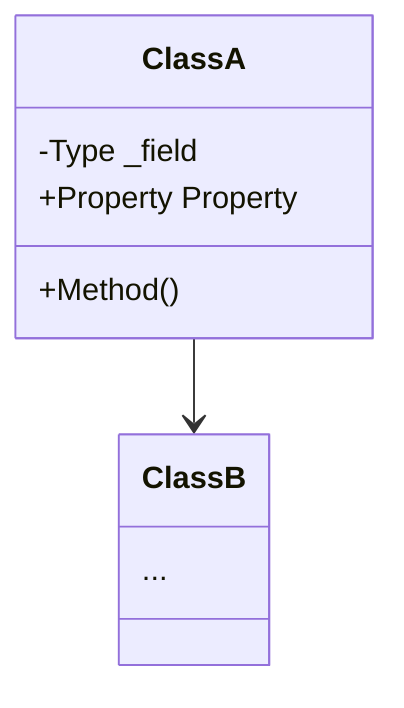

# 詳細設計書作成スキル (create-detailed-design)

このスキルは、ユーザーから「詳細設計書を作成する」よう指示された場合に使用します。
詳細設計書は、機能仕様書（仕様設計）や画面設計書をもとに、**具体的にどのようにクラスやロジック、データフロー、UIを実装するか**をエンジニア向けに詳しく定義するドキュメントです。

---

## ワークフロー手順

### 1. ディレクトリとファイルの準備
- プロジェクトルートから `設計/詳細設計/` というディレクトリを使用します（存在しない場合は作成します）。
- そのディレクトリ内に `<機能名>.md` というMarkdownファイルを作成します（ファイル名は必ず日本語にすること）。

### 2. 記述の基本方針
- **実装に直結する具体性**: 機能仕様・画面設計の要件を満たすために必要なクラス構成、データフロー、アルゴリズム、定数パラメータ、XAML/UIレンダリング詳細を漏れなく記述します。
- **視覚的な図解（Mermaid）の活用**: クラス図（`classDiagram`）や処理フロー図（`flowchart` / `sequenceDiagram`）を用いて、構造とデータ連携を一目で理解できるようにします。
- **数式・アルゴリズムの明文化**: 信号処理、周波数マッピング、座標計算、アニメーションイージングなどの計算式を明記します。
- **調整係数・パラメータの表形式まとめ**: チューニング可能な定数や設定値を一覧表にして定義します。

---

### 3. 詳細設計書の標準フォーマット
作成するMarkdownファイルには、以下のセクションを含めて構成してください。

```markdown
# [機能名] 詳細設計書

## 1. 概要
実装対象機能の目的、技術的スコープ、および参照する上位ドキュメント（機能仕様書・画面設計書）の要約。

## 2. アーキテクチャとクラス構造
### 2.1 クラス構成図 (Mermaid)

### 2.2 主要クラスと責務
各クラス・インターフェース・モデルの役割と責務を一覧で説明。

## 3. データフローと処理パイプライン
### 3.1 処理シーケンス / パイプライン構成 (Mermaid)

### 3.2 イベント連携・スレッド制御
- UIスレッドとの非同期連携（Dispatcher）、排他制御（lock）、ライフサイクル管理。

## 4. アルゴリズム・計算ロジック詳細
### 4.1 計算式および変換アルゴリズム
- 数式や具体的な計算ステップ、エッジケース対策（NaN/Infinity防止、ゼロ除算回避など）。
### 4.2 チューニング係数・定数一覧
| 定数・係数名 | 型・既定値 | 役割・調整時の影響 |
| :--- | :--- | :--- |
| `ConstantName` | `double = 1.0` | パラメータの目的と説明 |

## 5. UIレイアウトおよびレンダリング設計
### 5.1 XAMLコンポーネント構成
- コントロール階層、バインディング設計、アスペクト比・固定幅制御。
### 5.2 ビジュアルエフェクト・アニメーション仕様
- ブラシ・グラデーション定義、DropShadowEffect、Storyboard/イージング関数、特殊エフェクト（VisualBrush等）。

## 6. 関連ドキュメント・Issue
- 機能仕様書: [設計/機能仕様/<機能名>.md](../機能仕様/<機能名>.md)
- 画面設計書: [設計/画面設計/<機能名>.md](../画面設計/<機能名>.md)
- 関連Issue: #XX
```

---

### 4. Git操作 (任意)
- ユーザーから指示があった場合は、`rule_docs/git_operation_rules.md` に従い、コミット（`docs: #<Issue番号> <機能名>の詳細設計書を作成`）とプッシュを行ってください。
