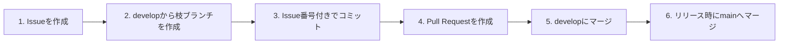

# ブランチ運用ルール

本プロジェクト（Audio Effector）におけるブランチ運用の統一ルールを定めます。

---

## 1. 開発ワークフロー

以下の流れで開発を進めます。



### Step 1: Issueを作成する

- **作業開始前に必ずIssueを作成する**
- Issueには目的（Why）・作業内容（What）・完了条件を記載する
- Issue番号はコミットメッセージとブランチ名で使用する

### Step 2: `develop` から枝ブランチを作成する

```bash
git checkout develop
git pull origin develop
git checkout -b feat/12-effect-switching
```

- 必ず **最新の `develop` ブランチ** から作成する
- 枝ブランチの命名規則は「2. ブランチ命名規則」に従う

### Step 3: Issue番号を含めてコミットする

```bash
git add <ファイル>
git commit -m "feat: #12 エフェクト切替機能を追加する"
```

- コミットメッセージには **必ずIssue番号を含める**
- `#<Issue番号>` を記載することでGitHub上でIssueと自動リンクされる
- コミットメッセージのフォーマットは [git_operation_rules.md](git_operation_rules.md) を参照

### Step 4: Pull Requestを作成する

- マージ先は **必ず `develop` ブランチ** に指定する（デフォルトが `main` になっている場合があるため要注意）
- GitHub CLIを使用する場合は、`gh pr create --base develop` のように `--base` オプションで明示的に指定する
- PRの説明にIssueへの参照を含める（例: `Closes #12`）

### Step 5: `develop` にマージする

- レビュー完了後、`develop` にマージする
- マージ後、枝ブランチは削除する

### Step 6: リリース時に `main` へマージする

- リリースのタイミングで `develop` → `main` にマージする
- `main` へのマージ後、必要に応じてタグを付与する

---

## 2. ブランチ命名規則

```
<Type>/<Issue番号>-<簡潔な説明>
```

### 例

```
feat/12-effect-switching
fix/34-playback-noise
docs/56-update-readme
refactor/78-audio-engine-cleanup
```

---

## 3. ブランチの種類

| ブランチ | 用途 | 備考 |
|---------|------|------|
| `main` | リリース可能な安定版 | 直接コミット禁止。`develop` からのマージのみ |
| `develop` | 開発の統合ブランチ | すべての枝ブランチの派生元・マージ先 |
| `feat/*` | 新機能の開発用 | `develop` から作成 |
| `fix/*` | バグ修正用 | `develop` から作成 |
| `docs/*` | ドキュメント修正用 | `develop` から作成 |
| `refactor/*` | リファクタリング用 | `develop` から作成 |
| `chore/*` | 設定変更・メンテナンス用 | `develop` から作成 |

> **⚠️ 注意**: 枝ブランチは必ず `develop` から作成してください。`main` から直接作成しないこと。

---

## 4. クイックリファレンス

```bash
# === 開発の全体フロー ===

# 1. Issueを作成（GitHub上で実施）

# 2. developから枝ブランチを作成
git checkout develop
git pull origin develop
git checkout -b feat/<Issue番号>-<説明>

# 3. 開発してIssue番号付きでコミット
git add <ファイル>
git commit -m "feat: #<Issue番号> 変更内容を記述する"

# 4. リモートにプッシュしてPRを作成（※マージ先をdevelopに指定）
git push origin feat/<Issue番号>-<説明>
gh pr create --base develop --title "..." --body "Closes #<Issue番号>"

# 5. PR承認後、developにマージ（GitHub上で実施）

# 6. リリース時にmainへマージ（GitHub上で実施）
```
