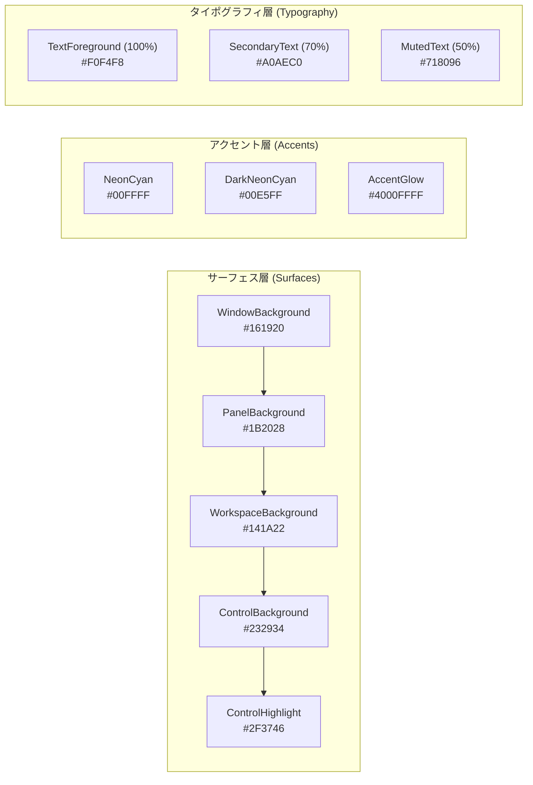

# デザイントークン仕様書 (Design Tokens Specification)

## 1. 概要

本仕様書は、Audio Effectorにおける視覚デザインの最小単位である「デザイントークン（Design Tokens）」を標準化・体系化した設計書です。
カラー、タイポグラフィ、スペーシング、角丸、エレベーション、モーションを名前付きのセマンティックトークンとして定義することで、コードおよびXAMLリソース間でのハードコードを排し、UI全体で破綻のない洗練されたビジュアル調和と高い保守性を保証します。

---

## 2. カラートークン (Color Tokens)

### 2.1 セマンティックカラーパレット（ダークテーマ標準）

Audio Effectorは、音楽の鑑賞性とサイバー感を両立する「ディープスレート＆プレミアムチャコール」を基調とし、鮮やかな「ネオンシアン」をアクセントとしています。

#### ① 背景・サーフェス層 (Surfaces & Backgrounds)
| トークン名 (Brush) | カラーコード (Hex) | 用途と適用箇所 |
| :--- | :--- | :--- |
| `WindowBackgroundBrush` | `#161920` | アプリケーションウィンドウのベース背景（Mica/アクリル効果の基準面） |
| `PanelBackgroundBrush` | `#1B2028` | 左サイドバー、右スライドパネル、下部常設プレイヤーバー |
| `WorkspaceBackgroundBrush` | `#141A22` | 中央メインワークスペース（コンテンツ描画領域） |
| `ControlBackgroundBrush` | `#232934` | ボタン、テキスト入力欄、コンボボックス、未選択カード |
| `ControlBackgroundHighlightBrush` | `#2F3746` | ホバー状態のコントロール、セカンダリサーフェス、スライダー未再生レール |
| `ControlBackgroundPressedBrush` | `#384454` | コントロール押下時（Pressed）の沈み込み背景 |

#### ② テキスト・前景層 (Typography & Foregrounds)
| トークン名 (Brush) | カラーコード (Hex) | 不透明度・用途 |
| :--- | :--- | :--- |
| `TextForegroundBrush` | `#F0F4F8` | 主要テキスト（Primary: 100%） - 楽曲名、見出し、アクティブラベル |
| `SecondaryTextForegroundBrush` | `#A0AEC0` | 補足テキスト（Secondary: 70%） - アーティスト名、アルバム名、パンくず |
| `MutedTextForegroundBrush` | `#718096` | 控えめなテキスト（Muted: 50%） - 再生時間、未選択アイコン、プレースホルダー |
| `DisabledTextForegroundBrush` | `#4A5568` | 無効状態（Disabled: 35%）のテキストおよび操作不能アイコン |
| `InverseTextForegroundBrush` | `#10141B` | 反転テキスト - ネオンシアン背景上の文字（再生ボタンアイコン等） |

#### ③ アクセント・ブランド層 (Brand Accents)
| トークン名 (Brush) | カラーコード (Hex) | 用途と適用箇所 |
| :--- | :--- | :--- |
| `NeonCyanBrush` | `#00FFFF` | **ブランドシグネチャー**: 再生ボタングロー、アクティブタブ、プログレスバー塗り、スペクトラムバー |
| `DarkNeonCyanBrush` | `#00E5FF` | アクセントホバー、深みのあるシアンアクセント |
| `NeonCyanPressedBrush` | `#00B8CC` | アクセント要素の押下時（Pressed）状態 |
| `AlwaysNeonCyanBrush` | `#00FFFF` | テーマ切り替え時も常にネオンシアンを維持する特定要素（アルバムアート上オーバーレイ等） |
| `AccentGlowBrush` | `#4000FFFF` (25% α) | ネオンシアン要素の周囲に配する光彩・フォーカスインジケーター |

#### ④ 境界線・区切り層 (Borders & Dividers)
| トークン名 (Brush) | カラーコード (Hex) | 用途と適用箇所 |
| :--- | :--- | :--- |
| `BorderBrush` | `#343E4E` | 標準の境界線（カード外枠、ペイン境界、入力欄ボーダー） |
| `SubtleBorderBrush` | `#232934` | 控えめな区切り線（リスト行間のセパレーター、非アクティブ境界） |
| `FocusBorderBrush` | `#00FFFF` | キーボードフォーカス・入力フォーカス時の強調外枠 |

#### ⑤ 状態・フィードバック層 (Status & Feedback)
| トークン名 (Brush) | カラーコード (Hex) | 用途と適用箇所 |
| :--- | :--- | :--- |
| `SuccessBrush` | `#10B981` | 転送完了トースト、安全接続ステータス、成功通知 |
| `WarningBrush` | `#F59E0B` | ストレージ容量不足警告、スキップ注意喚起 |
| `DangerBrush` | `#EF4444` | エラー通知、削除確認、タイトルバー閉じるホバー (`#E81123`) |
| `InfoBrush` | `#3B82F6` | 一般システム通知、ヘルプチップ |

---

## 3. タイポグラフィトークン (Typography Tokens)

### 3.1 フォントファミリー
- **プライマリフォント**: `Segoe UI` (欧文・数値・システムUI)
- **和文フォールバック**: `Meiryo UI`, `Yu Gothic UI`, `sans-serif`
- **等幅フォント (ビットレート・タイムコード用)**: `Consolas`, `Cascadia Code`, `monospace`

### 3.2 スケール階層定義

| トークン名 | FontSize | FontWeight | LineHeight | 主な用途 |
| :--- | :---: | :---: | :---: | :--- |
| `Typography.Display` | 24pt (32px) | Bold | 1.25 | メインヒーロータイトル、アーティストドリルダウン大見出し |
| `Typography.Header1` | 20pt (26px) | Bold | 1.30 | 各ビューの最上位見出し、アルバム詳細タイトル |
| `Typography.Header2` | 16pt (21px) | SemiBold | 1.35 | セクション見出し（「Playlists」「Albums」）、ダイアログ表題 |
| `Typography.Subheader` | 14pt (18px) | SemiBold | 1.40 | トラック名、カードタイトル、パネルヘッダー |
| `Typography.Body` | 13pt (17px) | Regular | 1.45 | **標準本文**: 楽曲リスト行テキスト、設定項目、メニュー |
| `Typography.Caption` | 11pt (15px) | Regular | 1.40 | **補足情報**: 再生経過/総時間、アーティスト補足、パンくず |
| `Typography.Micro` | 9pt (12px) | Bold | 1.20 | **タグ・バッジ**: ハイレゾ音源タグ (`FLAC 96/24`)、ステータスラベル |

---

## 4. スペーシング・サイジングトークン (Spacing Tokens)

レイアウトの破綻を防ぎ、均整の取れたリズムを生み出すため、**4pxベースのグリッドシステム**を採用します。

| トークン名 | ピクセル値 | 主な適用箇所 |
| :--- | :---: | :--- |
| `Spacing.XXS` | 2px | 極小オフセット、アイコンとインジケーターの微調整 |
| `Spacing.XS` | 4px | インラインアイコンとラベルの間隔、タイトなパディング |
| `Spacing.S` | 8px | ボタン内横パディング、リスト行の上下余白、コントロール間隔 |
| `Spacing.M` | 12px | カード内パディング、ツールバーアイテム間隔、パネルマージン |
| `Spacing.L` | 16px | 標準コンテナパディング、セクション間の垂直余白 |
| `Spacing.XL` | 24px | 大セクション間隔、ダイアログ内余白、グリッドカードのガター |
| `Spacing.XXL` | 32px | ウィンドウ境界からの大マージン、ヒーローセクション周囲 |

---

## 5. 角丸トークン (CornerRadius Tokens)

Windows 11 Fluent Designの柔らかな丸みと、精密機器のスマートさを両立する階層構造です。

| トークン名 | CornerRadius | 適用対象オブジェクト・コンポーネント |
| :--- | :---: | :--- |
| `Radius.Sharp` | `0` | タイトルバー、ウィンドウ外枠、画面端に接する境界線 |
| `Radius.Small` | `4` | ボタン、テキスト入力欄、コンボボックス、タグバッジ、ミニアルバムアート |
| `Radius.Medium` | `8` | コンテンツカード、コンテキストメニュー、トースト通知、ダイアログ |
| `Radius.Large` | `12` | フローティングパネル、モーダルメインウィンドウ |
| `Radius.Pill` | `9999` (円形/楕円) | 再生/一時停止ボタン、音量・シークバーのThumb、ステータスピル |

---

## 6. エレベーションと陰影トークン (Elevation Tokens)

パフォーマンス最適化方針に基づき、高負荷な動的ぼかしエフェクト（CPUソフトウェアレンダリング）の乱用を禁止し、**「ボーダー線（Border）による境界分離」を基本としつつ、静的オーバーレイにのみ厳選した陰影を適用**します。

| レベル | 表現手法 | 適用要素 |
| :--- | :--- | :--- |
| **Level 0 (Flat)** | 境界線なし、サーフェス色の差のみで分離 | メインワークスペース背景、プレイヤーバー |
| **Level 1 (Surface)** | `BorderThickness="1"` + `BorderBrush="#343E4E"` | アルバムカード、リストコンテナ、サイドバー区切り |
| **Level 2 (Floating)** | `DropShadowEffect BlurRadius="16" Opacity="0.5" Direction="270"` | トースト通知カード、コンテキストメニュー、ドロップダウンリスト |
| **Level 3 (Modal)** | `DropShadowEffect BlurRadius="32" Opacity="0.75" Direction="270"` | 設定ダイアログ、機器ストレージ管理ダイアログ |

> [!IMPORTANT]
> **パフォーマンス制約**: スペクトラムアナライザやシークバー、常時スクロールするリスト行など、毎フレーム描画更新される動的要素には `DropShadowEffect` を指定してはなりません。

---

## 7. モーション・トランジショントークン (Motion Tokens)

画面遷移や状態変化を直感的かつ自然に認知させるための時間・イージング定義です。

### 7.1 時間軸 (Duration)
| トークン名 | 時間 (ms) | 用途 |
| :--- | :---: | :--- |
| `Motion.Instant` | 0ms | 即時切り替え（チェック状態、フォーカス枠） |
| `Motion.Fast` | 100ms | マイクロインタラクション（ボタンホバー、押下時の色変化） |
| `Motion.Normal` | 200ms | フェードイン/アウト、タブ切り替え、ツールチップ |
| `Motion.Slide` | 250ms | 右スライドパネル開閉、ドロワー展開、アコーディオン開閉 |
| `Motion.Slow` | 400ms | 大規模な画面ビュー遷移、モーダルダイアログのポップアップ |

### 7.2 イージングカーブ (Easing Function)
- **標準イージング (`Easing.Standard`)**: `CubicEase EasingMode="EaseInOut"`
  - パネル開閉やサイズ変更など、自然な加速・減速を伴うモーションに適用。
- **進入イージング (`Easing.Enter`)**: `CubicEase EasingMode="EaseOut"`
  - 画面内へのスライドイン、トースト通知のポップアップに適用。
- **退出イージング (`Easing.Exit`)**: `CubicEase EasingMode="EaseIn"`
  - 画面外へのスライドアウト、要素のフェードアウトに適用。
