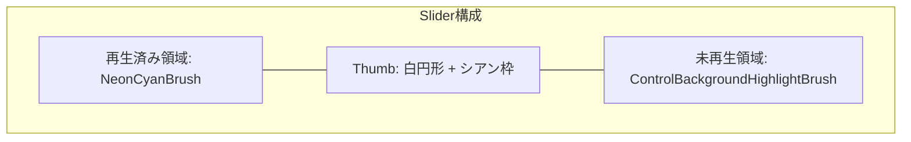

# 共通コントロールスタイル仕様書 (Common Control Styles Specification)

## 1. 概要

本仕様書は、Audio Effectorの各画面・ビューにおいて使用するWPF標準コントロールに対するカスタムStyleおよびControlTemplateの標準設計を定めたものです。
[デザイントークン仕様書](01_デザイントークン仕様書.md) で定義されたカラートークン、タイポグラフィ、角丸、スペーシング、モーションを適用し、すべてのコントロールにおいて一貫した操作感とアフォーダンス（操作可能性の視覚的手がかり）を提供します。
また、[パフォーマンス最適化方針](../詳細設計/パフォーマンス最適化.md) に完全準拠し、UI仮想化や効率的な描画構造を標準として義務付けます。

---

## 2. ボタン (Button & ToggleButton)

ボタンはアクションの重要度と文脈に応じて4つのバリアント（スタイル）を定義します。

### 2.1 ボタンバリアント一覧

| バリアント | 用途 | 通常時 (Normal) | ホバー時 (Hover) | 押下時 (Pressed) |
| :--- | :--- | :--- | :--- | :--- |
| **PrimaryButton** | 最重要アクション（再生/一時停止、転送開始、保存） | 背景: `NeonCyanBrush`<br>文字: `#10141B` (黒)<br>枠線: なし | 背景: `DarkNeonCyanBrush`<br>微小明度UP | 背景: `NeonCyanPressedBrush`<br>スケール 0.98 |
| **SecondaryButton** | 補助的アクション（キャンセル、設定変更、閉じる） | 背景: 透明<br>文字: `TextForegroundBrush`<br>枠線: `BorderBrush` (1px) | 背景: `ControlBackgroundHighlightBrush`<br>枠線: `NeonCyanBrush` | 背景: `ControlBackgroundPressedBrush` |
| **SubtleButton (Ghost)** | ツールバー、タイトルバー、インラインアイコン操作 | 背景: 透明<br>文字: `MutedTextForegroundBrush`<br>枠線: なし | 背景: `ControlBackgroundHighlightBrush`<br>文字: `TextForegroundBrush` | 背景: `ControlBackgroundPressedBrush` |
| **IconCircleButton** | プレイヤー中央の再生ボタン、クイック再生アクション | 背景: `NeonCyanBrush`<br>形状: 完全な円（Pill）<br>サイズ: 36x36px〜48x48px | グロー効果強調 (`AccentGlow`) | スケール 0.95 |

### 2.2 ToggleButton (トグルボタン)
シャッフル、リピート、EQ有効化、歌詞パネル展開など、オン/オフ状態を持つ機能に適用します。

- **未選択時 (Unchecked)**: 文字/アイコン色 `MutedTextForegroundBrush` (#718096)、背景透明。
- **選択時 (Checked)**: アイコン色 `NeonCyanBrush` (#00FFFF)、下部に微小ネオンシアンインジケータードットまたは発光背景を表示。
- **ホバー時**: 背景 `ControlBackgroundHighlightBrush`、スムーズなトランジション（100ms）。

---

## 3. テキスト入力 (TextBox & SearchBox)

### 3.1 標準 TextBox
- **通常時**: 背景 `ControlBackgroundBrush` (#232934)、枠線 `BorderBrush` (#343E4E, 1px)、角丸 4px、文字色 `TextForegroundBrush`。
- **フォーカス時 (Focused)**: 枠線 `FocusBorderBrush` (`#00FFFF`, 1.5px)、背景わずかに明度上昇。キャレット色はネオンシアン。
- **無効時 (Disabled)**: 背景 `#1A2028`、文字色 `DisabledTextForegroundBrush`、枠線透明。

### 3.2 SearchBox (クイック検索入力)
プレイリスト検索やライブラリ横断検索に適用する統合コントロールです。

```
+-----------------------------------------------------------------------+
|  🔍 [ 検索キーワードを入力...                          ]  [✕]         |
+-----------------------------------------------------------------------+
```
- **左側アイコン**: 虫眼鏡アイコン（🔍, 14x14px, `MutedTextForegroundBrush`）。
- **プレースホルダー (Watermark)**: 未入力時に「検索キーワードを入力...」を斜体/薄色でオーバーレイ表示（入力開始で即座に非表示）。
- **右側クリアボタン (✕)**: テキスト入力時のみフェードイン表示。クリックでテキスト全消去および検索リセット。

---

## 4. スライダー (Slider: Seek & Volume)

音楽アプリケーションのコア操作であるシークバーおよび音量バーに特化した、高レスポンスかつ滑らかなカスタムスライダーです。



### 4.1 プログレスシークバー (`NeonSliderStyle`)
- **トラック背景 (Track)**:
  - 左側（再生経過部分）: `NeonCyanBrush`（厚さ 4px、角丸 2px）
  - 右側（未再生部分）: `ControlBackgroundHighlightBrush`（厚さ 4px、角丸 2px）
- **つまみ (Thumb)**:
  - 通常時: 直径 10px、白塗り（#FFFFFF）＋ネオンシアン外枠（1px）。
  - マウスホバー時: 直径 14px へアニメーション拡大（所要時間: 100ms）。
  - ドラッグ中: ネオンシアン発光、ドラッグ位置のタイムコードツールチップをポップアップ表示。
- **クリック動作**: `IsMoveToPointEnabled="True"` により、バー上の任意位置クリックで即座にその位置へシーク。

### 4.2 音量スライダー (`NeonVolumeSliderStyle`)
- ツールバーやプレイヤーバー内に収まるコンパクト設計（幅80px〜100px、高さ4px）。
- ミュートボタン（スピーカーアイコン）と連携し、ミュート時はトラック全体が `DisabledTextForegroundBrush` に減光。

---

## 5. コレクション表示 (ListBox / ListView / DataGrid)

楽曲一覧、アルバムグリッド、プレイリスト項目など、膨大なオブジェクトを快適に一覧表示・操作するための標準仕様です。

### 5.1 パフォーマンス必須ルール（UI仮想化）
[パフォーマンス最適化方針](../詳細設計/パフォーマンス最適化.md) に基づき、すべてのコレクションコントロールは以下の属性指定を必須とします：

```xml
VirtualizingPanel.IsVirtualizing="True"
VirtualizingPanel.VirtualizationMode="Recycling"
VirtualizingPanel.ScrollUnit="Pixel"
ScrollViewer.CanContentScroll="True"
```

### 5.2 行インタラクションと状態スタイル
- **行の高さ**: 標準楽曲行 `36px`（コンパクト表示 `28px`）。
- **行ホバー (MouseOver)**: 背景 `ControlBackgroundHighlightBrush`（不透明度 40%）。
- **行選択 (Selected)**:
  - 背景 `ControlBackgroundHighlightBrush`（不透明度 80%）。
  - **行の左端に幅 3px のネオンシアンアクセント縦バー (`NeonCyanBrush`)** を表示し、どの行がアクティブであるかを明確に伝達。
- **現在再生中行 (Now Playing)**:
  - トラック名およびトラック番号を `NeonCyanBrush` で強調表示。
  - トラック番号列に小さな「イコライザー波形アニメーションアイコン」を表示。
- **ゼブラストライプ**: 偶数行は透明、奇数行は `ZebraOddBackgroundBrush` (`#08FFFFFF`, 3%白色透過) を敷き、多列データでの視認性を担保。

---

## 6. スクロールバー (ScrollBar)

Windows 11 Fluent Designのオートハイド（自動伸縮）思想を継承し、コンテンツの鑑賞を妨げないミニマルな設計とします。

- **非ホバー時 (Idle)**:
  - トラック背景: 完全透明 (`#00000000`)。
  - サム（Thumb）: 幅 4px の極細ライン、色 `ScrollBarThumbColor` (`#424C5E`)、角丸 2px。
- **マウス近接・ホバー時 (Hover)**:
  - サム幅が 8px へスムーズに拡張、色 `ScrollBarThumbHoverColor` (`#607088`)。
- **ドラッグ時 (Dragging)**:
  - サム色が `NeonCyanBrush` (`#00FFFF`) へ鮮やかに変化。

---

## 7. コンテキストメニューとメニューアイテム (ContextMenu & MenuItem)

オブジェクト（楽曲、アルバム、プレイリスト等）を右クリックした際に展開される、直接操作メニューの標準仕様です。

- **背景サーフェス**: `PanelBackgroundBrush` (`#1B2028`) に角丸 8px、外枠 `BorderBrush` (`#343E4E`)、Level 2 ドロップシャドウ。
- **MenuItem**:
  - 高さ: `32px`、パディング: 左右 `12px`。
  - 左端: アイコン配置領域（16x16px）。
  - 中央: アクション名（13pt, `TextForegroundBrush`）。
  - 右端: ショートカットキー表記（11pt, `MutedTextForegroundBrush`, 右寄せ）。
  - ホバー時: 背景 `ControlBackgroundHighlightBrush`、角丸 4px。
- **区切り線 (Separator)**:
  - 上下マージン `4px`、高さ `1px`、色 `SubtleBorderBrush` (`#232934`)。

---

## 8. チェックボックスとラジオボタン (CheckBox & RadioButton)

- **外枠**: 16x16px、角丸 3px（RadioButtonは円形）、枠線 `BorderBrush` (1.5px)。
- **チェック時 (Checked)**: 背景 `NeonCyanBrush`、チェックマークはダーク色（`#10141B`）のSVGベクターパス。
- **アニメーション**: チェック時に拡大・収縮するマイクロバウンス（所要時間: 100ms）。

---

## 9. 折りたたみコンテナ (Expander)

左サイドバーのプレイリスト一覧などで使用する折りたたみコンテナです。

- **ヘッダー**: 矢印アイコン（回転アニメーション: 開閉で0度 ↔ 90度）、セクションタイトル、および右端のアクションボタン群（＋ボタン、検索アイコン）を内包可能。
- **コンテンツ領域**: 開閉時にアコーディオン方式でスムーズにスライド展開。
