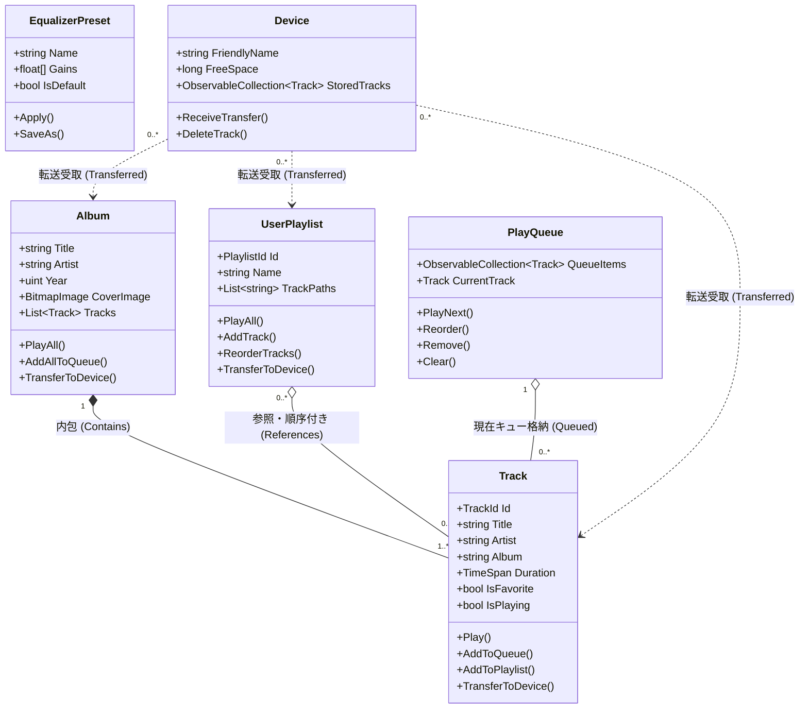

# 主要オブジェクト一覧とモデリング (Audio Effector)

本ディレクトリでは、コードベースの精査に基づき抽出された、Audio Effectorのコアオブジェクト（名詞）の定義、実装仕様（As-Is）、および相互関係をまとめています。

---

## 1. コレクション / シングル対応表

| オブジェクト名 | 英名 | 分類 | コレクション表示 (一覧) | シングル表示 (詳細) | 課題 / 今後の指針 (To-Be) | 詳細定義 |
| :--- | :--- | :--- | :--- | :--- | :--- | :---: |
| **楽曲** | Track | プライマリ | `AllSongsView.xaml`（全曲データグリッド）、アルバム展開、プレイリスト内、キュー内。 | 右カラムの再生情報やプロパティダイアログ。 | 全曲データグリッドによる一覧ブラウズ、複数選択一括操作、プロパティ/タグ編集ビューの提供。 | [01_楽曲_Track.md](01_楽曲_Track.md) |
| **アルバム** | Album | プライマリ / コンテナ | `LibraryView.xaml` （グリッド表示とリスト表示をツールバーで切替可能）。 | **独立画面なし**（カード内のExpander/ソケットオーバーレイでインライン展開）。 | 独立したアルバムシングルビュー（大アートヘッダー＋所属曲テーブル）へのシームレス展開。 | [02_アルバム_Album.md](02_アルバム_Album.md) |
| **プレイリスト** | UserPlaylist | プライマリ / コンテナ | `PlaylistSelectorView.xaml` （4分割サムネイル付きカード一覧）。 | `PlaylistTracksView.xaml` （ヘッダー＋所属曲一覧の独立画面）。 | コレクションとシングルは分離済み。楽曲のD&D直接投入・インライン名称編集の導入。 | [03_プレイリスト_UserPlaylist.md](03_プレイリスト_UserPlaylist.md) |
| **再生キュー** | PlayQueue | コンテナ / ワークスペース | `PlayQueueSidePanel.xaml` （右端からスライドオーバーレイ表示）。 | キュー内の現在再生曲ハイライト。 | ライブラリ各画面からのドラッグ＆ドロップによるキュー割り込み・追加の強化。 | [04_再生キュー_PlayQueue.md](04_再生キュー_PlayQueue.md) |
| **エフェクトプリセット** | EqualizerPreset | セカンダリ / 設定 | プリセット選択コンボボックス（`EqualizerViewModel.Presets`）。 | `EqualizerView.xaml` （10バンドゲインスライダー全画面）。 | 全画面占有から、再生中も操作できるポップアップ/ドロワー配置への見直し。 | [05_エフェクトプリセット_EqualizerPreset.md](05_エフェクトプリセット_EqualizerPreset.md) |
| **接続機器** | Device | セカンダリ / ロケーション | `DeviceSyncView.xaml` のコンボボックス、`DeviceManagerDialog` の一覧。 | `DeviceSyncView.xaml` のフォルダ探索ブラウザ。 | 専用同期画面ではなく、接続時トースト通知と右側端末転送パネルの自動起動、通常画面からの単選択・複数選択転送の実現（D&D転送は一旦保留）。 | [06_接続機器_Device.md](06_接続機器_Device.md) |

---

## 2. オブジェクト関係図 (Mermaid)

