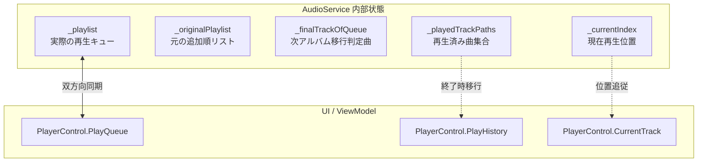
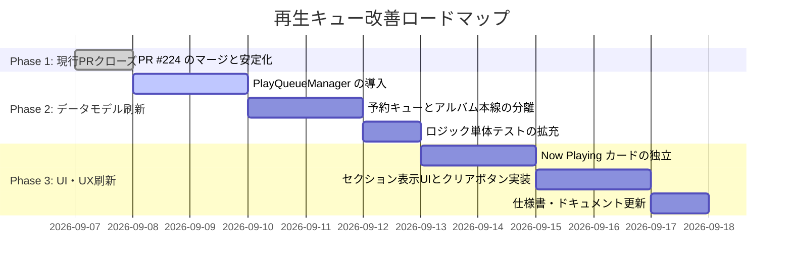

# 再生キュー順序制御およびUX改善提案書

## 1. エグゼクティブサマリー

### 1.1 背景
Audio Effector の「再生キュー（Play Queue）」機能は、以下の機能拡張を段階的に経て、高機能なリスニング体験を提供できるよう進化してきました：
- アルバム全曲再生および途中トラック（No.X以降）からの再生
- シャッフル再生時のUI順序リアルタイム同期および解除時の穴あき復元（複数アルバム対応）
- 楽曲再生終了時の自動キュー削除および「履歴」タブへの自動蓄積
- 履歴タブからの楽曲選択によるキュー先頭割り込み即時再生
- 当初のキュー最終曲終了時における次アルバム自動移行

### 1.2 課題認識
しかしながら、新機能の追加や不具合改修の積み重ねにより、**「1本のフラットなリスト（`_playlist`）」に対して多様な責務が集中**し、内部状態変数（`_playlist`, `_originalPlaylist`, `_finalTrackOfQueue`, `_playedTrackPaths`, `_currentIndex`）の相互依存度と分岐条件が極めて高くなっています。
その結果、次のような問題が生じやすくなっています：
1. **ユーザーの認知負荷**: 「アルバム本来の曲順」と「自分が手動で割り込ませた曲」の区別がつかず、シャッフル解除時や曲終了時に予期せぬ順序変化が起きる。
2. **保守・拡張の難易度上昇**: 状態の二重管理やイベント発火順序（例: `PlaylistEnded` 後の停止通知競合など）によるデグレリスクが顕在化。

### 1.3 提案の骨子
大手ストリーミングサービス（Spotify, Apple Music, YouTube Music 等）で確立された業界標準モデルである**「手動予約キュー（User Queue）」と「アルバム本線（Album Stream）」のセクション分離**を導入し、データ構造とUIの両面から再生キューを再構築することを提案します。

これにより、**ユーザーにとっては「次に何が流れるか」が完全に直感的に把握可能**となり、**内部ロジックはフラグや特殊条件判定の多くを撤廃して劇的にシンプル化**されます。

---

## 2. 現状分析（As-Is）

### 2.1 現状のデータ構造と管理状態
現在、`AudioService` において再生キューの順序と状態は以下の変数群によって管理されています。

| 変数名 | 型 | 役割と責務 |
| :--- | :--- | :--- |
| `_playlist` | `List<Track>` | **実キュー**。現在UIの「再生リスト」タブに表示されている並び順そのもの。 |
| `_originalPlaylist` | `List<Track>` | **元順序リスト**。シャッフルOFF時の復元やアルバム元順序を担保するための基準。 |
| `_finalTrackOfQueue` | `Track?` | **アルバム最終曲**。次アルバムへの自動遷移トリガーとなる曲を記憶。 |
| `_playedTrackPaths` | `HashSet<string>` | **再生済みパス**。シャッフル復元時に再生済み曲を穴あき除外するための履歴。 |
| `_currentIndex` | `int` | **現在再生中位置**。リスト内のどのインデックスの曲を再生中かを示す。 |



### 2.2 キュー順序が変化する7大トリガー
現状、キューの順序や内容が変化する操作は以下の7種類存在します。

```mermaid
flowchart TD
    T1[1. アルバム再生 / 途中再生] -->|全入れ替え| Q[_playlist]
    T2[2. 次に再生 / キューに追加] -->|割り込み挿入 / 末尾追加| Q
    T3[3. 履歴から再生] -->|先頭 (idx:0) 追加| Q
    T4[4. 楽曲再生終了] -->|キューから削除 & 履歴移行| Q
    T5[5. 手動D&D並び替え] -->|ユーザーが任意に順序変更| Q
    T6[6. シャッフルON / OFF] -->|Fisher-Yates / 穴あき復元| Q
    T7[7. キュー最終曲終了] -->|ループOFF時: 次アルバム移行| T1
```

| トリガー | 現在の動作とロジック |
| :--- | :--- |
| **1. アルバム再生** | 通常時はトラック順。シャッフル時はランダム1曲を先頭に固定し残りをシャッフル展開。末尾曲を `_finalTrackOfQueue` に保持。 |
| **2. 「次に再生」** | 現在曲の直後（`_currentIndex + 1`）に挿入。 |
| **3. 「キューに追加」** | 通常時は末尾追加。シャッフル時は**現在曲以外の全キューを再シャッフル**して散りばめる。 |
| **4. 履歴からの再生** | キューのインデックス `0` に挿入して即時再生開始。「再生リスト」タブへ自動切替。 |
| **5. 楽曲再生終了** | 自然完奏またはスキップ時、終了曲を `_playlist` / `_originalPlaylist` から物理削除し、履歴へ移動（未再生曲のみが残る消費型キュー）。 |
| **6. シャッフル切替** | **ON時**: `_originalPlaylist` を Fisher-Yates でシャッフル。<br>**OFF時**: アルバム時系列順にグループ化、アルバム内トラック番号順整列、再生済み曲の穴あき除外、未再生曲の保持、現在曲位置インジケータ追従を実行。 |
| **7. 次アルバム移行** | キューに曲が残っていても、再生終了曲が `_finalTrackOfQueue` と一致した時点で `PlaylistEnded` を発火し、次アルバムへ遷移。 |

### 2.3 現状アーキテクチャの3つの構造的課題（Pain Points）

#### 課題1: 「アルバム本線の流れ」と「手動の割り込み曲」が1本の配列に混在
- アルバムの曲を聴いている途中で「次に再生」や「履歴から再生」を行うと、アルバム本来の流れの中に外部曲が挿入されます。
- これにより、以下の問題が発生します：
  - **シャッフル解除時の破綻リスク**: ユーザーが意図して入れた割り込み曲が、シャッフルOFF時の「アルバム順復元ロジック」によって意図しない位置へ巻き込まれる。
  - **次アルバム移行の誤判定リスク**: ユーザーが `_finalTrackOfQueue` の曲を途中にドラッグ＆ドロップした場合、キューに後続曲があるのに突然次アルバムへ移行してしまう。

#### 課題2: シャッフル時の「キューに追加」による既存順序の破壊
- 現行仕様では、シャッフル再生中に「キューに追加」を押すと、**現在再生中以外の全キューリストがランダムに再シャッフル**されます。
- これにより、「あとで聴こう」とユーザーが意図して追加した曲だけでなく、すでにキューに並んでいた曲の順番まで勝手に崩れてしまい、ユーザーの予測可能性を損なっています。

#### 課題3: 「キュー消費モデル（終わると消える）」と「再生中インジケータ」の二重管理
- 曲が終わるとキューから削除されるため、キューの先頭が常に「次に流れる曲」または「現在曲」になります。
- しかし、リスト内に「現在再生中」の曲も残す設計のため、現在曲アイコン（▶/⏸）の表示・非表示の同期や、インデックスの整合性を保つための特殊コード（`SyncTrackPlayingStates`、停止イベント抑止ガード等）が必要になっています。

---

## 3. 改善提案（To-Be）: セクション分離モデル

### 3.1 コアコンセプト
キューを単一のフラットな配列として扱うのをやめ、以下の**2つの論理セクション（階層構造）**に分離します。

```
┌─────────────────────────────────────────────────────────┐
│  ▶ NOW PLAYING（現在再生中カード）                      │
│     曲A - アーティスト                                  │
├─────────────────────────────────────────────────────────┤
│  ▼ 予約キュー (In Queue / Up Next) (2)                  │
│     ※ ユーザーが手動で「次に再生」「キューに追加」した曲 │
│     1. 曲X（履歴から再生）                              │
│     2. 曲Y（「次に再生」で追加）                        │
├─────────────────────────────────────────────────────────┤
│  ▼ アルバムの残り曲 (Next from Album) (4)               │
│     ※ アルバムから引き続いて再生される予定の曲群       │
│     3. アルバム曲3                                      │
│     4. アルバム曲4                                      │
│     5. アルバム曲5（★このアルバムの最終曲）             │
└─────────────────────────────────────────────────────────┘
```

#### 再生の優先順位ルール
1. **予約キュー最優先**:
   - 予約キュー（User Queue）に楽曲が存在する場合は、上から順に再生・消費します。
2. **アルバム本線への自動復帰**:
   - 予約キューがすべて空になったら、自動的に「アルバムの残り曲（Album Stream）」の次の曲へ戻って再生を継続します。
3. **明快な次アルバム自動移行**:
   - 「アルバムの残り曲」の最後の曲（★）が終了した時点で、予約キューの有無に関わらず、次アルバムへ自動移行します（次アルバムの曲群が「アルバムの残り曲」に新たにセットされる）。

---

### 3.2 UI / UX デザイン設計案

スライドパネルの「再生リスト」タブのUIレイアウトを、以下のようにリファクタリングします。

```
┌──────────────────────────────────────────────┐
│ [再生リスト (6)]      [履歴 (15)]        🗑️ ✕ │
├──────────────────────────────────────────────┤
│ ┌──────────────────────────────────────────┐ │
│ │ [Cover]  現在再生中の曲名                │ │
│ │          アーティスト名 - 02:45 / 04:12  │ │
│ └──────────────────────────────────────────┘ │
│                                              │
│ ── 予約キュー (2) ──────────── [すべてクリア] ── │
│ ┌──────────────────────────────────────────┐ │
│ │ [≡] [Cover] 曲X - アーティスト      03:10 ✕│ │
│ ├──────────────────────────────────────────┤ │
│ │ [≡] [Cover] 曲Y - アーティスト      04:22 ✕│ │
│ └──────────────────────────────────────────┘ │
│                                              │
│ ── 次のアルバムから: Album Title (4) ───────── │
│ ┌──────────────────────────────────────────┐ │
│ │ [≡] [Cover] Track 3 - アーティスト  03:45 ✕│ │
│ ├──────────────────────────────────────────┤ │
│ │ [≡] [Cover] Track 4 - アーティスト  04:01 ✕│ │
│ ├──────────────────────────────────────────┤ │
│ │ [≡] [Cover] Track 5 - アーティスト  05:12 ✕│ │
│ └──────────────────────────────────────────┘ │
└──────────────────────────────────────────────┘
```

#### UI設計のポイント
1. **Now Playing の独立固定**:
   - 最上部に「現在再生中」のカードを常時表示。
   - キューのリスト内には「これから再生される未再生曲」のみが並ぶため、リストアイテムに再生中アイコンを同期表示させる複雑な仕組みが不要になります。
2. **セクションごとのヘッダーと曲数表示**:
   - 「予約キュー (Count)」と「次のアルバムから: [アルバム名] (Count)」をヘッダーで明確に区分。
   - 予約キューが0件の場合は、予約キューセクションを非表示（または折りたたみ）にし、アルバム本線のみをすっきりと表示。
3. **ドラッグ＆ドロップの自由度**:
   - 予約キュー内での並び替えはもちろん、アルバム本線から予約キューへの昇格（またはその逆）も直感的に行えます。
4. **予約キューの一括クリアボタン**:
   - 「予約キューだけを全消去して、元のアルバム再生に戻したい」という操作がワンクリックで可能になります。

---

### 3.3 データ構造および内部アルゴリズムの刷新案

#### 新しいデータモデル構造
```csharp
public class PlayQueueManager
{
    /// <summary>
    /// 現在再生中のトラック（未再生時は null）
    /// </summary>
    public Track? CurrentTrack { get; private set; }

    /// <summary>
    /// ユーザーが手動で割り込ませた予約キュー（最優先で消費）
    /// </summary>
    public ObservableCollection<Track> UserQueue { get; } = new();

    /// <summary>
    /// 現在のアルバム／プレイリストから引き続いて再生される予定のキュー
    /// </summary>
    public ObservableCollection<Track> AlbumQueue { get; } = new();

    /// <summary>
    /// アルバムキューの元の曲順（シャッフル解除用）
    /// </summary>
    private List<Track> _originalAlbumTracks = new();
}
```

#### 再生遷移ロジック（`OnTrackEnded` / `Next`）
```csharp
public Track? MoveToNextTrack()
{
    // 1. 直前の曲を履歴に追加
    if (CurrentTrack != null)
    {
        AddToHistory(CurrentTrack);
    }

    // 2. 予約キューに曲があれば最優先で取得
    if (UserQueue.Count > 0)
    {
        var next = UserQueue[0];
        UserQueue.RemoveAt(0);
        CurrentTrack = next;
        return CurrentTrack;
    }

    // 3. 予約キューが空なら、アルバム本線から取得
    if (AlbumQueue.Count > 0)
    {
        var next = AlbumQueue[0];
        AlbumQueue.RemoveAt(0);
        CurrentTrack = next;
        return CurrentTrack;
    }

    // 4. アルバム本線も空になった場合 → 次アルバムへ移行
    CurrentTrack = null;
    NotifyPlaylistEnded(); // 次アルバムのロードへ
    return null;
}
```

#### シャッフルおよび追加ルールの簡素化
1. **シャッフルの適用範囲を「`AlbumQueue`」に限定**:
   - シャッフルボタンをON/OFFした際、シャッフルされるのは「アルバム本線」のみです。
   - ユーザーが意図して並べた「予約キュー」はシャッフルの影響を一切受けず、設定した順序が100%保護されます。
2. **「キューに追加」の動作変更**:
   - シャッフル中であっても全体を再シャッフルせず、**予約キューの末尾（またはアルバムキューの末尾）にそのまま追加**します。
   - これにより、追加した曲の順番が勝手に崩れず、ユーザーの予測通りのリスニングフローが維持されます。

---

## 4. 新旧アーキテクチャ詳細比較（As-Is vs To-Be）

### 4.1 ユーザー体験（UX）の比較

| 評価軸 | 現状（As-Is: 1本リスト） | 提案（To-Be: セクション分離） | 改善効果 |
| :--- | :--- | :--- | :--- |
| **再生予定の把握** | アルバム曲と手動追加曲が混ざり、「次に何が流れるか」が分かりにくい。 | 「予約曲」と「アルバムの続き」が視覚的に分離され、一目瞭然。 | **大幅向上** |
| **手動追加曲の消化** | アルバムの途中に混入し、終わった後のアルバム進行位置が曖昧。 | 予約曲が消化された後、自動的に元のアルバムの続きにシームレスに戻る。 | **直感的** |
| **シャッフル時の予測性** | 「キューに追加」でキュー全体が再シャッフルされ、並び順が崩れる。 | 予約曲はシャッフルの影響を受けず、意図した曲順が完全に保持される。 | **ストレス解消** |
| **次アルバムへの移行** | キューに曲が残っているのに突然次アルバムに移るなど、唐突感がある。 | 「アルバムの残り曲」が空になったタイミングで移行するため、極めて自然。 | **納得感向上** |

### 4.2 システム設計・実装保守性の比較

| 評価軸 | 現状（As-Is: 1本リスト） | 提案（To-Be: セクション分離） | 改善効果 |
| :--- | :--- | :--- | :--- |
| **状態管理の複雑さ** | 5つの変数（`_playlist`, `_originalPlaylist`, `_finalTrackOfQueue`, `_playedTrackPaths`, `_currentIndex`）が複雑に連動。 | `UserQueue` と `AlbumQueue` の2本管理のみ。特殊フラグ（`_finalTrackOfQueue` 等）は廃止。 | **コード量半減** |
| **穴あき復元ロジック** | 複数アルバム混在ソート＋再生済み除外＋インデックス追従など高度で繊細。 | 単純に `_originalAlbumTracks` の未再生分を `AlbumQueue` に復元するだけで完結。 | **堅牢性向上** |
| **アイコン同期処理** | リスト内アイテムの `IsPlaying` を同期させるため、多重ループ走査と競合対策が必要。 | Now Playing カードを独立させるため、リスト側の `IsPlaying` 監視自体が不要に。 | **不具合要因撲滅** |

---

## 5. 移行ロードマップ案

本改善は規模が大きいため、段階的（3フェーズ）に進めることを提案します。



### Phase 1: 現行PR #224 のマージ・完了（直近）
- 現在修正が完了し全507件のテストが通過している PR #224 をマージし、まずは Issue #218（タブ切り替え・履歴管理）を完了させます。

### Phase 2: 内部データ構造の分離（バックエンド刷新）
- `AudioService` 内に `UserQueue` と `AlbumQueue` を導入し、再生順序決定ロジック（予約キュー最優先 → アルバム本線）を整理。
- `_finalTrackOfQueue` などのアドホックな追跡変数を撤廃。

### Phase 3: UIのセクション表示とNow Playing分離（フロントエンド刷新）
- `PlayQueueSidePanel.xaml` をリファクタリングし、最上部に「Now Playing」カード、その下に「予約キュー」と「次のアルバムから」の2セクションを表示。
- 仕様書（機能仕様書・UI仕様書・詳細設計書）を最新化。

---

## 6. まとめ・ネクストアクション

本提案を採用することで、これまでの機能拡張によって複雑化していたキュー制御の技術的負債が一掃され、今後のメンテナンス性・拡張性が飛躍的に向上します。また、ユーザーにとっても Spotify や Apple Music と同等以上の洗練されたリスニング体験を提供できるようになります。

### 西内さんへのご確認事項
1. **セクション分離（提案A）の方向性**:
   - 「予約キュー（手動追加）」と「アルバムの残り曲（本線）」を分ける方針について、ご意向やイメージと合致しているか。
2. **進め方のスケジュール**:
   - まずは現在の PR #224 を完了（マージ）させ、次期マイルストーン／Issue として本改善に着手する進め方でよろしいか。
