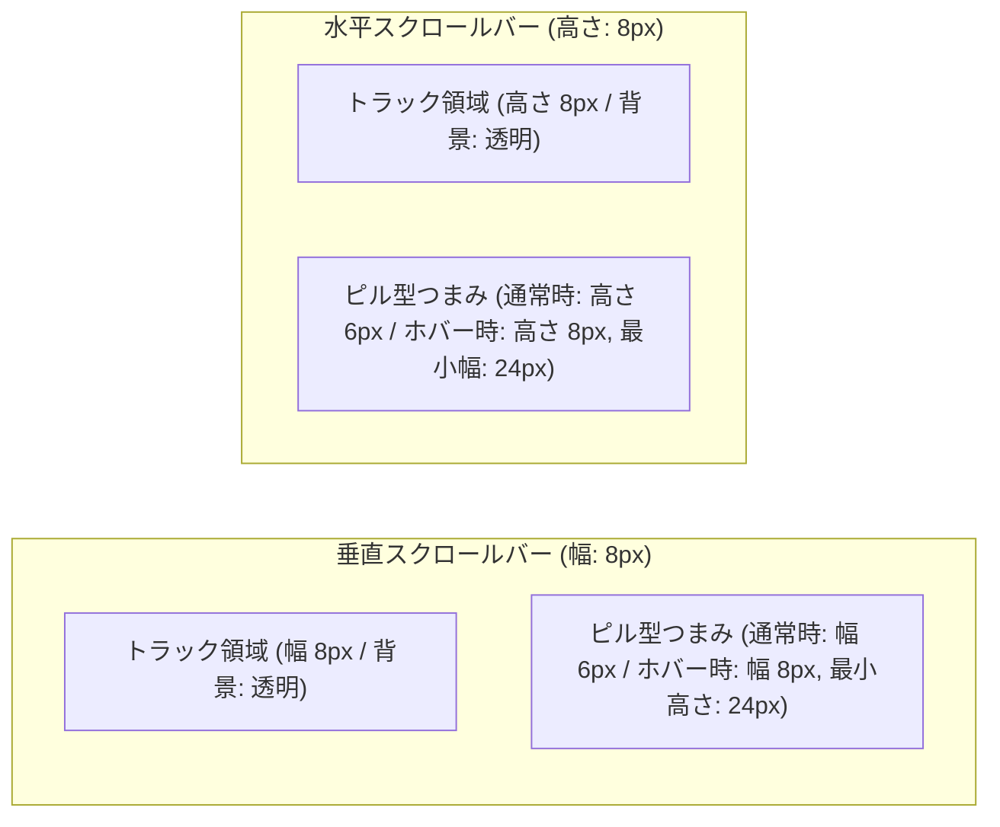

# スクロールバー 画面設計

## 1. 概要
本設計書は、アプリケーション全体で利用されるスクロールバーを、OS標準（WPF既定）の立体的な矢印ボタン付きスタイルから、スリム（幅6〜8px）・角丸ピル形状・テーマ連動（ダーク/ライト）のモダンでミニマルなデザインへと刷新するためのUI仕様を定義します。

従来の太いスクロールバー（約17px）がコンテンツ表示領域を圧迫していた問題を解消し、アルバムグリッドや楽曲トラックリスト、各種ダイアログにおいて、洗練された統一感のあるビジュアル体験を提供します。

---

## 2. 画面レイアウトと寸法仕様

### 2.1 垂直・水平スクロールバーの寸法仕様

| 項目 | 垂直スクロールバー (Vertical) | 水平スクロールバー (Horizontal) |
| :--- | :--- | :--- |
| **バー全体の寸法** | 幅: 8px（固定） | 高さ: 8px（固定） |
| **トラック（背景）** | 完全透明（`Transparent`） | 完全透明（`Transparent`） |
| **つまみ（Thumb）通常時** | 幅: 6px（中央配置・余白1px） | 高さ: 6px（中央配置・余白1px） |
| **つまみ（Thumb）ホバー時** | 幅: 8px（トラック全幅へ拡大） | 高さ: 8px（トラック全高へ拡大） |
| **つまみの最小サイズ** | 最小高さ: 24px（掴みやすさ確保） | 最小幅: 24px（掴みやすさ確保） |
| **角丸半径 (CornerRadius)** | `3px`（ピル型長方形） | `3px`（ピル型長方形） |
| **矢印ボタン** | 完全排除（非表示・非配置） | 完全排除（非表示・非配置） |

---

## 3. インタラクションとビジュアルフィードバック

### 3.1 状態別ビジュアル仕様

| 状態 | つまみサイズ | つまみ背景色 (DarkTheme) | つまみ背景色 (LightTheme) | 動作・視覚効果 |
| :--- | :--- | :--- | :--- | :--- |
| **通常時 (Normal)** | 6px | `ScrollBarThumbBrush` (`#424C5E`) | `ScrollBarThumbBrush` (`#CBD5E1`) | 背景に馴染む控えめな色合いで表示。 |
| **ホバー時 (MouseOver)** | 8px (拡大) | `ScrollBarThumbHoverBrush` (`#607088`) | `ScrollBarThumbHoverBrush` (`#94A3B8`) | スクロールバーまたはつまみへのホバーで幅が2px拡大し、明るい色へ遷移。 |
| **ドラッグ時 (Active)** | 8px (拡大) | `ScrollBarThumbDraggingBrush` (`#00FFFF`) | `ScrollBarThumbDraggingBrush` (`#0078D7`) | つまみを掴んでドラッグしている間、テーマのアクセントカラーに点灯。 |

### 3.2 ページ送り操作
- つまみ（Thumb）以外のトラック領域をクリックすると、OS標準と同様に1画面分のページスクロール（PageUp / PageDown、PageLeft / PageRight）がスムーズに動作します。

---

## 4. テーマ連動（Dark / Light）

スクロールバーの色設定はアプリケーション全体のテーマ設定と完全連動します。

| リソースキー | ダークテーマ (Dark) | ライトテーマ (Light) | 役割 |
| :--- | :--- | :--- | :--- |
| `ScrollBarTrackBrush` | 完全透明 (`#00000000`) | 完全透明 (`#00000000`) | トラック背景（コンテンツの邪魔をしない） |
| `ScrollBarThumbBrush` | `#424C5E` | `#CBD5E1` | 通常時のつまみ色（背景との調和） |
| `ScrollBarThumbHoverBrush` | `#607088` | `#94A3B8` | ホバー時のつまみ色（明度向上） |
| `ScrollBarThumbDraggingBrush` | `#00FFFF`（ネオンシアン） | `#0078D7`（アクセントブルー） | ドラッグ中のつまみ色（アクティブ強調） |

---

## 5. アプリケーション各画面への適用範囲

- **ライブラリ画面 (`LibraryView.xaml`)**:
  - アルバム一覧グリッド表示、楽曲一覧リスト表示に自動適用。
  - ※ アルバムカード展開トレイ（ソケットトレイ）は専用の極細スタイル（3px）を維持。
- **メイン画面 (`MainWindow.xaml`)**:
  - 右側パネルのアルバム収録曲リストに自動適用。
- **プレイリスト画面 (`PlaylistTracksView.xaml`, `PlaylistSelectorView.xaml`)**:
  - プレイリスト収録曲、プレイリスト一覧に自動適用。
- **ダイアログ類 (`SettingsDialog.xaml`, `DeviceManagerDialog.xaml`, `PlaylistSelectionDialog.xaml`)**:
  - 設定一覧、デバイス一覧、プレイリスト選択リストに自動適用。
- **機器転送画面 (`DeviceSyncView.xaml`)**:
  - デバイス内・PC内の各アルバム選択リストに自動適用。

---

## 6. 関連Issue
- 親Issue: #51
- 実装Issue: #180
