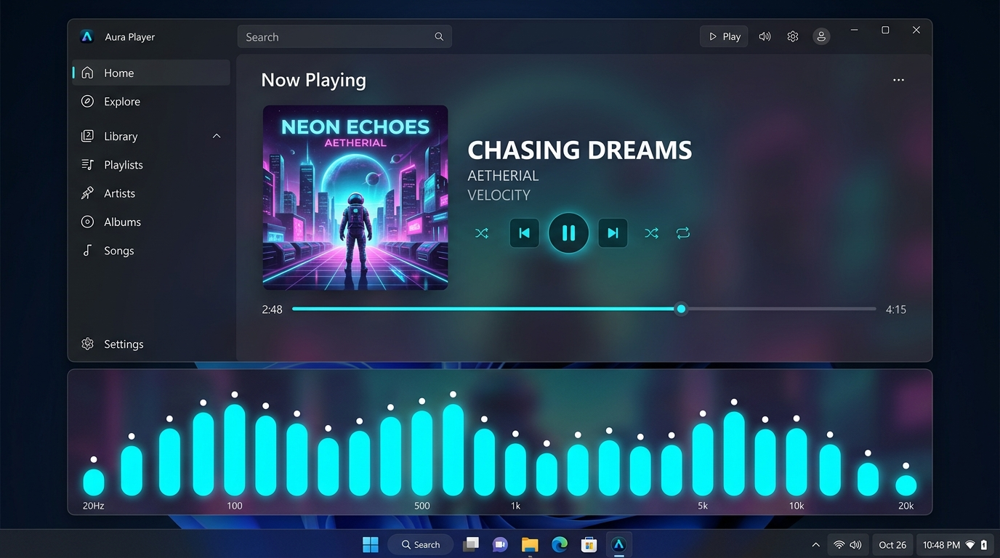

# スペクトラムアナライザ 画面設計

## 1. 概要
スペクトラムアナライザは、現在再生されている楽曲の周波数成分（低音〜高音）を視覚的にリアルタイム表示するUIコンポーネントです。
プロフェッショナルなDAW（デジタル・オーディオ・ワークステーション）や最新DJ機器を想起させる高密度スレンダー・ネオンスタイルを採用し、ウィンドウ最下部に配置されています。

## 2. 実装イメージ（モックアップ）

## 3. 画面レイアウトと構成

### 3.1 最下部配置とサイズ（高さ140px）
- ウィンドウ最下部に配置され、展開時の高さは約140pxです。

### 3.2 画面サイズ非依存のアスペクト比・寸法固定（中央配置）
- ウィンドウ幅やタブのサイズ伸縮にかかわらず、スペクトラムアナライザの描画領域は中央（Width: 768px）に配置され、**常に一定の縦横比およびバーの太さ・間隔**を維持します。
- 画面サイズを変更してもバーが横に引き伸ばされたり潰れたりせず、常に設計通りのプロポーションで表示されます。

### 3.3 トグルハンドルバー（展開・格納切り替え）
- スペクトラム領域の最上部に、高さ22pxの薄いハンドルバーを設置。
- 中央に「SPECTRUM ANALYZER」のラベルと矢印アイコン（▲/▼）を配置。
- クリックすることで、スペクトラム領域の展開（スライドオープン）と格納（スライドクローズ）を直感的に切り替え可能です。

### 3.4 6分割周波数インジケーター（目盛りラベル）
- スペクトラムバーの上部に、周波数帯域の目安を示す6つの代表ラベル（`60Hz`, `250Hz`, `500Hz`, `1kHz`, `4kHz`, `16kHz`）を均等配置。
- 上品なフォントと控えめなコントラストで表示し、視覚的な情報性と美しさを両立します。

### 3.5 アナライザー測定グリッド罫線（縦・横リファレンスライン）
- スペクトラムバーの背面に、鮮明でハイテクな縦横のグリッド罫線を表示。
  - **水平罫線**: 音量レベルの目安となる4段階の基準ライン（`#38FFFFFF`, `#30FFFFFF`, `#28FFFFFF`, `#20FFFFFF`）。
  - **垂直罫線**: 6つの周波数帯域を分割するディバイダーライン（`#30FFFFFF`）。
- 測定器やオーディオアナライザーのディスプレイのようなハイテク感と「データをリアルタイム計測している質感」を演出します。

### 3.6 スライドアニメーション
- トグル操作に応じて、下からスムーズにせり上がる（Slide In: 0px → 140px）、または下へ引き下がる（Slide Out: 140px → 0px）イージングアニメーション（QuadraticEase）が動作します。

## 4. ビジュアルデザインとエフェクト

### 4.1 高密度スレンダー・ネオンバー（64本構成）
- 64本の高密度バーを中央に配置。
- 各バーの幅を細身（固定6px・間隔6px）に設定し、細かな音のニュアンスや速いビートにも機敏に反応するプロフェッショナルな質感を表現します。

### 4.2 周波数帯域ごとの調整係数（低域抑制・高域強化）
- 低音から高音（シンバル/ハイハット）まで全帯域が均整の取れたダイナミックな躍動感を持つよう、以下のチューニング係数を実装：
  - **低音域スケール (`SpectrumBassScale: 0.55`)**: 低音（キック/ベース）が過剰に天井へ張り付かないよう抑制。
  - **中音域スケール (`SpectrumMidScale: 0.90`)**: ボーカルや主旋律の明瞭な動きを維持。
  - **高音域スケール (`SpectrumTrebleScale: 2.90`)**: 2.5kHz〜18kHzの高音域を大幅に持ち上げ、シンバルやハイハットの跳躍を鮮やかに表現。
  - **高音域チルト補正 (`SpectrumTrebleTiltDb: 8.5dB/oct`)**: 250Hz以上に対してオクターブ単位でdB感度を底上げ。

### 4.3 リッチな縦方向ネオングラデーション＆グロー
- 下部（ディープパープル/マゼンタ）→ 中央（ネオンシアン/ブルー）→ 頂点（ホワイト発光）へと変化する縦方向の多色グラデーションを適用。
- 各バーには発光グロー効果（`DropShadowEffect`）を施し、暗い背景にネオンが鮮やかに浮かび上がる演出を行います。

### 4.4 水面ミラーリフレクション（反射効果）
- ベースライン直下に、バーのアニメーションを上下反転した微かな光の反射（`VisualBrush` + `BlurEffect`）を配置し、水面に映り込むネオンのような奥行きと立体感を演出します。

### 4.5 背景コントラスト
- 背面には再生中アルバムアートのブラー画像と、ダークグラデーションのオーバーレイを重ね、バーの発光と視認性を最大限に引き立てます。

## 5. 関連Issue
- 親Issue: #51
- 実装Issue: #87 (スペクトラムアナライザのUIデザイン改良)
