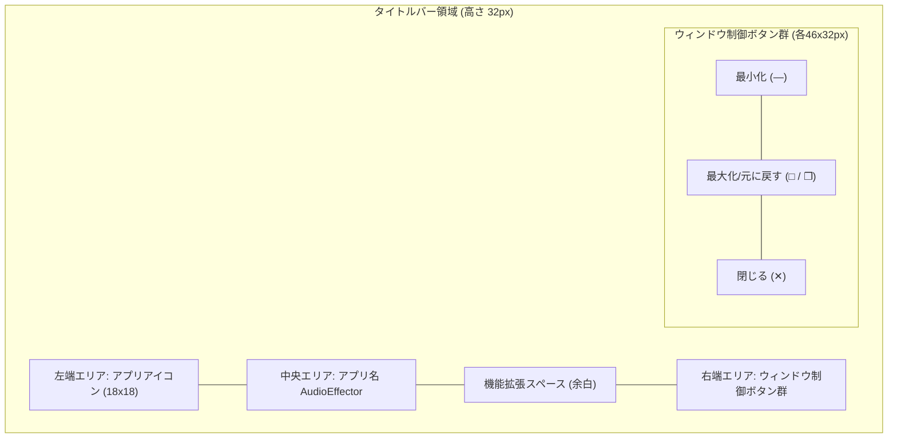

# カスタムタイトルバー 画面設計

## 1. 概要
アプリケーション画面の最上部にあるウィンドウ枠線（タイトルバー）を、OS標準のスタイルからアプリケーション独自のデザインへとカスタマイズした「カスタムタイトルバー」のUIレイアウトおよびビジュアル仕様を定義します。

左端にアプリアイコン、中央にアプリ名（AudioEffector）を配置し、右端に最小化・最大化・閉じるのウィンドウ制御ボタン群を設けるモダンなレイアウトを採用しています。また、中央と右端ボタン群の間には将来の機能追加（検索バー、通知ボタン、クイックアクション等）を見据えた拡張スペースを確保しています。
さらに、アプリケーションのカラーテーマ（ダーク/ライト）の切り替えに連動してタイトルバーの配色が自動で自然に切り替わります。

---

## 2. 画面レイアウトと構成

### 2.1 タイトルバー領域の寸法と配置
- **配置**: ウィンドウ最上部（ルートGrid Row 0）を横断して配置。
- **高さ**: 32px（固定）。
- **背景**: テーマ連動ブラシ（`TitleBarBackgroundBrush`）。

### 2.2 各エリアの構成

| エリア | 水平配置 | コントロール | 説明 |
| :--- | :--- | :--- | :--- |
| **左端エリア** | 左揃え (`Left`) | `Image` (18x18px) | アプリアイコン画像 (`Audio_Effector_icon_1.0.1.ico`) を左余白 10px で表示。クリックヒットテストは無効化し、ドラッグ領域として機能。 |
| **中央エリア** | 中央揃え (`Center`) | `TextBlock` | アプリ名「AudioEffector」をウィンドウ中央に配置。フォントサイズ 12px、太さ SemiBold。 |
| **拡張スペース** | 中央〜右端間 (`Right`) | `StackPanel` (`TitleBarExtensionArea`) | 将来的な機能ボタン（検索、通知、クイックアクション等）を配置するための余白領域。右余白 12px。 |
| **右端エリア** | 右揃え (`Right`) | `Button` x 3 | ウィンドウ制御ボタン群（最小化、最大化/元に戻す、閉じる）。各ボタン幅 46px、高さ 32px。 |

---

## 3. インタラクションとビジュアルフィードバック

### 3.1 ウィンドウ操作ボタンのフィードバック

| ボタン | 通常時背景 | ホバー時背景 | 押下時背景 | アイコン色（通常） | アイコン色（ホバー/押下） |
| :--- | :--- | :--- | :--- | :--- | :--- |
| **最小化** | 透明 | `TitleBarButtonHoverBrush` | `TitleBarButtonPressedBrush` | `TitleBarForegroundBrush` | `TitleBarForegroundBrush` |
| **最大化 / 元に戻す** | 透明 | `TitleBarButtonHoverBrush` | `TitleBarButtonPressedBrush` | `TitleBarForegroundBrush` | `TitleBarForegroundBrush` |
| **閉じる** | 透明 | `TitleBarCloseButtonHoverBrush` (`#E81123`) | `TitleBarCloseButtonPressedBrush` (`#B2101E`) | `TitleBarForegroundBrush` | `White` (`#FFFFFF`) |

### 3.2 最大化 / 元に戻すボタンの動的アイコン切り替え
- **通常表示時 (`WindowState == Normal`)**:
  - アイコン: 単一の正方形（最大化アイコン）
  - ツールチップ: 「最大化」
- **最大化表示時 (`WindowState == Maximized`)**:
  - アイコン: 重なり合う2つの正方形（元に戻すアイコン）
  - ツールチップ: 「元に戻す」

### 3.3 タイトルバー領域のドラッグとダブルクリック
- ボタン以外のタイトルバー領域をドラッグすることで、OS標準のウィンドウ移動およびスナップ操作（Aero Snap）が行えます。
- タイトルバー領域をダブルクリックすることで、最大化と通常サイズのトグル切り替えが行えます。

---

## 4. テーマ連動（Dark / Light）

タイトルバーの配色は、アプリケーション全体のテーマ設定と完全連動します。

| リソースキー | ダークテーマ (Dark) | ライトテーマ (Light) | 用途 |
| :--- | :--- | :--- | :--- |
| `TitleBarBackgroundBrush` | `#161920` | `#F5F5F5` | タイトルバーの背景色 |
| `TitleBarForegroundBrush` | `#F0F4F8` | `#1E1E1E` | アプリ名およびボタンの通常時アイコン色 |
| `TitleBarBorderBrush` | `#2A323D` | `#E2E8F0` | 通常表示時のウィンドウ外枠境界線色 |
| `TitleBarButtonHoverBrush` | `#2A323D` | `#E5E5E5` | 最小化・最大化ボタンのホバー色 |
| `TitleBarButtonPressedBrush` | `#384454` | `#CCCCCC` | 最小化・最大化ボタンの押下色 |
| `TitleBarCloseButtonHoverBrush` | `#E81123` | `#E81123` | 閉じるボタンのホバー色（鮮やかな赤） |
| `TitleBarCloseButtonPressedBrush` | `#B2101E` | `#C4101E` | 閉じるボタンの押下色（深い赤） |

---

## 5. ウィンドウ最大化時の境界調整
`WindowChrome` を利用したウィンドウ最大化時、OSの見えないリサイズ境界によって端が画面外にはみ出る問題を防ぐため、`WindowState == Maximized` の際にルートコンテナに 7px の外周マージンを自動適用し、タスクバーや画面端の閉じるボタンが見切れないよう調整されています。

---

## 6. 関連Issue
- 親Issue: #51
- 実装Issue: #165
