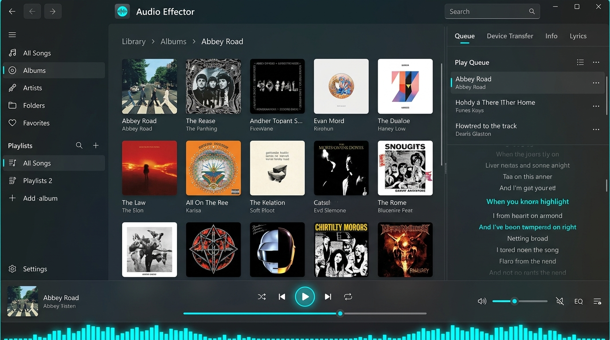

# 全体レイアウト・ペイン構成UI仕様書

## 1. 概要

本仕様書は、Audio EffectorのUI/UXをオブジェクト指向UI（OOUI）へ移行するプロジェクト（#233）のPhase 3.1として、アプリケーション全体の基本構造である画面レイアウトおよびペイン分割構造を定義するものです。

従来のタスク指向UIや画面単位の全画面切り替えを排し、ユーザーが常に「オブジェクト（楽曲・アルバム・アーティスト・プレイリスト・機器）」を直接認識・操作できる「3ペイン＋常設プレイヤーバー」のモードレスな統合レイアウトを確立します。
また、プレイヤー操作が複数箇所に重複定義されていた構造を解消し、常に一貫したリスニング環境と操作導線を提供します。

---

## 2. 実装イメージ（モックアップ）

Windows 11 Fluent Design（Micaエフェクト、ダークテーマ、ネオンシアンアクセントカラー `#00FFFF`）に準拠した統合3ペインレイアウトの実装イメージです。



---

## 3. 構造分析とTo-Beレイアウト方針

### 3.1 構造上の課題と解決アプローチ

| 構成領域 | 従来の構造と課題 | To-Be解決アプローチ |
| :--- | :--- | :--- |
| **プレイヤー操作の二重配置** | 上部コンパクトバー（60px）と右側パネル内の2箇所にプレイヤーが重複定義され、XAMLが1,600行超に肥大化。右パネル開閉時に上部バーが縮退する複雑な連動が認知的混乱を誘発 | **画面下部に常設プレイヤーバー（72px）を一元化**。画面遷移や右側パネルの開閉状態に一切依存せず、常に同一位置・同一操作で再生状態を把握・制御可能とする |
| **タイトルバーとナビゲーション** | タイトルバーにアプリ名と最小化/最大化/閉じるボタンのみが配置され、戻る/進む履歴導線が欠落 | タイトルバー左端に**「戻る（GoBack）」「進む（GoForward）」ボタン**を統合配置。マウスサイドボタンやショートカットと連携したグローバル履歴移動を実現 |
| **メインワークスペース** | パンくずリストが存在せず、アーティストやアルバムのドリルダウン時に自分がどこにいるか、親階層へどう戻るかが直感的でない | ワークスペース最上部に**パンくずリスト（Breadcrumbs）**を常時配置し、階層表示と親階層へのワンクリック復帰をサポート |
| **右側パネルの独立性** | 再生キュー、アルバム詳細、端末転送、歌詞表示がそれぞれ別個のオーバーレイや個別パネルとして混在 | **右スライドパネル（マルチタブコンテナ）**へ統合。タブまたはアイコンで切り替え、端末接続時は自動で「端末転送」タブが展開 |
| **ペイン境界のリサイズ** | パネル幅が固定アニメーション（開く/閉じる）のみで、境界の幅調整が不可 | 中央ワークスペースと右側パネルの境界に **`GridSplitter`** を導入し、大画面環境での自由な幅調整を可能とする |

---

## 4. レイアウトとデザイン

### 4.1 全体グリッド構造 (Grid Definitions)

ウィンドウ全体は、外側の `Border`（ウィンドウ枠・リサイズ境界）の内側に、縦方向（Rows）と横方向（Columns）の階層的グリッド構造として設計します。

```
+-----------------------------------------------------------------------------------------+
| [Row 0] タイトルバー (Height: 32px, Fixed)                                              |
|  [戻る/進む] [アイコン] [アプリ名: Audio Effector]              [検索バー] [最小/最大/閉]  |
+-----------------------------------------------------------------------------------------+
| [Row 1] メインボディ (Height: *, Variable)                                              |
| +-------------------+-------------------------------------+---+-----------------------+ |
| | [Col 0]           | [Col 1]                             |Col| [Col 3]               | |
| | 左サイドバー       | 中央ワークスペース                  | 2 | 右スライドパネル      | |
| | (幅: 220px/50px)  | (幅: 1*, MinWidth: 400px)           |   | (幅: 320px〜400px)    | |
| |                   |  [パンくずリスト (Breadcrumbs)]     | S |  [タブヘッダー]       | |
| | ・ライブラリ      |  ---------------------------------  | P |  Queue / Device /     | |
| | ・プレイリスト    |  コレクション / シングルビュー      | L |  Info / Lyrics        | |
| | ・ツール・設定    |  (AllSongs, AlbumCards, SplitView)  | I |  -------------------- | |
| |                   |                                     | T |  各パネルコンテンツ   | |
| +-------------------+-------------------------------------+---+-----------------------+ |
+-----------------------------------------------------------------------------------------+
| [Row 2] 常設プレイヤーコントロールバー (Height: 72px, Fixed)                            |
|  [ジャケット/曲情報]        [再生操作 & プログレスバー]         [音量 / EQ / キュー展開]   |
+-----------------------------------------------------------------------------------------+
| [Row 3] スペクトラムアナライザストリップ (Height: Auto, 0〜100px トグル開閉)             |
|  [ネオンシアン 64バンド バー表示]                                                        |
+-----------------------------------------------------------------------------------------+
```

### 4.2 XAML擬似構造レイアウト

```xml
<Grid x:Name="RootLayoutGrid">
    <Grid.RowDefinitions>
        <RowDefinition Height="32" />     <!-- Row 0: Custom Title Bar -->
        <RowDefinition Height="*" />      <!-- Row 1: Main 3-Pane Body -->
        <RowDefinition Height="72" />     <!-- Row 2: Persistent Player Bar -->
        <RowDefinition Height="Auto" />   <!-- Row 3: Spectrum Analyzer Strip -->
    </Grid.RowDefinitions>

    <!-- Row 0: Custom Title Bar -->
    <views:CustomTitleBar Grid.Row="0" />

    <!-- Row 1: Main 3-Pane Body -->
    <Grid Grid.Row="1" x:Name="MainBodyGrid">
        <Grid.ColumnDefinitions>
            <!-- Col 0: Left Sidebar (Fixed / Collapsible) -->
            <ColumnDefinition x:Name="LeftSidebarColumn" Width="220" MinWidth="50" MaxWidth="300" />
            <!-- Col 1: Center Workspace (Flexible) -->
            <ColumnDefinition x:Name="WorkspaceColumn" Width="1*" MinWidth="400" />
            <!-- Col 2: GridSplitter (Divider) -->
            <ColumnDefinition x:Name="SplitterColumn" Width="Auto" />
            <!-- Col 3: Right Side Panel (Collapsible / Resizable) -->
            <ColumnDefinition x:Name="RightPanelColumn" Width="340" MinWidth="0" MaxWidth="500" />
        </Grid.ColumnDefinitions>

        <!-- Col 0: Left Navigation Sidebar -->
        <views:SidebarControl Grid.Column="0" />

        <!-- Col 1: Center Workspace (Breadcrumbs + Content) -->
        <Grid Grid.Column="1">
            <Grid.RowDefinitions>
                <RowDefinition Height="Auto" /> <!-- Breadcrumbs Bar -->
                <RowDefinition Height="*" />    <!-- Dynamic Workspace View -->
            </Grid.RowDefinitions>
            <views:BreadcrumbsBar Grid.Row="0" />
            <ContentControl Grid.Row="1" Content="{Binding CurrentWorkspaceViewModel}" />
        </Grid>

        <!-- Col 2: Vertical GridSplitter -->
        <GridSplitter Grid.Column="2" Width="4" HorizontalAlignment="Center" VerticalAlignment="Stretch"
                      Background="Transparent" ShowsPreview="False" />

        <!-- Col 3: Right Slide Panel Container -->
        <views:RightSidePanelContainer Grid.Column="3" />
    </Grid>

    <!-- Row 2: Persistent Player Bar -->
    <views:PlayerControlBar Grid.Row="2" />

    <!-- Row 3: Spectrum Analyzer Strip -->
    <views:SpectrumAnalyzerStrip Grid.Row="3" />

    <!-- Overlay Layer: Toast Notification Area -->
    <views:ToastNotificationOverlay Panel.ZIndex="1000" VerticalAlignment="Top" HorizontalAlignment="Right" Margin="0,40,20,0" />
</Grid>
```

### 4.3 各ペインの詳細仕様

#### 1. タイトルバー (`CustomTitleBar`, Height: 32px)
- **左領域**:
  - アプリアイコン（18x18px）
  - 戻るボタン（`GoBackCommand`, 28x28px）: 履歴がある場合のみ有効化。
  - 進むボタン（`GoForwardCommand`, 28x28px）: 戻った履歴がある場合のみ有効化。
- **中央領域**:
  - アプリケーション名（「Audio Effector」, セミボールド, 12pt, 中央配置, ヒットテスト透過）
- **右領域**:
  - グローバル検索バー（幅180px、クイック絞り込み対応）
  - 最小化ボタン（`TitleBarMinimizeButton`）
  - 最大化/元に戻すボタン（`TitleBarMaximizeButton`）
  - 閉じるボタン（`TitleBarCloseButton`, ホバー時赤背景）

#### 2. 左ナビゲーションサイドバー (`SidebarControl`, Width: 220px / 50px)
- **上部ナビゲーションリスト**:
  - すべての曲 (`AllSongs`)、アルバム (`Albums`)、アーティスト (`Artists`)、フォルダ (`Folders`)、お気に入り (`Favorites`)。
- **プレイリストセクション (常設展開)**:
  - セクションヘッダー横にクイック検索（虫眼鏡 🔍）アイコンと新規作成（＋）ボタンを配置。
  - **独立スクロールコンテナ (`ScrollViewer` + UI仮想化)** により、プレイリスト数が増加してもサイドバー下部メニューが画面外へ押し出されない構造。
  - 折りたたみ可能な `Expander` 構造をサポート。
- **下部固定ツールエリア**:
  - イコライザー (`Equalizer`)、設定 (`Settings`) を常に最下部に固定表示。

#### 3. 中央ワークスペース (`WorkspaceColumn`, Width: 1*, MinWidth: 400px)
- **パンくずリスト領域 (高さ: 36px)**:
  - 現在閲覧中のオブジェクト階層（例: `ライブラリ > アーティスト > Queen > A Night at the Opera`）を常時表示。
  - 各親ノードをクリックすることで、即座に該当階層へダイレクト復帰可能。
- **コンテンツ表示領域**:
  - コレクションビュー（楽曲テーブル、アルバムカードグリッド、フォルダツリー）およびシングルビュー（アルバム詳細、アーティストSplitViewドリルダウン）を展開。
  - ビュー切り替えはモードレスに行われ、下部プレイヤーの再生を一切中断しない。

#### 4. 右スライドパネル (`RightSidePanelContainer`, Width: 340px, MinWidth: 280px)
- **マルチタブヘッダー (高さ: 36px)**:
  - **Queue (再生キュー)**: 予約キューとアルバム残り曲のセクション分離表示、ドラッグ並び替え。
  - **Device Transfer (端末転送)**: 外部機器接続時に自動選択展開。転送先既定フォルダ、空き容量予測、差分転送トグル、トランスコード設定、端末からの逆同期（取り込み）。
  - **Info (詳細情報)**: 選択中アルバム/トラックのアートワーク、ビットレート、形式、タグ情報。
  - **Lyrics (同期歌詞)**: 埋め込みタグまたはLRC歌詞のリアルタイムハイライトスクロール表示。
- **開閉トグル**:
  - プレイヤーバーの各アイコン（キューボタン、歌詞ボタン等）またはパネルヘッダー右上の「✕」ボタンでスムーズに開閉。

#### 5. 常設プレイヤーバー (`PlayerControlBar`, Height: 72px)
- **左エリア (Track Information, 幅: 260px)**:
  - ミニアルバムアートワーク（48x48px, 角丸4px）
  - タイトル（14pt, セミボールド, 長文時マーキースクロール）
  - アーティスト名（12pt, ミュート色）
  - お気に入りトグルボタン（ハートアイコン）
- **中央エリア (Controls & Progress, 幅: 480px)**:
  - 上段: シャッフル、前へ、再生/一時停止（ネオンシアンアクセント、中央配置）、次へ、リピート。
  - 下段: 現在再生時間（11pt）、ネオンプログレスシークバー（中央可変）、残り/総時間（11pt）。
- **右エリア (Extra & Volume, 幅: 240px)**:
  - 音量ミュートボタン & スライダー（幅80px）
  - イコライザー（EQ）トグルボタン
  - 歌詞パネルトグルボタン
  - 再生キュートグルボタン

#### 6. スペクトラムアナライザストリップ (`SpectrumAnalyzerStrip`, Height: Auto, 0〜100px)
- プレイヤーバーの直下に配置。
- トグルボタンにより高さ0（非表示）〜100px（展開）をスムーズに切り替え。
- 64バンドの高密度ネオンシアンバーが音楽の周波数帯域に合わせてリアルタイムに躍動。

#### 7. トースト通知レイヤー (`ToastNotificationOverlay`, ZIndex: 1000)
- 外部機器接続時やタスク完了時に、画面右上に非干渉なカード型トースト通知をポップアップ表示。
- クリックにより右側パネル（端末転送タブ）への即時連動を実現。

---

## 5. アニメーションとインタラクション

### 5.1 ペイン境界リサイズとアニメーション
- **GridSplitter ドラッグリサイズ**:
  - 中央ワークスペースと右側パネルの境界に配置されたスプリッターをドラッグすることで、パネル幅を `280px` 〜 `500px` の範囲で無段階調整可能。
  - ダブルクリックにより、推奨デフォルト幅（`340px`）へリセット。
- **右側パネルの開閉アニメーション**:
  - パネル開閉時、`ColumnDefinition.Width` に対して CubicEase による滑らかなスライドアニメーション（所要時間: 250ms）を適用。
  - パネルを閉じた状態（幅: 0px）では、中央ワークスペースが自動的に右端まで全幅拡張。

### 5.2 レスポンシブ挙動（画面サイズ適応）

Audio Effectorは、小型ノートPCからウルトラワイドディスプレイまで快適に利用できるよう、以下のブレークポイントに応じたレスポンシブな振る舞いを定義します：

| ウィンドウ幅 | レイアウト状態 | 自動調整の振る舞い |
| :--- | :--- | :--- |
| **幅 1280px 以上** (標準〜大画面) | 3ペイン常時展開 | 左サイドバー（220px）、中央ワークスペース（全幅）、右パネル（340px）をすべて同時に並行展開可能 |
| **幅 1100px 〜 1279px** (中画面) | 3ペイン標準 | 右パネルを開いた際、中央ワークスペースが自動的に縮小（アルバムカードの列数が自動減少） |
| **幅 960px 〜 1099px** (小画面) | 右パネルオーバーレイ化 | 中央ワークスペースの最小幅（400px）を死守するため、右パネル展開時は中央ワークスペース右側へ半透明のオーバーレイ（ドロワー）として重なり展開 |
| **幅 960px 未満** (最小制限: 960x600) | サイドバーコンパクト化 | ウィンドウの最小サイズ（`MinWidth="960"`, `MinHeight="600"`）によりこれ以下の縮小を抑止。左サイドバーをアイコンのみのコンパクトモード（幅50px）へ自動切り替え |

### 5.3 ペイン間のダイレクト・マニピュレーション
- **中央ワークスペース → 右側パネル（再生キュー）**:
  - ワークスペース内の楽曲リスト行またはアルバムカードを右側パネルの再生キューへドラッグ＆ドロップし、予約キューへの即時割り込み登録を可能とする。
- **中央ワークスペース → 左サイドバー（プレイリスト）**:
  - 選択楽曲またはアルバムを、左サイドバー内の特定プレイリスト項目へドラッグ＆ドロップして即座に追加。

---

## 6. 配色とテーマ設計 (Color Tokens)

Windows 11 Fluent Designおよび本アプリの象徴であるサイバー・モダン・ダークテーマを構成するカラートークン一覧です。

| トークン名 | カラーコード | 用途 |
| :--- | :--- | :--- |
| `WindowBackgroundBrush` | `#12171F` / `#0F1318` | ウィンドウ全体のベース背景（Mica効果透過） |
| `PanelBackgroundBrush` | `#18202A` | 左サイドバー、右パネル、プレイヤーバーの背景色 |
| `WorkspaceBackgroundBrush` | `#141A22` | 中央ワークスペースの背景色 |
| `ControlBackgroundBrush` | `#222D3B` | ボタン、入力フィールド、カードの背景色 |
| `NeonCyanBrush` | `#00FFFF` | 再生ボタン、アクティブタブ、シークバー、スペクトラムバー、ハイライト |
| `TitleBarBackgroundBrush` | `#10141B` | カスタムタイトルバーの背景色 |
| `BorderBrush` | `#2A3747` | ペイン境界線、カードボーダー、スプリッター |
| `TextForegroundBrush` | `#FFFFFF` | 主要タイトル、トラック名、アクティブテキスト |
| `MutedTextForegroundBrush` | `#8C9BAE` | アーティスト名、アルバム名、時間表示、非アクティブテキスト |

---

## 7. 関連Issue

- **親Issue**: #239 ([OOUI Phase3] レイアウトとインタラクションの設計)
- **対象Issue**: #240 ([OOUI Phase3.1] 全体レイアウト・ペイン構成の策定)
- **後続Issue**:
  - #241 ([OOUI Phase3.2] ダイレクト・マニピュレーション仕様の策定)
  - #242 ([OOUI Phase3.3] コンテキストメニュー・アクションの標準化)
