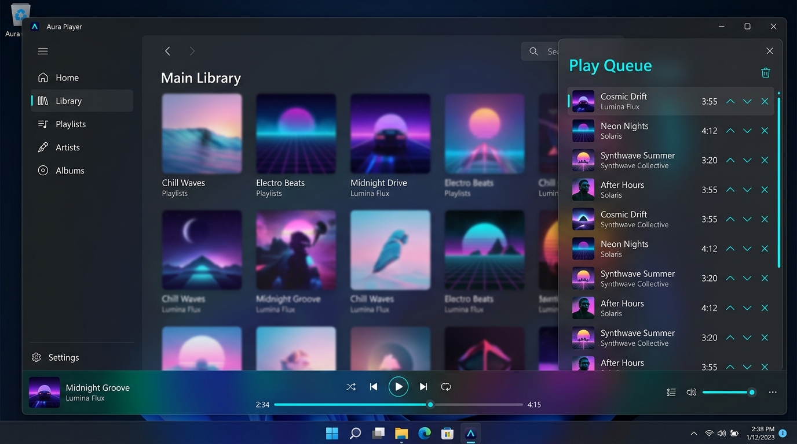

# 再生キュースライドパネル UI仕様書

## 1. 概要
本機能は、メイン画面の右側から滑らかにスライドアウトしてオーバーレイ表示されるサイドパネルUI（`PlayQueueSidePanel`）およびミニプレイヤー連携キューです。

ユーザーは楽曲ライブラリのブラウジングやイコライザー調整、アルバム詳細の閲覧など、メイン画面での操作を中断することなく、シームレスに再生キューの確認や編集（曲の削除・ドラッグ＆ドロップ並び替え・追加）、および「再生リスト／履歴」タブの切り替えによる再生履歴の振り返りを行うことができます。

なお、ミニプレイヤー（`MiniPlayerWindow`）においても、従来の独立ダイアログ（`PlayQueueDialog`）を完全撤廃し、ミニプレイヤー下部がアコーディオン状に下方に延長展開される一体型新デザイン（Issue #217）として共通のキュー体験を提供します。

## 2. 実装イメージ（モックアップ）
以下は、メイン画面の右側から再生キュースライドパネルが展開（スライドイン）した状態のイメージです。

## 3. レイアウトとデザイン

### パネル全体構成
- **配置場所**: メインウィンドウ（`MainWindow`）のメインクライアント領域（Row 1）右端にオーバーレイ配置（`HorizontalAlignment="Right"`, `Panel.ZIndex="30"`）。
- **サイズ**: 幅 360px、高さはウィンドウに連動（Stretch）。
- **背景・境界線**: 
  - 背景: `{DynamicResource WindowBackgroundBrush}`
  - 左境界線: 幅 1px、`{DynamicResource ControlBorderBrush}`（メイン領域との境界を明確に区切る）。

### セクション構成
1. **ヘッダー領域**:
   - **タイトル**: 「再生キュー」を水色ネオン色（`{DynamicResource AlwaysNeonCyanBrush}`）かつ太字で表示。ライト/ダーク共通で鮮明な水色ハイライトを維持。
   - **アクションボタン群**:
     - **全クリアボタン**: ゴミ箱アイコン（Tooltip: 「すべてクリア」）。表示中タブに応じ、再生リスト全消去（再生停止連動）または履歴全消去を実行。
     - **閉じるボタン**: 右端に「×」アイコン（Tooltip: 「閉じる」）。クリックで `ClosePlayQueuePanelCommand` を実行してパネルを格納。

2. **タブ切り替え領域（再生リスト / 履歴）**:
   - ヘッダー直下に「再生リスト (N)」と「履歴 (N)」の2つのタブを配置。
   - **アクティブスタイル**: 選択中のタブには下線またはピル状ハイライト（`AlwaysNeonCyanBrush`）を適用し、太字で強調表示。
   - **非アクティブスタイル**: セカンダリテキストカラー（`MutedTextForegroundBrush`）で表示し、ホバーで視覚フィードバックを提供。
   - ワンクリックで表示領域（キューリスト／履歴リスト）を即座に切り替え。

3. **リスト表示領域（UI仮想化）**:
   - `ListBox` 内に各リストを縦方向に一覧表示（UI仮想化を適用）。
   - **UI仮想化（Virtualization）**: `VirtualizingPanel.IsVirtualizing="True"`、`VirtualizationMode="Recycling"`、`ScrollUnit="Pixel"` により、画面内に表示される数曲分のみをオンデマンドで生成。大量の項目が存在する場合でも、メモリ消費を最小限に抑え、滑らかなスクロールと高速なレンダリングを両立。

   #### A. 再生リスト（キュー）表示時
   - **空状態（Empty State）**: キューが0件の場合は、音符アイコンと「再生キューは空です」「楽曲やアルバムを右クリックして『キューに追加』できます」というガイドメッセージを中央に淡く表示。また、キュー全クリアまたは全削除により空となった際は、音声を即座に完全停止し、プレイヤー側の現在再生中情報（トラック名、アーティスト名、カバーアート、再生時間・プログレス）を未選択・初期状態へクリア表示。
   - **各トラックアイテムカード**:
     - **ドラッグハンドル / カード領域**: カード全体をドラッグ＆ドロップ可能（ドロップ先インジケータ線を表示）。
     - **アルバムアートサムネイル**: 36x36px（角丸 4px）。クリックで即時再生。
     - **再生中インジケータ**: 再生中の楽曲には半透明黒オーバーレイ（#80000000）＋水色ネオンハイライト（`AlwaysNeonCyanBrush`）の再生/一時停止アイコンを重畳表示（単一曲のみに排他表示）。
     - **楽曲メタデータ**:
       - トラック名: 13pt、セミボールド、長文時Ellipsis。
       - アーティスト名: 11pt、セカンダリグレー、長文時Ellipsis。
     - **再生時間**: `mm:ss` 形式で右側に表示。
     - **個別削除ボタン（×）**: クリックでキューから除外。
     - **右クリックコンテキストメニュー**:
       - 再生 / 一時停止
       - 次に再生
       - キューから削除
       - お気に入りに追加 / 解除
       - プレイリストに追加...
       - プロパティ
       - ファイルの場所を開く
       - *(※PlacementTargetのDataContext参照を確実に設定し、全メニューが正常に動作する構造)*

   #### B. 履歴リスト表示時
   - **空状態（Empty State）**: 履歴が0件の場合は、時計/履歴アイコンと「再生履歴はありません」「再生が終了した楽曲がここに表示されます」というガイドメッセージを中央に淡く表示。
   - **各履歴アイテムカード**:
     - アルバムアートサムネイル（36x36px）、楽曲タイトル、アーティスト名、再生時間を表示。
     - **右クリックコンテキストメニュー**:
       - 今すぐ再生（キュー先頭にセットして即時再生）
       - 次に再生
       - 再生リストに追加
       - 履歴から削除

## 4. アニメーションとインタラクション

### パネル開閉アニメーションと非表示時描画抑止
- **初期状態（アプリ起動時）**:
  - パネルは `Visibility="Collapsed"` かつ `IsHitTestVisible="False"`、`RenderTransform.X="380"` で初期化。起動時の描画オーバーヘッドを完全抑止し、高速起動（1〜2秒）を維持。
- **展開時（Slide-in）**:
  - 各種プレイヤーの「Play Queue」ボタンクリックで `TogglePlayQueuePanelCommand` が発火し、`IsPlayQueuePanelOpen` が `True` に切り替わります。
  - パネルの `RenderTransform.X` が `380`（画面外）から `0`（画面内）へ、`0.35秒` の `DoubleAnimation`（`CubicEase EasingMode="EaseOut"`）で滑らかにスライドイン。
- **格納時（Slide-out）**:
  - パネル右上の閉じるボタン（×）または再度「Play Queue」ボタンをクリックすると `0.30秒` で `380` へスライドアウトし、完了時に自動的に `Visibility="Collapsed"` に切り替わります。

### 再生モード（シャッフル）連動
- **シャッフルON**: キューリストの表示順序が、現在再生中楽曲を先頭に固定した状態でシャッフル再生順に瞬時に整列。
- **シャッフルOFF（穴あき復元・複数アルバム対応）**: 
  - アルバムなどの再生中に解除した場合、元のアルバム収録順に再生キューの順番を戻します。
  - 複数アルバムの楽曲が含まれている場合でも、**キューに追加した順（アルバム単位）でまとまり**、各アルバム内はトラック番号順に復元されます。
  - 元の順序において現在再生中の曲より前の曲（先行アルバム含む）は、**未再生であればキューから除外せず、再生中の曲の上（手前）に残します**。
  - シャッフル再生によって既に再生されて「履歴」に入っている曲は、履歴タブに残したままキュー側は穴あき（除外）とし、未再生の曲のみがアルバム順・トラック順で並びます。
  - 現在再生中楽曲の復元後キュー内の正しい位置にインジケータが追従し、音途切れなく再生を継続します。
- **シャッフル中の追加**: 
  - **アルバム単位の「次に再生」**: アルバム内の楽曲順がランダム（シャッフル）な状態で、まとめて現在再生中楽曲の直後に追加（割り込み）。
  - **「キューに追加」**: 現在曲以外の全キューリストを再シャッフルして均一にランダム配置。

### ドラッグ＆ドロップ並び替えインタラクション
- マウス左ボタンドラッグでアイテムを持ち上げ、挿入位置の境界に水平インジケータ線（ネオン水色）を描画。
- ドロップ時にコレクション順序を入れ替え、`AudioService` の内部再生リストへ即座に同期。
- シャッフル再生中であっても手動並び替えが最優先され、ドラッグした順序通りに再生が継続。

### アルバム途中トラック再生の挙動
- アルバム内の特定トラック（例: No.5）を再生した場合、それより前のNo（No.1〜No.4）はキューに追加されず、No.5〜末尾のみがキューに展開。
- シャッフルON時はNo.5が先頭固定され、後続曲（No.6〜末尾）がシャッフルされてキューにセット。

## 5. 関連Issue
- 親Issue: [Issue #211: [Epic] 再生キュー機能の全面刷新・安定化・UX向上](https://github.com/taketonnbo/Audio_Effector/issues/211)
- [Issue #212: [検討・仕様策定] 再生キューの機能洗い出しとシャッフル・リピート・空状態等の仕様策定・仕様書追記](https://github.com/taketonnbo/Audio_Effector/issues/212)
- [Issue #213: [バグ修正] シャッフル再生時に再生キューの曲リストが再生順にならない不具合の修正](https://github.com/taketonnbo/Audio_Effector/issues/213)
- [Issue #214: [バグ修正] シャッフル再生時に再生中アイコンが複数表示される不具合の修正](https://github.com/taketonnbo/Audio_Effector/issues/214)
- [Issue #215: [バグ修正] 再生キューにおいて右クリックコンテキストメニューの操作が効かない不具合の修正](https://github.com/taketonnbo/Audio_Effector/issues/215)
- [Issue #216: [機能追加] 再生キューの楽曲リストにおけるドラッグ＆ドロップによる再生順変更機能](https://github.com/taketonnbo/Audio_Effector/issues/216)
- [Issue #217: [機能変更] ミニプレイヤーでの再生キュー下部連結延長デザイン化および旧ダイアログの完全撤廃](https://github.com/taketonnbo/Audio_Effector/issues/217)
- [Issue #218: [機能追加] 再生キューの「再生リスト／履歴」タブ切り替え機能および再生終了曲の履歴管理](https://github.com/taketonnbo/Audio_Effector/issues/218)
