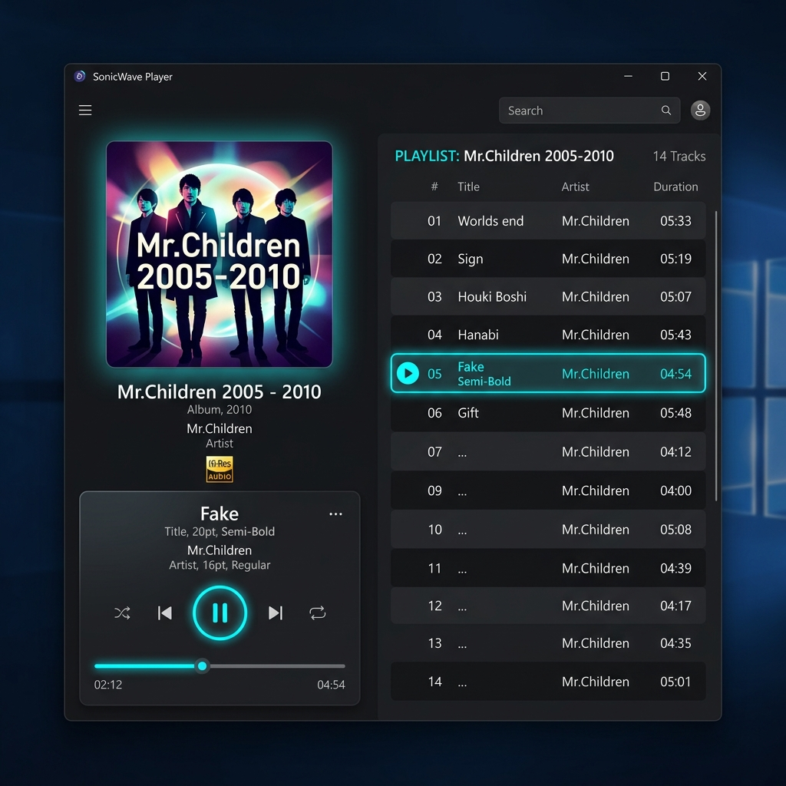

# 右側アルバム情報表示サイズ切り替え機能 UI仕様書

## 1. 概要
本画面仕様は、メイン画面右側パネルにおけるアルバム情報・プレイヤー表示領域の表示サイズを「最大化（全画面）」と「最小化（コンパクト）」の2段階で切り替えるUIコンポーネントおよびレイアウト設計を定義します。
ユーザーがアルバムの楽曲一覧を広く見たい場合（アルバム鑑賞モード）と、下半分の拡張タブ領域を広げたい場合（ライブラリ管理・分析モード）を、シンプルなトグル操作でシームレスに切り替えられるUIを提供します。

さらに、下部スペクトラムアナライザの開閉状態と連動してアルバムアートや各要素のサイズを動的に最適化し、下部余白（ブランク）の発生を防ぎながら画面領域を最大限活用したリッチなUIを実現します。

---

## 2. 実装イメージ（モックアップ）

### 2.1. 最大化表示（全画面モード・Pattern A: プレイヤーカード統合スタイル）
下半分の拡張タブ領域を折りたたみ、右側パネル全体に左右2カラム構成でアルバムアートおよび独立した角丸長方形コンテナ内のフルハイトトラックリストを展開した状態です。
左側には角丸アルバムアート、アルバム情報、および現在曲と操作系をまとめた半透明「Player Pod（プレイヤーカード）」を配置します。

### 2.2. 最小化表示（コンパクトモード）
トラックリストを非表示にし、上部にアルバムアート、曲名・アーティスト名、音質情報（Hi-Resバッジ、ビットレート/サンプリングレート等）、プレイヤーコントロールのみをコンパクトに表示した状態です。下部に広大な拡張タブ領域が確保されます。

---

## 3. レイアウトとデザイン

### 3.1. 表示モード別のレイアウト構成

| 表示モード | 構成要素 | 上部プレイヤー領域 | 下部拡張タブ領域 |
| :--- | :--- | :--- | :--- |
| **最大化表示（全画面・Pattern A）** | **【左カラム】角丸アルバムアート（アナライザ連動サイズ）・アルバム情報・半透明プレイヤーカード（Player Pod）** **【右カラム】独立した角丸長方形コンテナ内のPlaylistヘッダー ＆ 高コントラストゼブラトラックリスト** | 高さ 100% (`1*`) | 高さ 0% (`0*` / 非表示) |
| **最小化表示（コンパクト）** | 小型アルバムアート、タイトル、音質情報、再生コントロール（**トラックリスト非表示**） | 高さ 固定最小値 (`Auto`) | 残り全領域 (`1*` / 最大化) |

---

### 3.2. 詳細レイアウト構成

#### 🎵 最大化表示時（左右2カラム構成）

##### ① 左カラム（アートワーク・基本情報・プレイヤーカード）
*   **スペクトラムアナライザ連動の動的サイズ再編成**:
    画面下部のブランク発生を抑え、画面領域を有効活用するため、スペクトラムアナライザの開閉状態に応じて左カラム幅およびアルバムアートのサイズを動的に変更します。

    | スペクトラムアナライザ状態 | アルバムアートサイズ | 左カラム幅 | デザイン最適化のポイント |
    | :--- | :--- | :--- | :--- |
    | **表示中 (`IsSpectrumVisible = True`)** | `260 x 260px` | `340px` | 下部アナライザ領域とのバランスを保ち、縦スクロールなしで操作系をスッキリ配置 |
    | **非表示 (`IsSpectrumVisible = False`)** | `330 x 330px` | `380px` | 下部に生まれる広い余白（ブランク）を大迫力のアートワークと最適マージンで埋め、空間を有効活用 |

*   **【特大アルバムアート表示】**:
    *   **サイズ**: 260px × 260px（イコライザー閉時は 330px × 330px）。
    *   **角丸と縁取り**: 角の端のほうのみを自然に丸める微細な角丸（`CornerRadius="6"`）と、光の反射を演出するメタリック境界線（`BorderBrush="{DynamicResource MetallicCardBorderBrush}"`, `BorderThickness="1"`）を適用。
    *   **立体アンビエントシャドウ**: シアンの単色発光を排し、ディープスレート背景に自然に溶け込みつつ浮き上がる深みのあるソフトブラックシャドウ（`BlurRadius="22"`, `ShadowDepth="6"`, `Opacity="0.45"`）を適用。
    *   **滑らかな伸縮モーション**: アナライザ開閉と連動して 260px ⇔ 330px にスムーズにアニメーション変化。
*   **【アルバムメタ情報】**:
    *   アルバム名称（フォントサイズ **24pt**, Bold, テキストトリミング対応）
    *   アーティスト名称（フォントサイズ 13pt, Secondary Color）
    *   ゴールドバッジで品質ラベルを表示（例: `Hi-Res`、余分なアイコンは排したクリーンバッジ）、サンプリングレート・ビット深度・コーデックを表示（例: `FLAC 24bit/96kHz`）。
*   **【メタリック調プレイヤーカード (Player Pod)】**:
    *   アートワーク直下に、現在再生中の楽曲情報と操作系を一体化した角丸カード（`CornerRadius="12"`, `Padding="18,16"`）を配置。各要素が縦方向にゆったりと配置された一回り大きい美しい縦長デザイン。
    *   **メタリックグラデーション背景**: 左上が明るく右下が暗いリニアグラデーション（`MetallicCardBackgroundBrush`）と、光の反射を感じさせるエッジ境界線（`MetallicCardBorderBrush`）、および深みのあるソフトドロップシャドウにより、本物のオーディオハードウェアのような立体感を演出。
    *   **カード最上段（現在曲名）**:
        *   現在再生中トラック名（フォントサイズ **16pt**, SemiBold, シアン色、横幅いっぱい表示、テキストトリミング対応）
    *   **カード第2段（クイックアクション）**:
        *   曲名の一段下に十分な余白（約1.5倍の間隔）を確保して右揃えで再生キュー（`≡`）、プレイリスト追加（`＋`）、お気に入り（`♥`）を配置
    *   **カード第3段（センターフォーカス・操作ボタン群）**:
        *   シャッフルボタン (`🔀`): 有効時シアン点灯
        *   前へボタン (`⏮`)
        *   **大型シアン円形再生/一時停止ボタン (`▶` / `⏸`)**: 直径 **48px** の塗りつぶし円形アクセントボタン（ネオングロー効果付き）を中心配置
        *   次へボタン (`⏭`)
        *   リピートボタン (`🔁`): 有効時シアン点灯
    *   **カード第4段（延長ワイドシークバー）**:
        *   カード横幅いっぱいに延長されたシアン発光プログレススライダー（`NeonSliderStyle`）
    *   **カード最下段（タイムスタンプ）**:
        *   シークバーの一段下に、左揃えで現在時間（`02:12`）と右揃えで総時間（`04:54`）を美しく表示（フォントサイズ 11pt, `Consolas`）

##### ② 右カラム（メタリック調角丸長方形コンテナ内のトラックリスト）
*   **メタリック調角丸長方形カードコンテナ**:
    *   トラックリスト全体を、左上から右下へのメタリックリニアグラデーション（`MetallicCardBackgroundBrush`）とエッジボーダー（`MetallicCardBorderBrush`）、ドロップシャドウを施した角丸長方形コンテナ（`CornerRadius="12"`, `Padding="16,14"`）で囲み、洗練された統一感と高級感を演出。
*   **プレイリストヘッダー**:
    *   `Playlist: <アルバム名>` 形式のヘッダータイトル（アルバム名が長い場合は `...` で自動省略）を左側に配置し、右端に `10 Tracks` 形式で曲数を右揃え表示（テキストの重なりを完全防止）。
*   **トラックリスト行デザイン（動的テーマ完全連動・ゼブラストライプ）**:
    *   **行間隔**: 各行に `Margin="0,2"`, `Padding="8,6"` を確保。
    *   **背景色（動的ゼブラストライプ）**:
        *   偶数行: 透明 (`Transparent`)
        *   奇数行: WPFの `DynamicResource` システム（`ZebraOddBackgroundBrush`）に連動し、**テーマ切り替え時にも即座にリアルタイム更新**。
          * ダークテーマ: 上品で淡い白透過（`#10FFFFFF`、約6%）
          * ライトテーマ: 自然な乗算シャドウ（`#0C000000`、約5%）
        *   ホバー時: シアン微細発光ハイライト (`#2200FFFF`)
        *   再生中/選択中: シアンアクセントハイライト (`#3500FFFF`)
*   **トラック行カラム構成（3カラム構成）**:
    *   楽曲番号と再生状態アイコンを**同一カラム内で切り替え（インライン置き換え）**することにより、余計な左側オフセットを排除し、曲名表示領域を一段階左へ配置してスペースを最大限活用します。

    | カラム番号 | カラム幅 | 表示要素 | 詳細挙動・スタイル |
    | :--- | :--- | :--- | :--- |
    | **Column 0** | `28px` (固定) | **トラック番号 / 再生ステータス** | ・**非再生時**: 2桁ゼロ埋め曲番号（`01.`, `02.`...）を左揃え表示（Muted Color） ・**再生中**: シアン色再生三角アイコン（`▶`）を表示 ・**一時停止中**: シアン色一時停止アイコン（`⏸`）を表示 |
    | **Column 1** | `*` (可変) | **曲名（トラックタイトル）** | 左揃え、テキストトリミング（`CharacterEllipsis`）対応。再生中はシアン色ハイライト＆SemiBold |
    | **Column 2** | `45px` (固定) | **再生時間** | `03:45` 形式の曲長表示（右揃え、Muted Color） |

*   **楽曲クリック時の挙動**:
    *   再生中の楽曲をクリック → 一時停止（`⏸` に切り替え）。
    *   一時停止中の楽曲をクリック → 再開（`▶` に切り替え）。
    *   別楽曲をクリック → その曲を新規再生。

---

#### 📦 最小化表示時（コンパクトプレイヤー構成）
*   **上部コンパクトプレイヤー領域**:
    *   アルバムアートサムネイル（角丸 50x50px）
    *   曲名・アーティスト名・音質情報バッジ
    *   下段にコンパクトな操作ボタン群＆シークバー
*   **下部拡張タブ領域**:
    *   右側パネルの残り領域全体（縦幅いっぱい `1*`）に拡張機能（リスニング統計・タグクラウド等）を展開。

---

### 3.3. モード切替ボタンスタイル
- **配置位置**: 右側パネルの最右上端に常時固定配置
- **アイコン構成**:
  - **最大化時（縮小ボタン）**: 四隅から中央へ縮小する整った矢印アイコン（クリックで最小化）
  - **最小化時（拡大ボタン）**: 中央から四隅へ拡大する整った矢印アイコン（クリックで最大化）
- **カラーパレット**:
  - 通常時: `#808080` (Muted)
  - ホバー時: `#00FFFF` (Neon Cyan)

---

## 4. アニメーションとインタラクション

### 4.1. モード切り替えアクション
- **ボタンクリック時**:
  - ボタンを押下すると、ViewModelの表示モード状態（`IsAlbumViewMaximized` bool値）が切り替わります。
  - `GridLengthAnimation` または `Storyboard` を用いて、上部・下部領域のサイズがスムーズ（約 0.3秒、`CubicEaseOut`）に伸縮します。
- **トラックリストのフェード/スライドイン**:
  - 最小化モードへの移行時は、右カラムのトラックリストがフェードアウトした後に下部拡張領域が展開されます。
  - 最大化モードへの移行時は、下部拡張領域が折りたたまれた後に左右2カラムの最大化レイアウトがフェードインします。

### 4.2. スペクトラムアナライザ開閉との連動トランジション（スムーズモーション）
- **同期モーション設計**:
  - スペクトラムアナライザのトグル時（`IsSpectrumVisible` の変化時）、アナライザ領域の開閉（高さ 140px ↔ 0px の伸縮アニメーション）と完全に同期して、アルバムアートのサイズ（`260px` ↔ `330px`）および左カラム幅（`340px` ↔ `380px`）がシームレスに連続変化します。
- **アニメーションパラメータ**:
  - **フレームワーク**: WPF標準の `Storyboard` & `DoubleAnimation`
  - **アニメーション時間**: `0:0:0.3` (300ms)
  - **イージング関数**: `CubicEase` (または `QuadraticEase`、`EasingMode="EaseInOut"` / `"EaseOut"`)
  - **視覚効果**: 右側タブ開閉時と同等の自然で滑らかな伸縮モーションを実現し、カクつきや急激なレイアウトの跳ね（ポップ）を完全に防止します。

---

## 5. 関連Issue・仕様書
- 親Issue: [#121 [機能追加] 右側タブの整理・拡張タスク（親Issue）](https://github.com/taketonnbo/Audio_Effector/issues/121)
- 対象Issue: [#122 [機能追加] 右側タブのアルバム情報の表示サイズ切り替え（全画面・最小化）](https://github.com/taketonnbo/Audio_Effector/issues/122)
- 機能仕様書: [設計/機能仕様/右側アルバム情報表示サイズ切り替え機能.md](../../機能仕様/右側アルバム情報表示サイズ切り替え機能.md)

