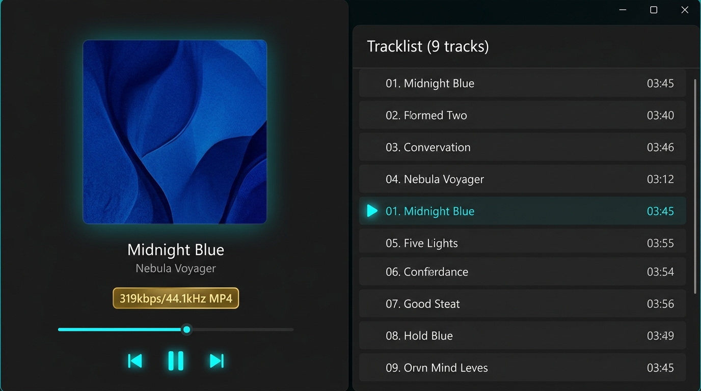
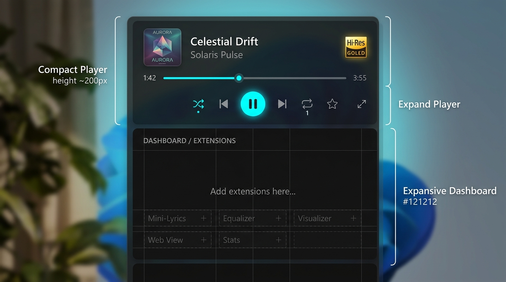

# 右側アルバム情報表示サイズ切り替え機能 UI仕様書

## 1. 概要
本画面仕様は、メイン画面右側パネルにおけるアルバム情報・プレイヤー表示領域の表示サイズ（通常・最大化・最小化）を切り替えるUIコンポーネントおよびレイアウト設計を定義します。
ユーザーがアルバムの楽曲一覧を広く見たい場合や、下半分の拡張タブ領域を広げたい場合に、直感的かつスムーズに切り替えられるUIを提供します。

---

## 2. 実装イメージ（モックアップ）

### 2.1. 最大化表示（全画面モード）
下半分の拡張タブ領域を折りたたみ、右側パネル全体に左右2カラム構成でアルバム情報およびトラックリストを展開した状態です。

### 2.2. 最小化表示（コンパクトモード）
トラックリストを非表示にし、アルバムアート、曲名・アーティスト名、音質情報（Hi-Resバッジ、ビットレート/サンプリングレート等）、プレイヤーコントロールのみをコンパクトに表示した状態です。

---

## 3. レイアウトとデザイン

### 3.1. 表示モード別のレイアウト構成

| 表示モード | 構成要素 | 上部プレイヤー領域 | 下部拡張タブ領域 |
| :--- | :--- | :--- | :--- |
| **通常表示（デフォルト）** | アルバムアート、タイトル、音質情報、トラックリスト、再生コントロール | 高さ 50% (`1*`) | 高さ 50% (`1*`)（表示） |
| **最大化表示（全画面）** | **【左カラム】特大アート・アルバム情報・操作系** **【右カラム】Track数・曲番号・曲名・再生時間・ステータス** | 高さ 100% (`1*`) | 高さ 0% (`0*` / 非表示) |
| **最小化表示（コンパクト）** | 小型アルバムアート、タイトル、音質情報、再生コントロール（**トラックリスト非表示**） | 高さ 固定最小値 (`Auto`) | 残り全領域 (`1*` / 最大化) |

---

### 3.2. 最大化表示時の詳細レイアウト構成

#### ① 左カラム（アートワーク・基本情報・楽曲操作）
*   **アルバムアート**:
    *   正方形アスペクト比を維持し、左カラムの幅いっぱいに大きく配置（角丸 `CornerRadius="8"`, ドロップシャドウ付与）。
*   **アルバム情報テキスト**:
    *   アルバム名称（フォントサイズ 18〜20pt, SemiBold, テキストトリミング対応）
    *   アーティスト名称（フォントサイズ 13〜14pt, Muted Color）
*   **音質・フォーマット詳細**:
    *   ゴールドまたはシアンの角丸バッジでビットレート・サンプリング周波数・コーデックを表示（例: `319kbps/44.1kHz MP4`、`Hi-Res 24bit/96kHz FLAC`）。
*   **プレイヤーコントロール**:
    *   シークバー（ネオンスタイル、シアンのプログレスバーと現在時間/総時間表示）
    *   操作ボタン群（シャッフル、前へ、再生/一時停止、次へ、リピート、お気に入り、プレイリスト追加）

#### ② 右カラム（トラックリスト・ステータス）
*   **トラックリストヘッダー**:
    *   アルバムの総曲数を明記（例: `Tracklist (9 tracks)`、フォントサイズ 16pt, SemiBold）。
*   **トラック行（ListBoxItem / DataTemplate）**:
    *   **曲番号**: `01.`, `02.` 形式の2桁ゼロ埋め表示（固定幅、Muted Color）。
    *   **曲名**: トラックタイトル（左揃え、可変幅、ホバー時にハイライト）。
    *   **再生時間**: `03:45` 形式の曲長表示（右揃え）。
    *   **再生ステータスアイコン**:
        *   **再生中**: 行の先頭（または曲番号の左）にシアン色に発光する再生三角アイコン（`▶` または波形アニメーション）を表示。
        *   **一時停止中**: 一時停止アイコン（`⏸`）を表示。
        *   **非再生時**: アイコンは非表示（またはホバー時のみ薄く再生ボタンを表示）。

---

### 3.3. モード切替ボタンスタイル
- **配置位置**: アルバムヘッダー上部（曲名・アーティスト名の右側、またはプレイヤーコントロール付近）
- **アイコン構成**:
  - 通常時 → 最大化ボタン（`⛶` / 拡張アイコン）および 最小化ボタン（`—` / 折りたたみアイコン）
  - 最大化時 → 通常復帰ボタン（`🗗` / 縮小アイコン）
  - 最小化時 → 通常復帰ボタン（`🗖` / 展開アイコン）
- **カラーパレット**:
  - 通常時: `#808080` (Muted)
  - ホバー時: `#00FFFF` (Neon Cyan)
  - アクティブ時: `#FFFFFF`

---

## 4. アニメーションとインタラクション

### 4.1. モード切り替えアクション
- **ボタンクリック時**:
  - ボタンを押下すると、ViewModelの表示モード状態（`FullScreen` / `Normal` / `Minimized`）が更新されます。
  - `GridLengthAnimation` または `Storyboard` を用いて、上部・下部領域のサイズがスムーズ（約 0.3秒、`CubicEaseOut`）に伸縮します。
- **トラックリストのフェード/スライドイン**:
  - 最小化モードへの移行時は、トラックリストがフェードアウトした後に領域が縮小します。
  - 通常・最大化モードへの移行時は、領域が展開された後にトラックリストがフェードインします。

---

## 5. 関連Issue・仕様書
- 親Issue: [#121 [機能追加] 右側タブの整理・拡張タスク（親Issue）](https://github.com/taketonnbo/Audio_Effector/issues/121)
- 対象Issue: [#122 [機能追加] 右側タブのアルバム情報の表示サイズ切り替え（全画面・最小化）](https://github.com/taketonnbo/Audio_Effector/issues/122)
- 機能仕様書: [設計/機能仕様/右側アルバム情報表示サイズ切り替え機能.md](../../機能仕様/右側アルバム情報表示サイズ切り替え機能.md)
