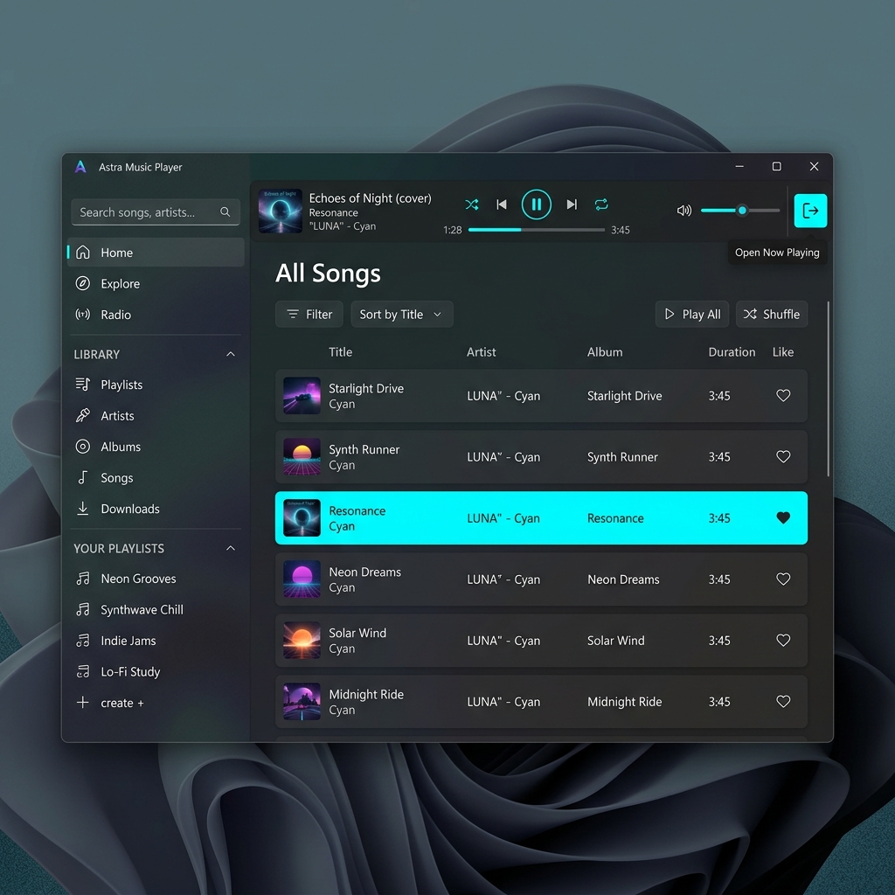
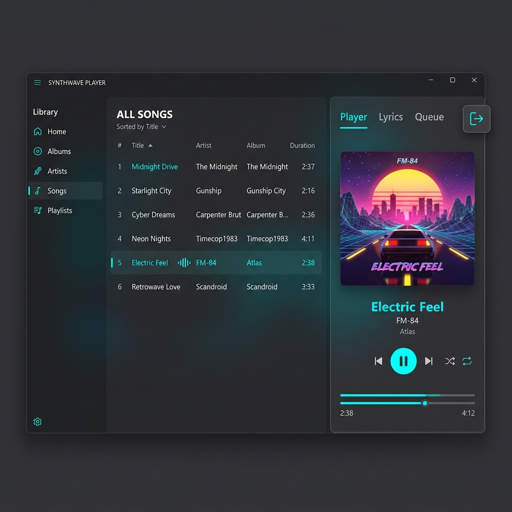

# 右側タブ開閉機能 UI仕様書

## 1. 概要
本機能は、アプリケーション右側のタブエリア（Player & Tab Area）をデフォルトで閉じた状態にし、画面上部にプレイヤー操作パネル（コンパクトプレイヤー）を配置することで、メインコンテンツ（ライブラリ領域）を広く使えるようにするものです。
ユーザーはトグルボタンをクリックすることで、右側タブエリアの開閉を行い、それに伴ってプレイヤー操作系のレイアウトが動的に切り替わります。

## 2. 実装イメージ（モックアップ）
### タブが閉じている状態（トップバー表示）
以下は、右側タブが閉じており、画面上部（Top Bar）にコンパクトプレイヤーが表示されている状態のイメージです。

### タブが開いている状態（右側パネル表示）
以下は、右側タブが開いており、既存のプレイヤー操作系が画面右側に表示されている状態のイメージです（トップバーのコンパクトプレイヤーは非表示）。

## 3. レイアウトとデザイン

### トップバー（コンパクトプレイヤー）
- **表示条件**: 右側タブが閉じている（`IsRightPanelOpen == false`）状態の場合にのみ表示。
- **配置場所**: 画面上部（左サイドバーの右側〜右端にかけて）。
- **構成要素**:
  - **アルバムアート**: 小型（例: 40x40 ピクセル程度）で左端に表示。
  - **楽曲情報**: 曲名とアーティスト名をアルバムアートの右に表示。
  - **再生コントロール**: シャッフル、戻し、再生/一時停止、次へ、リピートボタンを中央付近に配置。
  - **プログレスバー**: コントロール群の下、または横に配置。
  - **再生キュー**: 再生リスト（Play Queue）を開くためのボタンを配置。
  - **ボリューム**: 右側にアイコンを配置（ボリューム操作スライダーは別Issueでの対応とするためUIから削除）。

### 右側パネル（既存領域）
- **表示条件**: 右側タブが開いている（`IsRightPanelOpen == true`）状態の場合にのみ表示。
- **配置場所**: 画面右側（Grid.Column="2"）。
- **構成要素**: 既存のプレイヤー操作系とタブ群。

### タブ開閉トグルボタン
- **配置場所**: メインタブ（ライブラリ領域）と右側パネルの間のスプリッター領域上（Grid.Column="1" 中央付近）。
- **構成要素**: 常に表示される「く」の字ボタン。
  - タブが開いているときは「＞」のような形状（閉じる操作を示す）。
  - タブが閉じているときは「＜」のような形状（開く操作を示す）。

## 4. アニメーションとインタラクション
- **トグルボタンクリック時**:
  - `IsRightPanelOpen` の値が反転します。
  - **閉じる（True -> False）**: 
    - 右側パネルの幅が滑らかに縮小（`1*` → `0*`、0.4秒）して右端へスライドアウトし、境界線（スプリッター領域）およびトグルボタンもパネルと完全に連動して右端へ移動します。
    - トップバー（コンパクトプレイヤー）が上部から滑らかに展開（高さ `0` → `60`、0.4秒）します。
  - **開く（False -> True）**: 
    - トップバーが上部へ折りたたまれて非表示（高さ `60` → `0`、0.4秒）になります。
    - 右側パネルの幅が画面右端から滑らかに拡大（`0*` → `1*`、0.4秒）してスライドインし、境界線およびトグルボタンもパネルの中身と完全に一体となって連動移動します。
- **ホバー時**: トグルボタンにホバーした際は、背景がハイライトされ、クリック可能であることを示します（Cursor="Hand"）。

## 5. 関連Issue
- [Issue #107: 右側タブの開閉機能とプレイヤー操作系の動的レイアウト変更](https://github.com/taketonnbo/Audio_Effector/issues/107)
- [Issue #116: [Bug] 右側パネル展開時に境界線(スプリッター)が中身より先に移動してしまう現象](https://github.com/taketonnbo/Audio_Effector/issues/116)
