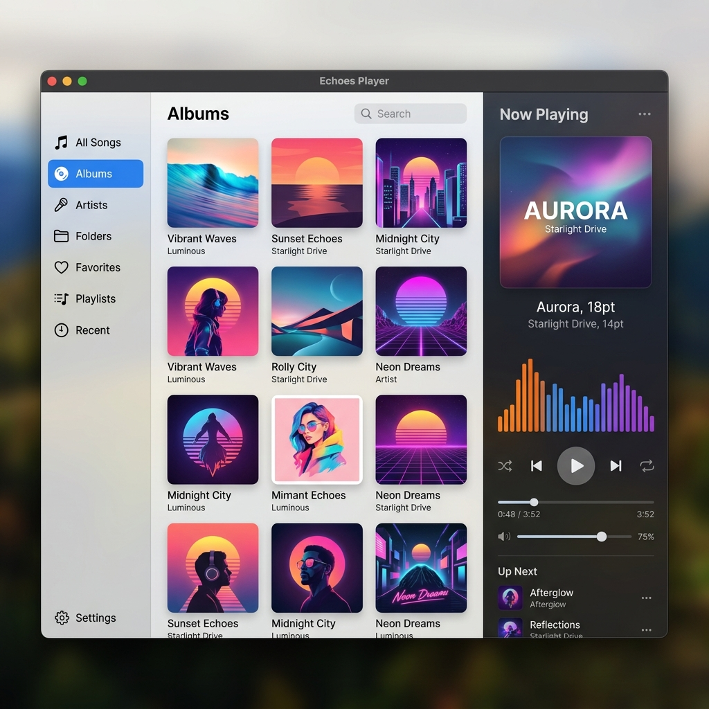

# 左サイドバー UI仕様書

## 1. 概要
メイン画面の左側に配置されるナビゲーション用サイドバーのUIおよび振る舞いに関する仕様を定義します。本サイドバーは、アプリ全体の画面遷移と主要機能（ライブラリ管理、パーソナライズ、設定）へのアクセスを提供します。

## 2. 実装イメージ（モックアップ）

## 3. レイアウトとデザイン
### 3.1 全体サイズと状態
- **折りたたみ時（デフォルト）**: 幅約 50px。各アイテムのアイコンのみが表示されるコンパクトな状態。
- **展開時（ホバー時）**: 幅約 200px。アイコンに加えてテキストラベルが表示される状態。
- **レイアウトの挙動**: サイドバーはメインコンテンツに手前に覆い被さる形（オーバーレイ）で展開される。展開時もメインコンテンツの幅や位置は変化せず、画面レイアウトの崩れやちらつきを防止する。

### 3.2 アイコンデザイン
- **アイコンセット**: Fluent UI System Icons などのモダンなアイコンセットを採用。
- **配置**: 各アイテム内で左寄せにし、テキストとの間に適切なマージンを設ける。

### 3.3 セクション構成
サイドバー内のアイテムは以下の通りグループ化して配置する。
1. **ライブラリ管理**（上部）
   - すべての曲
   - アルバム
   - アーティスト
   - フォルダ
2. **パーソナライズ・履歴**（中間部）
   - お気に入り
   - プレイリスト
   - 最近再生した曲 / よく聴く曲
3. **システム**（最下部に固定）
   - 設定

## 4. アニメーションとインタラクション
### 4.1 ホバーアニメーション
- **展開**: マウスポインタがサイドバー領域に入った時（`MouseEnter`）、横幅が50pxから200pxへ滑らかにアニメーション（`DoubleAnimation`）して広がる。
- **折りたたみ**: マウスポインタがサイドバー領域から出た時（`MouseLeave`）、元の50px幅にアニメーションで戻る。

### 4.2 クリックとビュー切り替え
- 各アイテムをクリックすると、メインコンテンツ領域のビューが切り替わる。
- 内部的には `MainViewModel.CurrentView`（列挙型等）が更新され、UI側で対応する `UserControl` に切り替わる仕組み。
- 選択中（アクティブ）のアイテムは、背景色または左側のボーダーライン（アクセントカラー）で視覚的に強調する。

### 4.3 ドラッグ＆ドロップ対応
- メインコンテンツエリア（「すべての曲」ビューなど）の楽曲アイテムをドラッグし、サイドバーの「プレイリスト」や「お気に入り」タブにドロップすることで、楽曲を対象リストへ追加できる。
- ドラッグ中に対応するタブの上をホバーした際、ドロップ可能であることを示す視覚的フィードバック（背景色変更など）を提供する。

## 5. 関連Issue
- #65 [機能追加] アプリ左側にタブ切り替え用サイドバーを実装する
- #73 [ドキュメント] サイドバーのUIに関する仕様書作成
