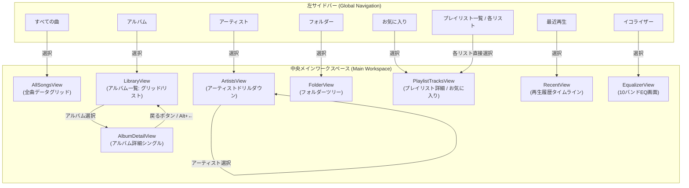
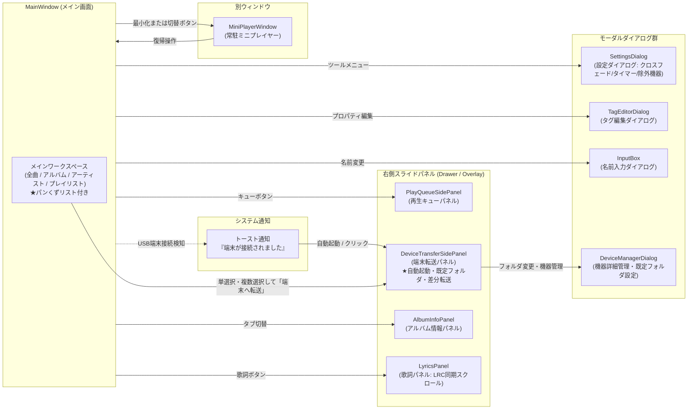

# 画面遷移・ナビゲーション設計書 (Audio Effector)

## 1. 概要
本ドキュメントは、Audio Effectorにおける画面レイアウト構成、モードレスなナビゲーションモデル、画面遷移関係、および外部端末連携のインタラクション仕様を体系的にまとめた設計書です。
タスク指向（機能ごとの全画面切り替え）を排し、オブジェクト指向UI（OOUI）に基づく「モードレスなドリルダウン」「戻る/進む履歴ナビゲーション」、および「接続時トースト通知と右側転送パネル自動起動によるシームレスな端末転送」を標準仕様として定義します。

---

## 2. 全体レイアウト構成

Audio Effectorのメインウィンドウは、常時アクセス可能な「グローバル制御領域」、コンテキストに応じて柔軟にドリルダウンする「メインワークスペース」、および必要に応じてスライド表示される「右側パネル領域（オーバーレイ）」で構成されます。

```
+-----------------------------------------------------------------------------------+
|  カスタムタイトルバー ( [←] [→] 戻る/進むボタン | タイトル | 最小化 / 最大化 / 閉じる ) |
+-----------------------------------------------------------------------------------+
|  プレイヤーコントロールバー (再生/一時停止/シーク/音量/EQ/クロスフェード/タイマー/キュー/端末/歌詞/設定) |
+-------------------+-------------------------------------------+-------------------+
|                   |  [パンくずリスト: アーティスト > アルバム > 楽曲]  |                   |
|  左サイドバー     +-------------------------------------------+  右スライドパネル |
|  (Global Nav)     |  中央メインワークスペース                 |  (Overlay/Drawer) |
|                   |  (Content Workspace)                      |                   |
|  ・ライブラリ     |                                           |  ・再生キュー     |
|    - すべての曲   |  [モードレス・ドリルダウン表示]           |    (PlayQueue)    |
|    - アルバム     |  - 全曲データグリッド (AllSongsView)      |  ・端末転送パネル |
|    - アーティスト |  - アルバム一覧 / 詳細 (LibraryView)      |    (DeviceTransfer|
|    - フォルダー   |  - アーティスト・ドリルダウン (Artists)   |    ※接続時自動起動|
|    - お気に入り   |  - フォルダーツリー (FolderView)          |  ・アルバム情報   |
|    - 最近再生     |  - プレイリスト収録曲 (PlaylistTracksView)|    (Info Panel)   |
|  ・プレイリスト   |  - 再生履歴タイムライン (RecentView)      |  ・歌詞パネル     |
|    [🔍検索] [▼]   |  - イコライザー (EqualizerView)           |    (LyricsPanel)  |
|    (独立スクロール)|                                           |                   |
|  ・設定 / ツール  |                                           |                   |
|                   |                                           |                   |
+-------------------+-------------------------------------------+-------------------+
|  [トースト通知エリア: 外部端末接続検知ポップアップ等]                             |
+-----------------------------------------------------------------------------------+
```

---

## 3. ナビゲーションおよび画面遷移モデル

### 3.1 モードレスなドリルダウンとナビゲーション構造
従来の「全画面を切り替えて階層を行き来する」方式を廃止し、オブジェクトのコンテキストを維持したまま閲覧・操作できるモードレスなナビゲーションを採用します。

1. **プレイリストの直接展開とサイドバー縦長化防止策**:
   - 左サイドバー内に登録済みプレイリスト一覧が常設展開されます。
   - 目的のプレイリストをクリックするだけで、中央ワークスペースに該当プレイリストの収録曲一覧（`PlaylistTracksView`）が直接表示されます（一覧画面と詳細画面の全画面遷移を排除）。
   - **独立スクロールコンテナ ＆ 折りたたみ (Expander)**:
     - プレイリスト数が増加しても下部の「設定」や「ツール」項目が押し出されないよう、プレイリストセクション専用の**独立スクロール領域（`ScrollViewer` + UI仮想化）**を配置。
     - セクションヘッダー「プレイリスト（XX件）」をクリックすることで、セクション全体の**開閉・折りたたみ（Expander）**がワンクリックで可能。
   - **ヘッダー横の虫眼鏡アイコン（インラインクイック検索・フィルター）**:
     - プレイリストセクションヘッダー横に「虫眼鏡（🔍）アイコン」を常設。
     - クリックでコンパクトな検索ボックスがインライン展開され、キー入力によるインクリメンタル絞り込み（リアルタイムフィルター）が可能。多数のプレイリストを保有している場合でも、目的のリストへ即座にアクセス可能。
2. **アーティストの階層ドリルダウン**:
   - `ArtistsView` 内において、同一画面内で「アーティスト一覧」から目的のアーティストを選択すると、そのアーティストの所属アルバム一覧および全収録曲テーブルへシームレスにドリルダウン（SplitView / カスケード展開）します。
3. **アルバムのシングル詳細展開**:
   - アルバム一覧（`LibraryView`）からアルバムを選択した際、大ジャケットアート、メタ情報（サイズ・ビットレート・リリース年等）、および収録曲テーブルを持つ詳細シングルビュー（`AlbumDetailView`）へスムーズにドリルダウンします。
4. **パンくずリスト（Breadcrumbs）ナビゲーション**:
   - メインワークスペースの最上部に、階層位置を示すパンくずリスト（例: `アーティスト一覧 > Queen > A Night at the Opera` や `フォルダー > D:\Music > Rock`）を常時表示。
   - 各要素がクリック可能なリンクとなっており、ブラウザ風の「戻る」ボタンと併せて、目的の親階層へワンクリックでダイレクトに復帰できます。

### 3.2 戻る / 進む（Back / Forward）履歴ナビゲーション
ブラウザのような直感的な移動体験を提供するため、グローバルなナビゲーションスタックを実装します。

- **UIコントロール**:
  - タイトルバー（またはツールバー）左上に常時「戻る（←）」「進む（→）」ボタンを配置。
  - 履歴が存在しない場合は不活性（グレーアウト）表示。
- **入力トリガー**:
  - 画面上の「戻る」「進む」ボタンクリック
  - マウスのサイドボタン（XButton1: 戻る / XButton2: 進む）
  - キーボードショートカット: `Alt + ←`（戻る） / `Alt + →`（進む）、または `Backspace`
- **履歴管理 (`NavigationJournal`)**:
  - `MainViewModel` 内で閲覧履歴（画面種別 `ViewType` および対象オブジェクトID・パラメータ）をスタック管理し、ドリルダウン前の親階層や直前の表示画面へ確実に復帰可能とします。

### 3.3 外部端末接続と転送ナビゲーション
日常的なライブラリブラウズを阻害せず、かつ迷わずに転送を行えるインタラクションを提供します。
*(※ドラッグ＆ドロップによる端末への直接転送は一旦保留とし、以下の通知＆右側パネル連携を採用します)*

1. **接続検知とトースト通知**:
   - PCに外部ポータブル機器（Walkman、USBストレージ等）が接続されると、まず機器の固有IDがアプリの「無視端末リスト」に存在しないか照合。
   - **無視端末の検出スキップ**: バックアップ用外付けHDDや常時接続ストレージなど、事前に無視設定された端末である場合は、トースト通知およびパネル自動起動を完全に抑止し、ユーザーの作業を邪魔しません。
   - 対象端末が有効な場合のみ、アプリ画面内に「外部機器 [デバイス名] が接続されました」というトースト通知を自動ポップアップ表示（トースト上にも「この機器を無視」リンクを配置）。
2. **端末識別と右側「端末転送パネル」の自動起動・既定フォルダ自動バインド**:
   - 端末接続検知時（またはトースト通知クリック時、プレイヤーバーの転送アイコン押下時）に、画面右側から「端末転送パネル (`DeviceTransferSidePanel`)」が自動でスライドイン（オーバーレイ起動）。
   - **端末ごとの既定フォルダ自動選択**: 機器固有ID（ボリュームシリアル番号等）に基づき接続端末を自動識別し、各端末ごとに事前に登録・記憶された「デフォルト転送先フォルダ」（例: `E:\MUSIC`）を自動的にターゲットとしてセット。接続するたびにフォルダを選び直す手間を完全になくし、起動直後から即座に転送可能な状態とします。
   - パネル上部には端末名・転送先フォルダパス（変更ボタン付き）・ストレージ総容量・現在空き容量・転送後予測空き容量バーが表示され、下部には転送キューリストと「転送開始」ボタンが配置されます。
3. **各画面からの単選択・複数選択転送**:
   - ユーザーは専用の同期画面へ移動する必要がなく、メインワークスペースの各画面（「すべての曲」「アルバム一覧」「アーティスト」「プレイリスト」等）を開いたまま、楽曲やアルバムを単選択または複数選択（Ctrl/Shift選択、チェックボックス）。
   - 右クリックメニュー「端末へ転送」または端末転送パネル内の「選択した楽曲を追加」ボタンを押下することで、即座に転送リストへ投入され、ワンクリックで転送を実行できます。
4. **既定フォルダの登録・管理**:
   - 初回接続時、または転送先を変更したい場合、パネル内のフォルダブラウザから目的フォルダを選択し、「このフォルダを既定に登録」ボタンを押すだけで端末と紐付けて記憶されます。
   - 「機器詳細管理ダイアログ (`DeviceManagerDialog`)」からも、認識済み端末ごとの既定フォルダの確認・変更・リセットが可能です。
5. **不要端末の検出抑止（無視・除外リスト設定）**:
   - 常時接続されている外付けHDDなど、音楽転送を行わない端末について、転送パネルのオプションメニューやトースト通知から「この端末をアプリ内で無視する」を指定できます。
   - 「設定ダイアログ (`SettingsDialog`)」および「機器詳細管理ダイアログ」に「無視設定された端末一覧」を管理するUIを設け、誤って無視した端末の解除（再検出対象への復帰）がいつでも行えます。
6. **差分転送（重複自動スキップ）とトランスコード転送**:
   - **重複曲の自動スキップ（差分転送）**: 転送実行時、転送先フォルダ内の既存ファイル（タイトル/アーティスト/ファイル名）と自動照合。既に端末へ転送済みの楽曲を自動的にスキップ（または上書き確認）し、アルバムやプレイリストを丸ごと投入しても重複コピーが発生せず、転送時間を最小限に短縮します。
   - **転送時トランスコード（自動フォーマット変換）**: ハイレゾFLACや非圧縮音源を転送する際、端末の空き容量や互換性に応じて、指定ビットレート（128k / 256k / 320kbpsのMP3またはAAC）へオンザフライで変換しながら転送するオプションを提供します。

### 3.4 再生制御とリスニング機能 (Playback & Listening Features)
上部プレイヤーバーおよび右側パネル領域と連携し、快適なリスニング体験をサポートします。

1. **クロスフェード再生 (Crossfade)**:
   - ギャップレス再生（無音部分の排除）に加えて、曲の終わりと次の曲の始まりを指定秒数（1〜10秒）重ねて滑らかにフェード移行するクロスフェード機能をサポート。
   - プレイヤーバーまたは設定からワンタッチで切り替えでき、BGM再生やプレイリストの連続再生に最適です。
2. **スリープタイマー (Sleep Timer)**:
   - 就寝時や作業時間の管理のため、「15分 / 30分 / 60分 / 現在のアルバム終了時」を指定して自動停止タイマーを設定可能。
   - タイマー到達時は急に音が切れるのではなく、数秒かけて滑らかに音量をフェードアウトさせて安全に停止します。
3. **歌詞表示パネル (Lyrics Panel)**:
   - 画面右側スライドパネル領域に「歌詞パネル (`LyricsPanel`)」を配置。プレイヤーバーの歌詞アイコン（またはタブ切替）で展開。
   - 音声ファイルに埋め込まれた歌詞タグ（ID3/Vorbis Comments）や外部同名LRCファイル（タイムタグ付き同期歌詞）を読み込み、再生位置に合わせてリアルタイムに自動スクロール表示します。

---

## 4. 画面遷移図 (Navigation Flow)

### 4.1 メインワークスペースのモードレス遷移とドリルダウン



### 4.2 右側パネル（オーバーレイ）、通知、およびモーダルダイアログ



---

## 5. 画面・ビュー一覧とナビゲーション定義マトリクス

| 画面 / ビュー名 | 種別 | 到達トリガー (From) | 戻り方 / 遷移先 (To) | 端末転送連携 / 主な機能 |
| :--- | :--- | :--- | :--- | :--- |
| **すべての曲** (`AllSongs`) | コレクション | サイドバー「すべての曲」選択 | 戻るボタン (`GoBack`)、他項目選択 | 単選択・複数選択し、右クリック「端末へ転送」またはパネル追加 |
| **アルバム一覧** (`Albums`) | コレクション | サイドバー「アルバム」選択 | アルバム選択で詳細へドリルダウン | アルバム選択し、右クリック「端末へ転送」 |
| **アルバム詳細** (`AlbumDetail`) | シングル | アルバムカード/行の選択・ダブルクリック | 戻るボタン (`GoBack`)、パンくずリストで一覧へ復帰 | 収録楽曲の単選択・複数選択転送、アルバム一括転送 |
| **アーティスト一覧** (`Artists`) | コレクション / ドリルダウン | サイドバー「アーティスト」選択 | アーティスト選択で同画面内ドリルダウン、パンくず移動 | 所属アルバム・楽曲の単選択・複数選択転送 |
| **フォルダー探索** (`Folders`) | コレクション | サイドバー「フォルダー」選択 | フォルダツリー展開移動、パンくず移動 | フォルダ内楽曲の選択転送 |
| **お気に入り一覧** (`Favorites`) | コレクション | サイドバー「お気に入り」選択 | 戻るボタン (`GoBack`)、他項目選択 | お気に入り楽曲の単選択・複数選択転送 |
| **プレイリスト詳細** (`PlaylistTracks`) | シングル | サイドバー内の各プレイリスト直接選択 | 他プレイリスト選択、戻るボタン | プレイリスト内楽曲の選択転送、一括転送 |
| **最近再生した曲** (`Recent`) | コレクション | サイドバー「最近再生」選択 | 戻るボタン (`GoBack`)、他項目選択 | 履歴楽曲の選択転送 |
| **イコライザー** (`Equalizer`) | ツール / 設定 | サイドバー「イコライザー」、プレイヤーバーEQ押下 | 戻るボタン (`GoBack`)、他項目選択 | - |
| **再生キューパネル** | オーバーレイ | ツールバーのキューアイコン押下 | 「✕」ボタン、または再度トグル押下 | 楽曲並び替え、割り込み再生、ギャップレス事前ロード |
| **端末転送パネル** | オーバーレイ | 端末接続検知時自動起動、トーストクリック、転送アイコン押下 | 「✕」ボタン押下、または転送完了後閉じる | 投入楽曲受付、容量予測、既定フォルダセット、差分転送（重複スキップ）、トランスコード転送 |
| **歌詞パネル** (`LyricsPanel`) | オーバーレイ | プレイヤーバーの歌詞アイコン押下、パネルタブ切替 | 「✕」ボタン、または再度トグル押下 | 埋め込み歌詞・LRC同期歌詞のリアルタイム自動スクロール表示 |
| **設定ダイアログ** | モーダル | メニュー「ツール」→「設定...」押下 | 「保存」または「キャンセル」ボタン | 認識済み端末の既定フォルダ変更、無視端末リスト管理、クロスフェード秒数、スリープタイマー設定 |
| **ミニプレイヤー** | 別ウィンドウ | 最小化（設定有効時）、または切替ボタン | 「復帰」ボタン押下、またはタスクバークリック | - |
