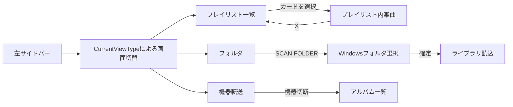

# 画面遷移・ナビゲーション設計書

## 1. 概要

MainWindowの `CurrentViewType` とContentTemplateで中央ワークスペースを切り替える。サイドバー、右側の曲情報、上部プレイヤー、スペクトラム、再生キューは同じメインウィンドウ内に配置する。各画面の表示は[画面仕様一覧](index.md)を参照する。

## 2. ワークスペースの遷移

| サイドバー・トリガー | ViewType | 表示XAML / DataContext |
| :--- | :--- | :--- |
| すべての曲 | AllSongs | AllSongsView / MainViewModel |
| アルバム | Albums | LibraryView / Library |
| アーティスト | Artists | ArtistsView / MainViewModel |
| フォルダ | Folders | FolderView / Folder |
| お気に入り | Favorites | PlaylistTracksView / Playlist |
| プレイリスト | Playlists | PlaylistSelectorView / Playlist |
| プレイリストカード選択 | PlaylistTracks | PlaylistTracksView / Playlist |
| 最近再生した曲 | Recent | RecentView / MainViewModel |
| イコライザー | Equalizer | EqualizerView / Equalizer |
| 機器転送（接続中） | DeviceSync | DeviceSyncView / DeviceBrowser |

サイドバーは `SwitchViewCommand` にViewTypeを渡す。プレイリストカードは `ShowPlaylistCommand`、楽曲画面のXは `ShowPlaylistSelectorCommand`。全曲、アーティスト、最近再生のビューは中央に案内文を表示する。ライブラリ一覧の曲・アルバムの操作は再生対象を更新し、専用の詳細ページへドリルダウンしない。

戻る／進むの履歴スタックやタイトルバーのBack／Forwardボタンは遷移手段に含めない。機器が切断され、DeviceSyncが選択中の場合はAlbumsへ戻る。

## 3. パネルと再生状態

右側の開閉は `IsRightPanelOpen`、アルバム情報の大小は `IsAlbumViewMaximized`、スペクトラムは `PlayerControl.IsSpectrumVisible`。ワークスペースのViewTypeと独立して保持する。キューの開閉は `IsPlayQueuePanelOpen`、キュー／履歴は `SelectedQueueTabIndex`。

右側パネルを開くと本文上端のプレイヤーを格納し、右パネルを閉じると上部に高さ60のプレイヤーを表示する。右側に歌詞・EQ・転送のTabControlは置かない。最近再生の案内画面とキューパネルの履歴は別のUIとして扱う。

## 4. ダイアログと別ウィンドウ

| 起点 | 表示先 | 閉じ方・反映 |
| :--- | :--- | :--- |
| サイドバー設定 | SettingsDialog | 閉じる。設定変更は逐次保存 |
| 機器転送のManage | DeviceManagerDialog | Close |
| プレイリスト作成／名称変更・EQ保存 | InputBox | OKで文字列確定、Cancel／Escで取消 |
| 曲のプレイリスト追加 | PlaylistSelectionDialog | ADDで選択確定、CANCEL／Escで取消 |
| メイン最小化 | MiniPlayerWindow | 復帰ボタンでメインへ戻る |
| ミニプレイヤーの再生リスト表示 | PlayQueueDialog | ウィンドウを閉じる |
| SCAN FOLDER | Windows OpenFolderDialog | 確定でパス保存と読込、キャンセルで維持 |

削除確認、曲のプロパティ、無効なショートカットなどはWPF MessageBoxで表示する。OS／WPFの標準ダイアログは専用のXAML画面仕様の対象に含めず、呼出元のインタラクションに記載する。

## 5. 実装参照

- [MainWindow.xaml](../../AudioEffector/Presentation/Views/MainWindow.xaml)
- [MainViewModel.cs](../../AudioEffector/Presentation/ViewModels/MainViewModel.cs)
- [ViewType.cs](../../AudioEffector/Presentation/ViewModels/ViewType.cs)
- [PlaylistViewModel.cs](../../AudioEffector/Presentation/ViewModels/PlaylistViewModel.cs)
