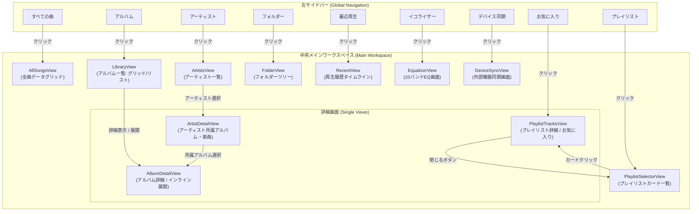

# 画面遷移・ナビゲーション設計書 (Audio Effector)

## 1. 概要
本ドキュメントは、Audio Effectorにおける全画面・ビュー・パネル・ダイアログの画面構成、ナビゲーション構造、および画面遷移関係を体系的にまとめた設計書です。
ユーザーが迷うことなく目的のオブジェクト（楽曲、アルバム、プレイリスト、機器等）にアクセスし、シームレスに操作を完結できるモードレスなナビゲーションモデルの構築を目的とします。

---

## 2. 全体レイアウト構成

Audio Effectorのメインウィンドウは、常時アクセス可能な「グローバル領域」と、コンテキストに応じて切り替わる「ワークスペース領域」、および補助「オーバーレイ領域」で構成されます。

```
+-----------------------------------------------------------------------------------+
|  カスタムタイトルバー (ウィンドウ制御: 最小化 / 最大化 / 閉じる)                   |
+-----------------------------------------------------------------------------------+
|  プレイヤーコントロールバー (再生/一時停止/シーク/音量/EQ切替/キュー開閉/設定)     |
+-------------------+-------------------------------------------+-------------------+
|                   |                                           |                   |
|  左サイドバー     |  中央メインワークスペース                 |  右スライドパネル |
|  (Global Nav)     |  (Content Workspace)                      |  (Overlay/Drawer) |
|                   |                                           |                   |
|  ・ライブラリ     |  [ViewType によるビュー切り替え]          |  ・再生キュー     |
|    - すべての曲   |  - 全曲データグリッド (AllSongsView)      |    (PlayQueue)    |
|    - アルバム     |  - アルバム一覧 (LibraryView)             |  ・アルバム情報   |
|    - アーティスト |  - アーティスト一覧 (ArtistsView)         |    (Info Panel)   |
|    - フォルダー   |  - フォルダーツリー (FolderView)          |                   |
|    - お気に入り   |  - プレイリスト一覧 (PlaylistSelectorView)|                   |
|    - 最近再生     |  - プレイリスト詳細 (PlaylistTracksView)  |                   |
|  ・プレイリスト   |  - 再生履歴 (RecentView)                  |                   |
|    - 各プレイリス |  - イコライザー (EqualizerView)           |                   |
|  ・ツール / 機器  |  - デバイス同期 (DeviceSyncView)          |                   |
|    - イコライザー |                                           |                   |
|    - デバイス同期 |                                           |                   |
|                   |                                           |                   |
+-------------------+-------------------------------------------+-------------------+
```

---

## 3. 画面遷移図 (Navigation Flow)

### 3.1 メインコンテンツ領域のビュー遷移 (`ViewType`)



### 3.2 オーバーレイ、モーダルダイアログ、および別ウィンドウの遷移

```mermaid
flowchart LR
    subgraph MainWindow["MainWindow (メイン画面)"]
        MainUI["メイン操作画面"]
    end

    subgraph Overlays["ドロワー / オーバーレイ"]
        QueuePanel["PlayQueueSidePanel\n(再生キュースライドパネル)"]
        InfoPanel["AlbumInfoPanel\n(アルバム情報パネル)"]
    end

    subgraph Modals["モーダルダイアログ群"]
        DlgSettings["SettingsDialog\n(設定ダイアログ)"]
        DlgDeviceMgr["DeviceManagerDialog\n(機器ストレージ管理)"]
        DlgPlaylistSelect["PlaylistSelectionDialog\n(プレイリスト追加先選択)"]
        DlgInputBox["InputBox\n(名称入力・変更)"]
        DlgTagEditor["TagEditorDialog\n(楽曲メタ情報・タグ編集)"]
    end

    subgraph SeparateWindows["別ウィンドウ"]
        MiniPlayer["MiniPlayerWindow\n(常駐ミニプレイヤー)"]
    end

    %% オーバーレイ開閉
    MainUI <-->|ツールバーボタン / 右スライド| QueuePanel
    MainUI <-->|右側タブ切替| InfoPanel

    %% ダイアログ起動
    MainUI -->|メニュー: ツール→設定| DlgSettings
    MainUI -->|右クリック: プロパティ/タグ編集| DlgTagEditor
    MainUI -->|右クリック: プレイリストに追加| DlgPlaylistSelect
    MainUI -->|右クリック: 名前の変更| DlgInputBox
    MainUI -->|機器同期画面: Manageボタン| DlgDeviceMgr

    %% ミニプレイヤー切り替え
    MainUI <-->|最小化(設定有効時) / 専用ボタン| MiniPlayer
```

---

## 4. 画面・ビュー一覧とナビゲーション定義マトリクス

| 画面 / ビュー名 | 種別 | 関連View / ViewModel | 到達トリガー (From) | 戻り方 / 遷移先 (To) | 保持状態 / ライフサイクル |
| :--- | :--- | :--- | :--- | :--- | :--- |
| **すべての曲** (`AllSongs`) | コレクション | [AllSongsView.xaml](file:///c:/Users/tnish/vs_code_git/Audio_Effector/AudioEffector/Presentation/Views/AllSongsView.xaml)<br>[AllSongsViewModel.cs](file:///c:/Users/tnish/vs_code_git/Audio_Effector/AudioEffector/Presentation/ViewModels/AllSongsViewModel.cs) | サイドバー「すべての曲」クリック | 他サイドバー項目の選択 | ソート順、スクロール位置、カラム幅設定 |
| **アルバム一覧** (`Albums`) | コレクション | [LibraryView.xaml](file:///c:/Users/tnish/vs_code_git/Audio_Effector/AudioEffector/Presentation/Views/LibraryView.xaml)<br>[LibraryViewModel.cs](file:///c:/Users/tnish/vs_code_git/Audio_Effector/AudioEffector/Presentation/ViewModels/LibraryViewModel.cs) | サイドバー「アルバム」クリック（初期表示画面） | 他サイドバー項目の選択、アルバムカードクリックによる詳細表示 | 表示形式（グリッド/リスト）、ソート順、展開状態 |
| **アーティスト一覧** (`Artists`) | コレクション | [ArtistsView.xaml](file:///c:/Users/tnish/vs_code_git/Audio_Effector/AudioEffector/Presentation/Views/ArtistsView.xaml)<br>[ArtistsViewModel.cs](file:///c:/Users/tnish/vs_code_git/Audio_Effector/AudioEffector/Presentation/ViewModels/ArtistsViewModel.cs) | サイドバー「アーティスト」クリック | アーティスト項目選択（ドリルダウン）、他サイドバー項目の選択 | 選択アーティスト、スクロール位置 |
| **フォルダー探索** (`Folders`) | コレクション | [FolderView.xaml](file:///c:/Users/tnish/vs_code_git/Audio_Effector/AudioEffector/Presentation/Views/FolderView.xaml)<br>[FolderViewModel.cs](file:///c:/Users/tnish/vs_code_git/Audio_Effector/AudioEffector/Presentation/ViewModels/FolderViewModel.cs) | サイドバー「フォルダー」クリック | フォルダツリーノード展開、楽曲ダブルクリック再生 | フォルダ展開ツリー状態 |
| **お気に入り一覧** (`Favorites`) | コレクション | [PlaylistTracksView.xaml](file:///c:/Users/tnish/vs_code_git/Audio_Effector/AudioEffector/Presentation/Views/PlaylistTracksView.xaml) (お気に入りモード)<br>[PlaylistViewModel.cs](file:///c:/Users/tnish/vs_code_git/Audio_Effector/AudioEffector/Presentation/ViewModels/PlaylistViewModel.cs) | サイドバー「お気に入り」クリック | 他サイドバー項目の選択 | お気に入り楽曲リスト |
| **プレイリスト一覧** (`Playlists`) | コレクション | [PlaylistSelectorView.xaml](file:///c:/Users/tnish/vs_code_git/Audio_Effector/AudioEffector/Presentation/Views/PlaylistSelectorView.xaml)<br>[PlaylistViewModel.cs](file:///c:/Users/tnish/vs_code_git/Audio_Effector/AudioEffector/Presentation/ViewModels/PlaylistViewModel.cs) | サイドバー「プレイリスト」クリック、または詳細画面の「閉じる」ボタン | プレイリストカードクリック（詳細遷移）、他サイドバー選択 | プレイリストカード一覧 |
| **プレイリスト詳細** (`PlaylistTracks`) | シングル | [PlaylistTracksView.xaml](file:///c:/Users/tnish/vs_code_git/Audio_Effector/AudioEffector/Presentation/Views/PlaylistTracksView.xaml)<br>[PlaylistViewModel.cs](file:///c:/Users/tnish/vs_code_git/Audio_Effector/AudioEffector/Presentation/ViewModels/PlaylistViewModel.cs) | プレイリストカードのクリック (`ShowPlaylistCommand`) | 右上の閉じるボタン「✕」押下で一覧 (`Playlists`) へ復帰 | 選択中プレイリスト、曲順ソート |
| **最近再生した曲** (`Recent`) | コレクション | [RecentView.xaml](file:///c:/Users/tnish/vs_code_git/Audio_Effector/AudioEffector/Presentation/Views/RecentView.xaml)<br>[RecentViewModel.cs](file:///c:/Users/tnish/vs_code_git/Audio_Effector/AudioEffector/Presentation/ViewModels/RecentViewModel.cs) | サイドバー「最近再生」クリック | 他サイドバー項目の選択 | 再生日時降順タイムライン |
| **イコライザー** (`Equalizer`) | ツール / 設定 | [EqualizerView.xaml](file:///c:/Users/tnish/vs_code_git/Audio_Effector/AudioEffector/Presentation/Views/EqualizerView.xaml)<br>[EqualizerViewModel.cs](file:///c:/Users/tnish/vs_code_git/Audio_Effector/AudioEffector/Presentation/ViewModels/EqualizerViewModel.cs) | サイドバー「イコライザー」、または上部プレイヤーバーのEQアイコン押下 | 他サイドバー項目の選択（または閉じる） | 各バンドゲイン値、選択中プリセット |
| **デバイス同期** (`DeviceSync`) | ターゲット | [DeviceSyncView.xaml](file:///c:/Users/tnish/vs_code_git/Audio_Effector/AudioEffector/Presentation/Views/DeviceSyncView.xaml)<br>[DeviceBrowserViewModel.cs](file:///c:/Users/tnish/vs_code_git/Audio_Effector/AudioEffector/Presentation/ViewModels/DeviceBrowserViewModel.cs) | サイドバー「デバイス同期」クリック | 他サイドバー項目の選択 | 選択中機器、フォルダ移動階層、転送進捗 |
| **再生キュースライドパネル** | オーバーレイ | [PlayQueueSidePanel.xaml](file:///c:/Users/tnish/vs_code_git/Audio_Effector/AudioEffector/Presentation/Views/PlayQueueSidePanel.xaml)<br>[PlayerControlViewModel.cs](file:///c:/Users/tnish/vs_code_git/Audio_Effector/AudioEffector/Presentation/ViewModels/PlayerControlViewModel.cs) | ツールバーのキューアイコン押下 (`TogglePlayQueuePanelCommand`) | パネル右上の「✕」ボタン押下、または再度トグルボタン押下 | キュー内楽曲並び順、再生インデックス |
| **ミニプレイヤー** | 別ウィンドウ | [MiniPlayerWindow.xaml](file:///c:/Users/tnish/vs_code_git/Audio_Effector/AudioEffector/Presentation/Views/MiniPlayerWindow.xaml) | メイン画面最小化（設定有効時）、または専用切り替えボタン | ミニプレイヤーの「復帰」ボタン押下、またはタスクバークリック | メインウィンドウと同一の再生エンジン状態 |
| **設定ダイアログ** | モーダル | [SettingsDialog.xaml](file:///c:/Users/tnish/vs_code_git/Audio_Effector/AudioEffector/Presentation/Views/SettingsDialog.xaml)<br>[SettingsViewModel.cs](file:///c:/Users/tnish/vs_code_git/Audio_Effector/AudioEffector/Presentation/ViewModels/SettingsViewModel.cs) | メニュー「ツール」→「設定...」押下 | 「保存」または「キャンセル」ボタン押下 | ダイアログ内の一時入力設定値 |

---

## 5. ナビゲーションにおけるOOUI設計指針 (To-Be)

画面ナビゲーション構造において、タスク指向（動詞中心）の画面遷移やモーダル分断を解消し、OOUIの理念に則り以下の改善を推進します。

### 5.1 モードレスなドリルダウンと分割ビュー (Split View)
- **課題**: プレイリストを閲覧する際、一覧画面（`PlaylistSelectorView`）から詳細画面（`PlaylistTracksView`）への「全画面切り替え」が発生し、他のプレイリストの存在やサイドバーのコンテキストが遮断されやすい。

- **To-Be**:
  - サイドバーに登録プレイリスト名を一覧展開し、クリックするだけで右側ワークスペースに該当プレイリストが即座に表示される構造とする。
  - アーティスト画面（`ArtistsView`）も、左にアーティスト一覧、中央に選択アーティストのアルバム、右に楽曲リストを配置する3ペインまたは2ペインのドリルダウン（SplitView）を採用し、画面遷移をゼロにする。

### 5.2 ナビゲーション履歴（戻る / 進む）のサポート
- ブラウザのような「戻る（Back）」「進む（Forward）」ボタンおよびマウスのサイドボタン（XButton1 / XButton2）をサポートし、アルバム詳細から一覧へ戻る操作や、以前開いていた画面へ直感的に戻れるナビゲーションスタックを提供する。

### 5.3 ダイレクトマニピュレーションによる「遷移レス」操作
- **課題**: 楽曲をプレイリストに追加するために `PlaylistSelectionDialog`（モーダル画面）を経由し、外部機器へ転送するために `DeviceSyncView`（専用同期画面）へ遷移する必要がある。
- **To-Be**:
  - 楽曲やアルバムのカード/行をドラッグし、**左サイドバーの「目的のプレイリスト」や「接続機器（Device）」へ直接ドロップ**するだけで操作が完了する直接操作（ダイレクトマニピュレーション）を実現し、画面遷移を大幅に削減する。

