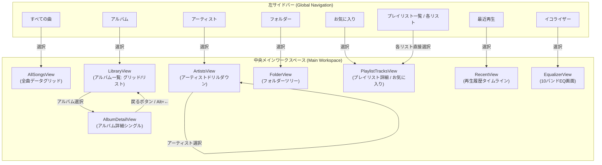
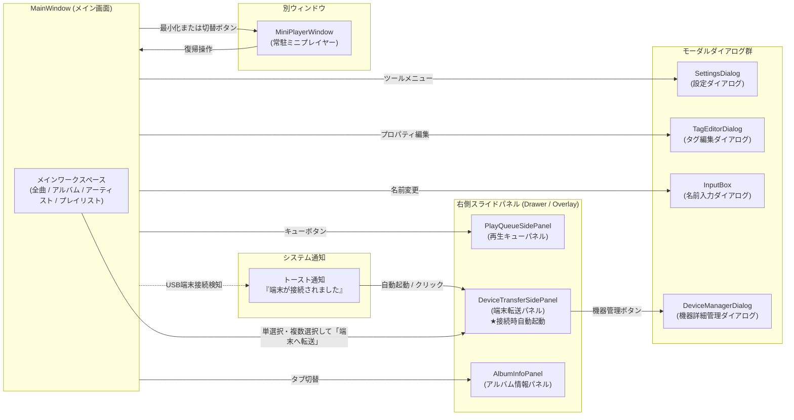

# 画面遷移・ナビゲーション設計書 (Audio Effector)

## 1. 概要
本ドキュメントは、Audio Effectorにおける画面レイアウト構成、モードレスなナビゲーションモデル、画面遷移関係、および外部端末連携のインタラクション仕様を体系的にまとめた設計書です。
タスク指向（機能ごとの全画面切り替え）を排し、オブジェクト指向UI（OOUI）に基づく「モードレスなドリルダウン」「戻る/進む履歴ナビゲーション」、および「接続時トースト通知と右側転送パネル自動起動によるシームレスな端末転送」を標準仕様として定義します。

---

## 2. 全体レイアウト構成

Audio Effectorのメインウィンドウは、常時アクセス可能な「グローバル制御領域」、コンテキストに応じて柔軟にドリルダウンする「メインワークスペース」、および必要に応じてスライド表示される「右側パネル領域（オーバーレイ）」で構成されます。

```
+-----------------------------------------------------------------------------------+
|  カスタムタイトルバー ( [←] [→] 戻る/進むボタン | タイトル | 最小化 / 最大化 / 閉じる ) |
+-----------------------------------------------------------------------------------+
|  プレイヤーコントロールバー (再生/一時停止/シーク/音量/EQ切替/キュー/端末パネル/設定)     |
+-------------------+-------------------------------------------+-------------------+
|                   |                                           |                   |
|  左サイドバー     |  中央メインワークスペース                 |  右スライドパネル |
|  (Global Nav)     |  (Content Workspace)                      |  (Overlay/Drawer) |
|                   |                                           |                   |
|  ・ライブラリ     |  [モードレス・ドリルダウン表示]           |  ・再生キュー     |
|    - すべての曲   |  - 全曲データグリッド (AllSongsView)      |    (PlayQueue)    |
|    - アルバム     |  - アルバム一覧 / 詳細 (LibraryView)      |  ・端末転送パネル |
|    - アーティスト |  - アーティスト・ドリルダウン (Artists)   |    (DeviceTransfer|
|    - フォルダー   |  - フォルダーツリー (FolderView)          |    ※接続時自動起動|
|    - お気に入り   |  - プレイリスト収録曲 (PlaylistTracksView)|  ・アルバム情報   |
|    - 最近再生     |  - 再生履歴タイムライン (RecentView)      |    (Info Panel)   |
|  ・プレイリスト   |  - イコライザー (EqualizerView)           |                   |
|    - (リスト一覧) |                                           |                   |
|  ・設定 / ツール  |                                           |                   |
|                   |                                           |                   |
+-------------------+-------------------------------------------+-------------------+
|  [トースト通知エリア: 外部端末接続検知ポップアップ等]                             |
+-----------------------------------------------------------------------------------+
```

---

## 3. ナビゲーションおよび画面遷移モデル

### 3.1 モードレスなドリルダウンとナビゲーション構造
従来の「全画面を切り替えて階層を行き来する」方式を廃止し、オブジェクトのコンテキストを維持したまま閲覧・操作できるモードレスなナビゲーションを採用します。

1. **プレイリストの直接展開**:
   - 左サイドバー内に登録済みプレイリスト一覧が常設展開されます。
   - 目的のプレイリストをクリックするだけで、中央ワークスペースに該当プレイリストの収録曲一覧（`PlaylistTracksView`）が直接表示されます（一覧画面と詳細画面の全画面遷移を排除）。
2. **アーティストの階層ドリルダウン**:
   - `ArtistsView` 内において、同一画面内で「アーティスト一覧」から目的のアーティストを選択すると、そのアーティストの所属アルバム一覧および全収録曲テーブルへシームレスにドリルダウン（SplitView / カスケード展開）します。
3. **アルバムのシングル詳細展開**:
   - アルバム一覧（`LibraryView`）からアルバムを選択した際、大ジャケットアート、メタ情報（サイズ・ビットレート・リリース年等）、および収録曲テーブルを持つ詳細シングルビュー（`AlbumDetailView`）へスムーズにドリルダウンします。

### 3.2 戻る / 進む（Back / Forward）履歴ナビゲーション
ブラウザのような直感的な移動体験を提供するため、グローバルなナビゲーションスタックを実装します。

- **UIコントロール**:
  - タイトルバー（またはツールバー）左上に常時「戻る（←）」「進む（→）」ボタンを配置。
  - 履歴が存在しない場合は不活性（グレーアウト）表示。
- **入力トリガー**:
  - 画面上の「戻る」「進む」ボタンクリック
  - マウスのサイドボタン（XButton1: 戻る / XButton2: 進む）
  - キーボードショートカット: `Alt + ←`（戻る） / `Alt + →`（進む）、または `Backspace`
- **履歴管理 (`NavigationJournal`)**:
  - `MainViewModel` 内で閲覧履歴（画面種別 `ViewType` および対象オブジェクトID・パラメータ）をスタック管理し、ドリルダウン前の親階層や直前の表示画面へ確実に復帰可能とします。

### 3.3 外部端末接続と転送ナビゲーション
日常的なライブラリブラウズを阻害せず、かつ迷わずに転送を行えるインタラクションを提供します。
*(※ドラッグ＆ドロップによる端末への直接転送は一旦保留とし、以下の通知＆右側パネル連携を採用します)*

1. **接続検知とトースト通知**:
   - PCに外部ポータブル機器（Walkman、USBストレージ等）が接続されると、アプリ画面内に「外部機器 [デバイス名] が接続されました」というトースト通知を自動ポップアップ表示。
2. **右側パネル（端末転送パネル）の自動起動**:
   - 端末接続検知時（またはトースト通知クリック時、プレイヤーバーの転送アイコン押下時）に、画面右側から「端末転送パネル (`DeviceTransferSidePanel`)」が自動でスライドイン（オーバーレイ起動）。
   - パネル上部には端末名・ストレージ総容量・現在空き容量・転送後予測空き容量バーが表示され、下部には転送キューリストと「転送開始」ボタンが配置されます。
3. **各画面からの単選択・複数選択転送**:
   - ユーザーは専用の同期画面へ移動する必要がなく、メインワークスペースの各画面（「すべての曲」「アルバム一覧」「アーティスト」「プレイリスト」等）を開いたまま、楽曲やアルバムを単選択または複数選択（Ctrl/Shift選択、チェックボックス）。
   - 右クリックメニュー「端末へ転送」または端末転送パネル内の「選択した楽曲を追加」ボタンを押下することで、即座に転送リストへ投入され、ワンクリックで転送を実行できます。

---

## 4. 画面遷移図 (Navigation Flow)

### 4.1 メインワークスペースのモードレス遷移とドリルダウン



### 4.2 右側パネル（オーバーレイ）、通知、およびモーダルダイアログ



---

## 5. 画面・ビュー一覧とナビゲーション定義マトリクス

| 画面 / ビュー名 | 種別 | 到達トリガー (From) | 戻り方 / 遷移先 (To) | 端末転送連携 |
| :--- | :--- | :--- | :--- | :--- |
| **すべての曲** (`AllSongs`) | コレクション | サイドバー「すべての曲」選択 | 戻るボタン (`GoBack`)、他項目選択 | 単選択・複数選択し、右クリック「端末へ転送」またはパネル追加 |
| **アルバム一覧** (`Albums`) | コレクション | サイドバー「アルバム」選択 | アルバム選択で詳細へドリルダウン | アルバム選択し、右クリック「端末へ転送」 |
| **アルバム詳細** (`AlbumDetail`) | シングル | アルバムカード/行の選択・ダブルクリック | 戻るボタン (`GoBack`) で一覧へ復帰 | 収録楽曲の単選択・複数選択転送、アルバム一括転送 |
| **アーティスト一覧** (`Artists`) | コレクション / ドリルダウン | サイドバー「アーティスト」選択 | アーティスト選択で同画面内ドリルダウン | 所属アルバム・楽曲の単選択・複数選択転送 |
| **フォルダー探索** (`Folders`) | コレクション | サイドバー「フォルダー」選択 | フォルダツリー展開移動 | フォルダ内楽曲の選択転送 |
| **お気に入り一覧** (`Favorites`) | コレクション | サイドバー「お気に入り」選択 | 戻るボタン (`GoBack`)、他項目選択 | お気に入り楽曲の単選択・複数選択転送 |
| **プレイリスト詳細** (`PlaylistTracks`) | シングル | サイドバー内の各プレイリスト直接選択 | 他プレイリスト選択、戻るボタン | プレイリスト内楽曲の選択転送、一括転送 |
| **最近再生した曲** (`Recent`) | コレクション | サイドバー「最近再生」選択 | 戻るボタン (`GoBack`)、他項目選択 | 履歴楽曲の選択転送 |
| **イコライザー** (`Equalizer`) | ツール / 設定 | サイドバー「イコライザー」、プレイヤーバーEQ押下 | 戻るボタン (`GoBack`)、他項目選択 | - |
| **再生キューパネル** | オーバーレイ | ツールバーのキューアイコン押下 | 「✕」ボタン、または再度トグル押下 | - |
| **端末転送パネル** | オーバーレイ | 端末接続検知時自動起動、トーストクリック、転送アイコン押下 | 「✕」ボタン押下、または転送完了後閉じる | 選択楽曲の投入受付、容量予測表示、転送実行・進捗管理 |
| **設定ダイアログ** | モーダル | メニュー「ツール」→「設定...」押下 | 「保存」または「キャンセル」ボタン | - |
| **ミニプレイヤー** | 別ウィンドウ | 最小化（設定有効時）、または切替ボタン | 「復帰」ボタン押下、またはタスクバークリック | - |
