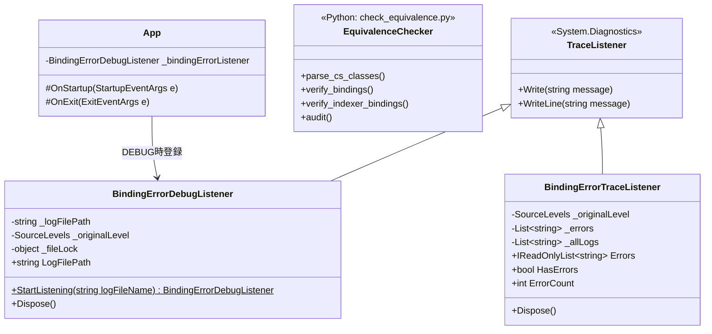
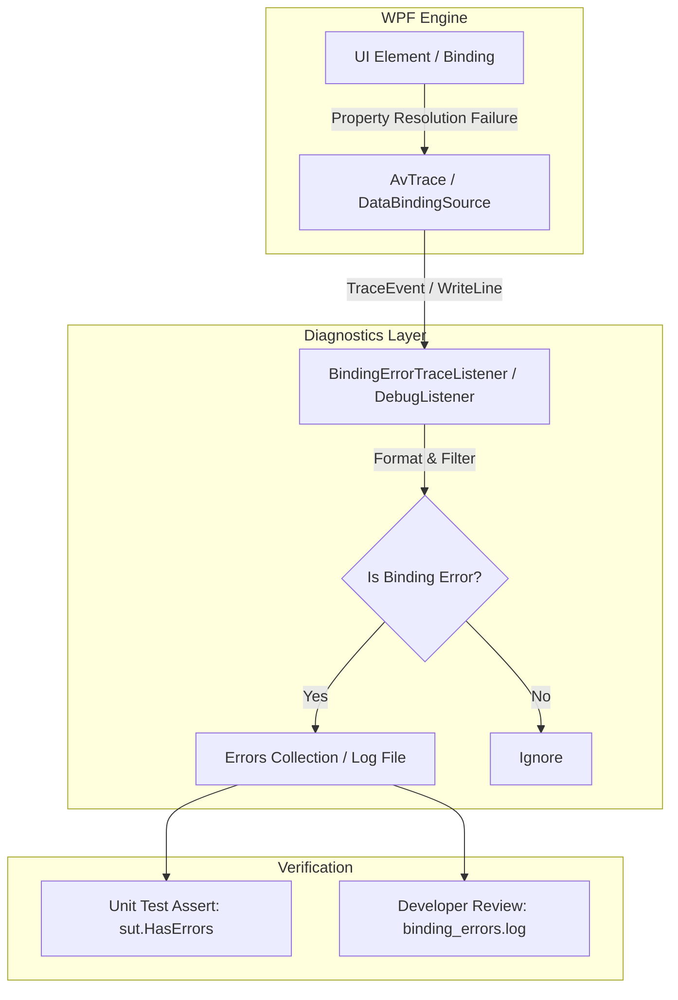
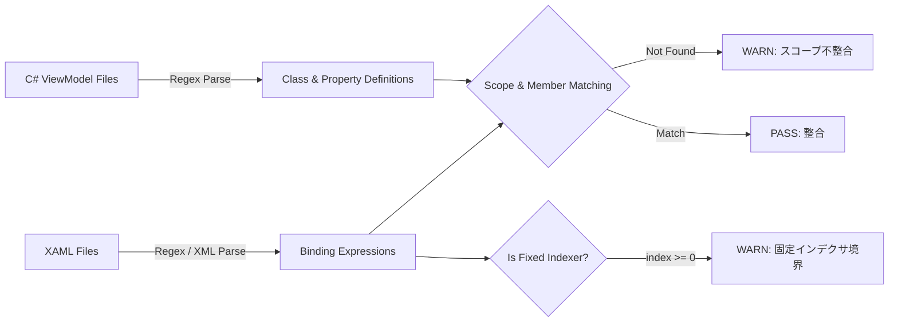

# XAMLバインディング検証基盤 詳細設計書

## 1. 概要
本設計書は、WPFアプリケーションにおけるXAMLデータバインディングエラーを自動検出し、早期発見・品質担保を実現するための検証基盤（静的検証ツール、実行時テスト監視機構、デバッグ時トレースロガー）の実装詳細を定義する。

### 1.1 背景と課題
- WPFのデータバインディングエラー（プロパティ名のタイポ、未解決パス、ViewModelスコープの不整合など）は、デフォルトでは実行時例外をスローせず、サイレントに失敗してVisual Studioのデバッグ出力に埋もれやすい。
- コレクションの固定インデクサバインディング（例: `Tracks[0].FilePath`）は、コレクション要素が0件の場合に実行時エラーや意図しない表示欠落を招く潜在的リスクがある。
- リファクタリング時や画面改修時において、バインディングの整合性デグレを自動かつ機械的に検証する仕組みが不足していた。

### 1.2 本基盤のスコープと責務分離
- **本Issue（#193）のスコープ**: 静的解析ツール・実行時テスト監視機構・デバッグ時トレースロガーからなる「バインディングエラー検出基盤（チェックツール）」の構築。
- **後続タスクのスコープ**: 本ツール群によって検出された既存のバインディングエラー（`IsTransferring` のスコープ不整合や固定インデクサ境界）の修正対応。

---

## 2. アーキテクチャとクラス構造

### 2.1 クラス構成図 (Mermaid)


### 2.2 主要クラスと責務
| クラス / ツール | 配置場所 | 役割と責務 |
| :--- | :--- | :--- |
| `BindingErrorDebugListener` | `AudioEffector/Presentation/Diagnostics/` | デバッグ起動時に `PresentationTraceSources.DataBindingSource` を監視し、`binding_errors.log` およびデバッグ出力へ自動記録する常駐リスナー。 |
| `BindingErrorTraceListener` | `AudioEffector.Tests/Presentation/Diagnostics/` | 単体テスト実行中にデータバインディングエラーをインターセプト・蓄積し、テストのアサーションで利用可能にするテスト用リスナー。 |
| `BindingErrorDebugListenerTests` | `AudioEffector.Tests/Presentation/Diagnostics/` | `BindingErrorDebugListener` のファイル出力・メッセージ記録・リソース解放を検証する単体テスト。 |
| `BindingErrorDetectionTests` | `AudioEffector.Tests/Presentation/Diagnostics/` | 不正プロパティバインディング発生時にリスナーがエラーを確実に捕捉できることを検証する単体テスト。 |
| `check_equivalence.py` | `tools/` | XAMLファイル群を静的走査し、ViewModelプロパティ定義・スコープ整合性・固定インデクサ境界（`--indexer`）を機械検証するスクリプト。 |

---

## 3. データフローと処理パイプライン

### 3.1 実行時トレース監視パイプライン (Mermaid)


### 3.2 静的解析パイプライン (Mermaid)


### 3.3 スレッド制御とリスナー登録順序
WPFの内部実装において、`PresentationTraceSources.Refresh()` をリスナー登録「後」に呼び出すと、内部の `AvTrace` キャッシュがリセットされ、登録済みリスナーが消去される仕様がある。
本基盤では以下の登録シーケンスを徹底する：

1. `PresentationTraceSources.Refresh()` を呼び出し、内部設定を最新化。
2. 現在の `Switch.Level` をバックアップ退避。
3. `Switch.Level` を `SourceLevels.Error | SourceLevels.Warning` に設定。
4. `PresentationTraceSources.DataBindingSource.Listeners.Add(listener)` でリスナーを追加。
5. （破棄時）リスナーを削除し、`Switch.Level` を元に戻す。

---

## 4. 検出アルゴリズム・判定詳細

### 4.1 静的解析ツールの検出仕様 (`tools/check_equivalence.py`)
1. **ViewModelプロパティの再帰解決**:
   - `ClassInfo.get_all_members()` により、基底クラス（`ViewModelBase` 等）のメンバーも再帰的に走査し、派生クラス側で未定義に見える偽陽性（False Positive）を防止。
2. **ViewModelスコープ追跡**:
   - `ElementName=MainWindowRoot` または `AncestorType=Window` を持つバインディング式から `DataContext.` パスを抽出。
   - `MainViewModel` にプロパティが存在するか判定し、存在しない場合は `[ WARN ]` として検知。
3. **固定インデクサ境界チェック (`--indexer`)**:
   - 正規表現 `r'\{Binding\s+([^}]+)\}'` により、`Tracks[0].FilePath` や `ThumbnailTrackPaths[0]` 等のインデックス指定を抽出。
   - コレクション要素数が不足している場合の実行時例外リスク箇所として警告を出力。

### 4.2 実行時トレースの検出判定
`System.Diagnostics.TraceListener` に流れるメッセージから、以下のWPFバインディングエラー特有のパターンを判定・捕捉する：
- `System.Windows.Data Error`
- `BindingExpression path error`
- `Cannot find governing FrameworkElement`
- `Cannot find source for binding`
- `property not found on 'object'`

---

## 5. 運用と今後の修正方針

### 5.1 本基盤によって検出された既知の対象（後続タスクでの修正項目）
静的解析ツールおよび検出テスト基盤により、以下の既存不整合が検出可能な状態として特定されている：
1. **`IsTransferring` スコープ不整合（5箇所）**:
   - `LibraryView.xaml` (L384, L493, L627, L710): `ElementName=MainWindowRoot` 経由で `MainViewModel.IsTransferring` を参照しているが、`MainViewModel` には直接存在せず `DeviceBrowser.IsTransferring` に存在。
   - `PlaylistTracksView.xaml` (L141): `AncestorType=Window` 経由で同様の不整合。
2. **固定インデクサ境界（11箇所）**:
   - `DeviceSyncView.xaml` (L161)
   - `LibraryView.xaml` (L401, L556)
   - `PlaylistSelectorView.xaml` (L81, L83, L85, L87)
   - `PlaylistTracksView.xaml` (L50, L51, L52, L53)

### 5.2 開発時の利用方法
- **デバッグ時**: アプリをデバッグ実行すると、実行ファイル直下に `binding_errors.log` が自動生成され、バインディングエラーが発生した瞬間にログ追記される。
- **CI / 静的チェック時**:
  ```bash
  python tools/check_equivalence.py --indexer
  ```
- **自動テスト時**:
  ```bash
  dotnet test --filter "FullyQualifiedName~AudioEffector.Tests.Presentation.Diagnostics"
  ```

---

## 6. 関連ドキュメント・Issue
- 関連Issue: #193
- パフォーマンス最適化設計書: [設計/詳細設計/パフォーマンス最適化.md](パフォーマンス最適化.md)
- テストコード作成ルール: [.agents/rules/test_rules.md](../../.agents/rules/test_rules.md)
- ビルド・検証ルール: [.agents/rules/build_rules.md](../../.agents/rules/build_rules.md)
