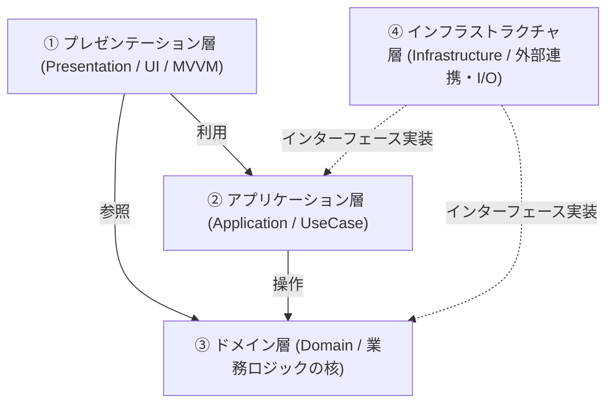
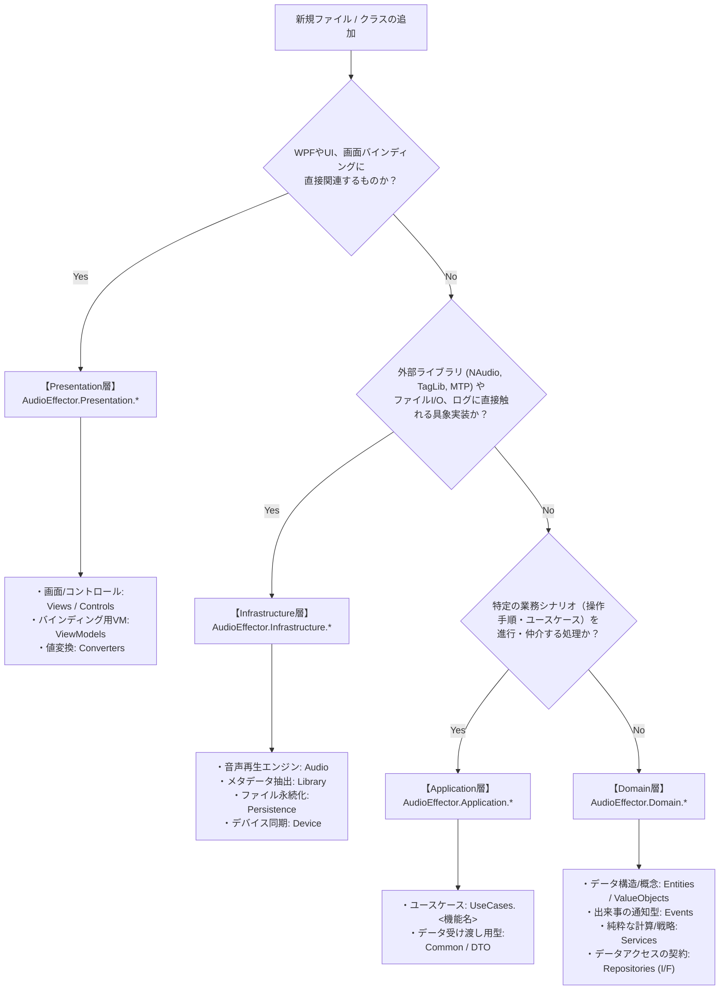
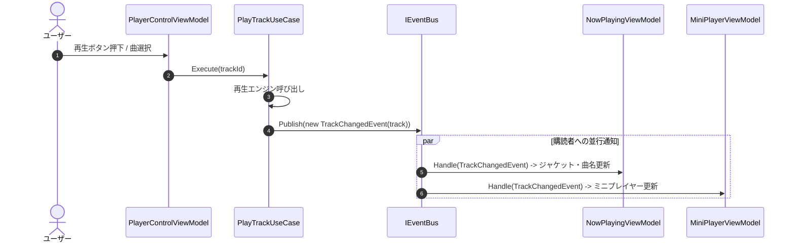

# アーキテクチャ全体設計書

## 1. 概要

### 1.1 目的
本ドキュメントは、AudioEffector におけるアーキテクチャの基本構造、各層の責務、名前空間（Namespace）の階層構造、およびソースコード配置の基準を定義する仕様書です。
開発者が新しい機能やクラスを追加する際に、**「どの層のどの名前空間に配置すべきか」「インターフェースと実装をどう分けるべきか」「DIをどのように管理するか」** に迷わないための共通ガイドラインとします。

### 1.2 設計の基本原則
1. **関心の分離 (Separation of Concerns)**: UI制御、業務ロジック、データアクセス、外部ライブラリ連携の責務をレイヤーごとに明確に分離します。
2. **依存性逆転の原則 (DIP: Dependency Inversion Principle)**: 上位レイヤー（ドメイン層・アプリケーション層）は下位レイヤー（インフラ層）の具象に依存せず、インターフェースに依存します。
3. **ドメインの独立性**: ドメイン層は、WPFなどのUIフレームワークやNAudio・TagLib等の外部I/Oライブラリに一切依存しない純粋なC#で構成します。

---

## 2. 4層アーキテクチャの定義と各層の役割

本システムは以下の4層構造で構成されます。依存の方向は **常に外側から内側（ドメイン層）へ向かう単方向** です。



### 2.1 各層の役割一覧

| レイヤー名 | 役割と責務 | 配置するもの | 依存してよい層 | 依存してはならないもの |
| :--- | :--- | :--- | :--- | :--- |
| **① プレゼンテーション層**<br>*(Presentation)* | ・UIの描画とユーザー入力受付<br>・画面遷移および表示状態の管理<br>・UIバインディング（MVVM） | View, ViewModel, Control, Converter, Theme | Application層, Domain層 | Infrastructure層の具象クラス |
| **② アプリケーション層**<br>*(Application)* | ・ユーザーの操作シナリオ（ユースケース）の進行<br>・ドメインモデルとリポジトリ/外部エンジンの連携調整<br>・トランザクションやイベント発行のオーケストレーション | UseCase, DTO, EventBus, アプリケーション共通処理 | Domain層, インフラ層の抽象(I/F) | Presentation層(UI/WPF), Infrastructure層の具象 |
| **③ ドメイン層**<br>*(Domain)* | ・アプリケーションの核となる業務ルールとデータ構造の表現<br>・不変条件（バリデーション等）の保護<br>・外部I/OやUIに依存しない純粋な計算処理 | Entity, Value Object, Domain Service, Domain Event, Repository I/F | なし (純粋なC#標準ライブラリのみ) | 全ての上位層, 外部ライブラリ (WPF, NAudio, TagLib等) |
| **④ インフラストラクチャ層**<br>*(Infrastructure)* | ・外部ライブラリやOS機能との仲介（アダプター）<br>・ファイルシステム・JSONへのデータ永続化<br>・ハードウェア（オーディオデバイス、MTPデバイス）制御 | Repository実装, Audio再生エンジン, メタデータ抽出器, デバイス同期, Logger | Domain層(I/F実装), Application層(I/F実装) | Presentation層 (UI/WPF) |

---

## 3. 名前空間（Namespace）とディレクトリ配置基準

### 3.1 新規コードの配置判定フロー

新しいクラスやファイルを作成する際は、以下のフローに従って配置先の層と名前空間を決定します。



---

### 3.2 名前空間・ディレクトリ階層一覧

```
AudioEffector/
│
├── Domain/                                      # [名前空間: AudioEffector.Domain]
│   ├── Entities/                                # エンティティ（IDを持ちライフサイクルがあるモデル）
│   │   └── Device/                              # デバイス関連エンティティ
│   ├── ValueObjects/                            # 値オブジェクト（値そのものを表す不変オブジェクト）
│   ├── Events/                                  # ドメインイベント（状態変化を通知するレコード型）
│   ├── Services/                                # ドメインサービス（特定エンティティに属さない純粋ロジック/計算）
│   └── Repositories/                            # リポジトリおよび外部アクセスのインターフェース (I/F)
│
├── Application/                                 # [名前空間: AudioEffector.Application]
│   ├── Common/                                  # アプリケーション共通基盤（EventBus, 共通I/F, 結果型など）
│   └── UseCases/                                # ユースケース（機能カテゴリごとにサブディレクトリを配置）
│       ├── Audio/                               # 再生・停止・シーク・音量等のユースケース
│       ├── Library/                             # ライブラリスキャン・検索・お気に入り等のユースケース
│       ├── Playlist/                            # プレイリスト作成・編集・並び替え等のユースケース
│       ├── Equalizer/                           # イコライザー設定・プリセット適用等のユースケース
│       ├── Device/                              # デバイス検出・ファイル転送等のユースケース
│       └── Settings/                            # 設定読み込み・保存等のユースケース
│
├── Infrastructure/                              # [名前空間: AudioEffector.Infrastructure]
│   ├── Audio/                                   # NAudioを利用した音声再生・DSPエンジン実装
│   ├── Library/                                 # TagLibSharpを利用したファイルメタデータ解析・画像抽出
│   ├── Device/                                  # MediaDevicesを利用したMTPポータブルデバイス操作
│   ├── Persistence/                             # JSONファイル読み書き等のリポジトリ具象実装
│   └── Logging/                                 # NLog等を利用したログ出力実装
│
└── Presentation/                                # [名前空間: AudioEffector.Presentation]
    ├── ViewModels/                              # 各画面・コントロールに対応するViewModel
    ├── Views/                                   # XAMLウィンドウおよびユーザーコントロール
    ├── Controls/                                # アプリ共通のカスタムUIコントロール
    ├── Converters/                              # XAMLデータバインディング用ValueConverter
    └── Themes/                                  # スタイル・リソースディクショナリ (XAML)
```

---

## 4. DI（依存性注入）設計とインターフェース・実装の配置基準

### 4.1 インターフェースと実装の配置ルール（DIPの適用）

「インターフェースをどこに置き、実装をどこに置くか」は以下の原則で統一します。

| 種別 | インターフェース (I/F) の配置層 | 実装 (Impl) の配置層 | 理由 |
| :--- | :--- | :--- | :--- |
| **データ永続化 (Repository)** | **Domain層**<br>(`Domain.Repositories.IxxxRepository`) | **Infrastructure層**<br>(`Infrastructure.Persistence.JsonxxxRepository`) | Domain層がデータアクセスの契約を定義し、永続化手段（JSON/DB）から独立させるため。 |
| **外部ハード/ライブラリ連携**<br>*(Audio Engine, MTP等)* | **Domain層** または **Application層**<br>(`Domain.Repositories.IDeviceRepository`<br>`Application.Common.IAudioEngine` 等) | **Infrastructure層**<br>(`Infrastructure.Audio.NAudioPlaybackEngine`<br>`Infrastructure.Device.MtpDeviceAdapter`) | 外部ライブラリ（NAudio等）の変更やテスト時のモック差し替えを容易にするため。 |
| **イベント仲介 (EventBus)** | **Application層**<br>(`Application.Common.IEventBus`) | **Application層** または **Infrastructure層**<br>(`Application.Common.EventBus`) | アプリケーション全体の通信ハブとして機能させるため。 |
| **ユースケース (UseCase)** | **Application層** (具象クラスで可、またはI/F) | **Application層** (`xxxUseCase`) | UseCaseは状態を持たない操作単位（Service）として登録。 |
| **画面モデル (ViewModel)** | インターフェース不要（具象クラス） | **Presentation層** (`xxxViewModel`) | WPFのDataContextに直接バインドするため。 |

---

### 4.2 DIコンテナの管理方法

依存性注入には `Microsoft.Extensions.DependencyInjection` を使用します。
レイヤー間の依存関係をクリーンに保つため、**各レイヤーごとに `ServiceCollection` の拡張メソッドを用意してDI登録を集約** します。

```
AudioEffector/
├── Infrastructure/DependencyInjection.cs  --> AddInfrastructureServices()
├── Application/DependencyInjection.cs     --> AddApplicationServices()
├── Presentation/DependencyInjection.cs    --> AddPresentationServices()
└── App.xaml.cs                            --> 各拡張メソッドを呼び出してコンテナをビルド
```

#### 各層の拡張メソッドの登録イメージ

```csharp
// Infrastructure層の登録例 (Infrastructure/DependencyInjection.cs)
public static class DependencyInjection
{
    public static IServiceCollection AddInfrastructure(this IServiceCollection services)
    {
        services.AddSingleton<IAudioEngine, NAudioPlaybackEngine>();
        services.AddSingleton<IPlaylistRepository, JsonPlaylistRepository>();
        services.AddSingleton<IFavoriteRepository, JsonFavoriteRepository>();
        services.AddSingleton<ISettingsRepository, JsonSettingsRepository>();
        return services;
    }
}

// Application層の登録例 (Application/DependencyInjection.cs)
public static class DependencyInjection
{
    public static IServiceCollection AddApplication(this IServiceCollection services)
    {
        services.AddSingleton<IEventBus, EventBus>();
        services.AddTransient<PlayTrackUseCase>();
        services.AddTransient<ScanLibraryFolderUseCase>();
        services.AddTransient<SyncTracksToDeviceUseCase>();
        return services;
    }
}

// Presentation層の登録例 (Presentation/DependencyInjection.cs)
public static class DependencyInjection
{
    public static IServiceCollection AddPresentation(this IServiceCollection services)
    {
        services.AddSingleton<MainViewModel>();
        services.AddSingleton<PlayerControlViewModel>();
        services.AddSingleton<LibraryViewModel>();
        services.AddSingleton<PlaylistViewModel>();
        services.AddSingleton<EqualizerViewModel>();
        services.AddSingleton<DeviceSyncViewModel>();
        return services;
    }
}
```

#### アプリケーション起動時の初期化 (`App.xaml.cs`)
```csharp
public partial class App : Application
{
    public static IServiceProvider Services { get; private set; } = null!;

    protected override void OnStartup(StartupEventArgs e)
    {
        base.OnStartup(e);

        var services = new ServiceCollection();

        // 各レイヤーのサービスを一括登録
        services.AddInfrastructure();
        services.AddApplication();
        services.AddPresentation();

        Services = services.BuildServiceProvider();

        // メインウィンドウの表示
        var mainWindow = new MainWindow
        {
            DataContext = Services.GetRequiredService<MainViewModel>()
        };
        mainWindow.Show();
    }
}
```

---

### 4.3 ライフサイクル（Lifetime）の選定基準

| ライフサイクル | 適用対象 | 選定の基準 |
| :--- | :--- | :--- |
| **Singleton**<br>*(単一インスタンス)* | ・`IAudioEngine` (再生デバイス管理)<br>・各種 `Repository` (ファイルキャッシュ・競合防止)<br>・`IEventBus` (イベントハブ)<br>・主要な `ViewModel` (アプリ起動中の表示状態・バインディング維持) | アプリケーション全体で状態を共有・維持する必要があるもの、またはリソースの再生成コストが高いもの。 |
| **Transient**<br>*(都度生成)* | ・各種 `UseCase` (PlayTrackUseCase等)<br>・一時ダイアログ用ViewModel (InputBoxViewModel等)<br>・短命なヘルパー・計算クラス | 状態を保持しない（ステートレスな）処理単位、または使い捨ての画面・処理。 |
| **Scoped**<br>*(スコープ内共有)* | （原則デスクトップWPFアプリでは通常使用しません） | リクエスト単位等の明確なスコープが存在する場合のみ。 |

---

## 5. ドメインイベントの配置と連携仕様

画面間（ViewModel間）や処理間の結合度を下げるため、ドメインイベント（Pub/Sub）を活用します。

### 5.1 配置と連携ルール
1. **イベントの定義**: **Domain層 (`Domain/Events/`)** に配置します。イミュータブルな `record` 型として定義します。
2. **イベントの発行 (Publish)**: **Application層 (UseCase)** のみが `IEventBus.Publish(e)` を呼び出して発行します（Domain層はEventBusに依存せず、100%純粋な状態を保ちます）。
3. **イベントの購読 (Subscribe)**: **Presentation層 (ViewModel)** や **Application層** で `IHandle<TEvent>` を実装し、自律的に状態を更新します。



---

## 6. 関連ドキュメント・Issue

- **親Issue**: [#131 [Refactoring] DDD（ドメイン駆動設計）およびレイヤードアーキテクチャ（4層＋MVVM）への大規模リファクタリング](https://github.com/taketonnbo/Audio_Effector/issues/131)
- **対象Issue**: [#132 [Refactoring Phase 0] アーキテクチャ詳細設計書の作成](https://github.com/taketonnbo/Audio_Effector/issues/132)
