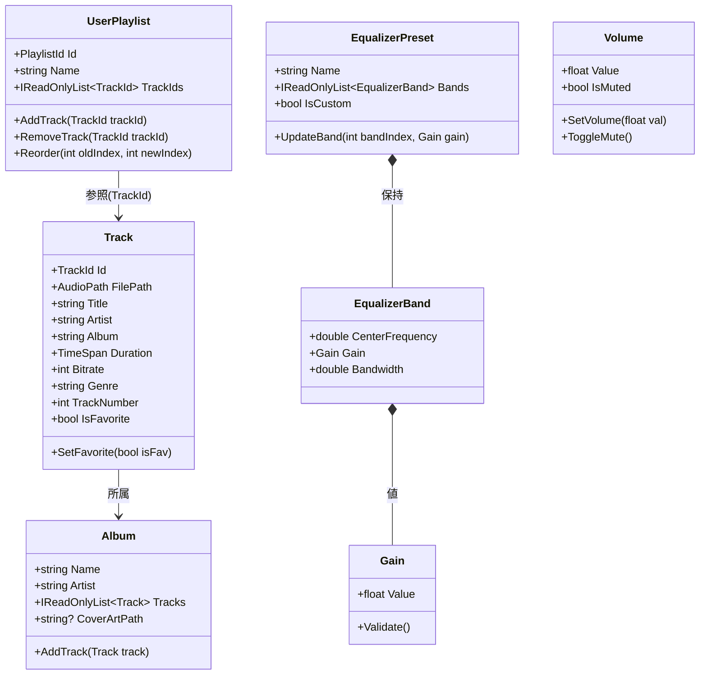
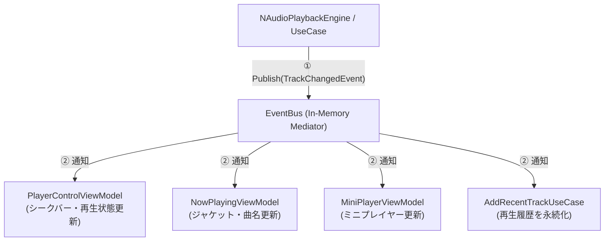
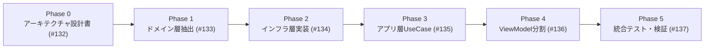

# アーキテクチャ全体設計書 (DDD・4層レイヤードアーキテクチャ)

## 1. 概要

### 1.1 目的
本ドキュメントは、AudioEffector における大規模リファクタリングの全体設計書です。
**DDD（ドメイン駆動設計）** の原則および **4層レイヤードアーキテクチャ（プレゼンテーション層・アプリケーション層・ドメイン層・インフラストラクチャ層）** を導入し、UIフレームワーク（WPF/MVVM）に最適化したアーキテクチャ基盤を定義します。

### 1.2 リファクタリングの背景と技術課題
- **神クラス（God Object）の解体**: `MainViewModel.cs` (約3,241行) に集中していた「再生制御」「ライブラリ管理」「プレイリスト編集」「イコライザー計算」「MTPデバイス同期」「UI状態管理」を分離・独立させます。
- **ドメインロジックの純粋化**: `Models` がUIライブラリ（`BitmapImage` や UI通知等）に依存している状態を解消し、フレームワーク非依存の純粋なC#クラスへ再構築します。
- **インフラストラクチャとの疎結合化**: NAudio, TagLibSharp, MediaDevices, ファイルI/O への依存をインターフェースを介したアダプター構造に改め、単体テスト（Unit Test）を容易にします。

---

## 2. アーキテクチャ方針と全体構成

### 2.1 4層レイヤードアーキテクチャの定義

本システムは、責務ごとに明確に分離された以下の4層で構成されます。

| レイヤー名 | 主な責務 | 許可される依存先 | 依存してはならないもの |
| :--- | :--- | :--- | :--- |
| **プレゼンテーション層**<br>*(Presentation)* | 画面描画、ユーザー入力処理、UIバインディング、画面遷移 | アプリケーション層, ドメイン層 | インフラ層具象クラス |
| **アプリケーション層**<br>*(Application)* | 業務シナリオ（ユースケース）の調整・進行、トランザクション境界 | ドメイン層, インフラ層インターフェース | プレゼンテーション層 (UI/WPF), インフラ層具象 |
| **ドメイン層**<br>*(Domain)* | 業務ルール、エンティティ、値オブジェクト、ドメインサービス、リポジトリI/F | なし (純粋なC#) | 全ての上位層, 外部ライブラリ (WPF, NAudio等) |
| **インフラストラクチャ層**<br>*(Infrastructure)* | 外部ライブラリ連携 (NAudio, TagLib, MTP)、ファイルI/O (JSON)、ログ | ドメイン層 (I/Fの実装), アプリケーション層 | プレゼンテーション層 (UI/WPF) |

### 2.2 アーキテクチャ全体構成図

```mermaid
flowchart TD
    subgraph PresentationLayer["プレゼンテーション層 (Presentation / MVVM)"]
        Views["Views / XAML / Controls / Converters"]
        MainVM["MainViewModel (ルーティング・全体ダイアログ)"]
        PlayerVM["PlayerControlViewModel (再生UI)"]
        LibraryVM["LibraryViewModel (ライブラリ・検索)"]
        PlaylistVM["PlaylistViewModel (プレイリストUI)"]
        EqualizerVM["EqualizerViewModel (EQ・プリセットUI)"]
        DeviceSyncVM["DeviceSyncViewModel (MTP同期UI)"]
        NowPlayingVM["NowPlayingViewModel (ジャケット・曲情報)"]
    end

    subgraph ApplicationLayer["アプリケーション層 (Application / UseCases)"]
        AudioUC["Audio UseCases (Play, Pause, Seek, Volume, Next/Prev)"]
        LibraryUC["Library UseCases (Scan, Search, Sort, Favorites)"]
        PlaylistUC["Playlist UseCases (Create, Add, Remove, Reorder)"]
        EqualizerUC["Equalizer UseCases (ApplyPreset, UpdateGain)"]
        DeviceUC["Device UseCases (Fetch, Sync)"]
        SettingsUC["Settings UseCases (Load, Save)"]
    end

    subgraph DomainLayer["ドメイン層 (Domain Layer - 業務ロジックの核)"]
        Entities["Entities (Track, Album, UserPlaylist, EqualizerPreset, DeviceTrack)"]
        ValueObjects["Value Objects (AudioPath, Volume, FrequencyBand, Gain, TimePosition)"]
        DomainServices["Domain Services (SpectrumCalculator, PlaybackOrderStrategy)"]
        DomainEvents["Domain Events (TrackChangedEvent, PlaybackStateChangedEvent)"]
        RepoInterfaces["Repository Interfaces (ITrackRepository, IPlaylistRepository, IFavoriteRepository, ISettingsRepository)"]
        EngineInterface["Audio Engine Interface (IAudioEngine)"]
    end

    subgraph InfrastructureLayer["インフラストラクチャ層 (Infrastructure)"]
        NAudioEngine["NAudioPlaybackEngine (NAudio再生・シーク・EQ DSP)"]
        SampleAgg["SampleAggregator (FFT解析バッファ)"]
        TagLibExtractor["TagLibMetadataExtractor (TagLibSharpメタデータ解析)"]
        AlbumArt["AlbumArtLoader (画像ロード・メモリキャッシュ)"]
        MtpAdapter["MtpDeviceAdapter (MediaDevices MTP転送)"]
        JsonRepos["JsonRepositories (JSON永続化: Playlist, Favorite, Settings)"]
        NLogAdapter["NLogService (ロギング)"]
    end

    Views --> MainVM & PlayerVM & LibraryVM & PlaylistVM & EqualizerVM & DeviceSyncVM & NowPlayingVM
    MainVM & PlayerVM & LibraryVM & PlaylistVM & EqualizerVM & DeviceSyncVM & NowPlayingVM --> ApplicationLayer
    
    AudioUC & LibraryUC & PlaylistUC & EqualizerUC & DeviceUC & SettingsUC --> Entities
    AudioUC & LibraryUC & PlaylistUC & EqualizerUC & DeviceUC & SettingsUC --> DomainServices
    AudioUC & LibraryUC & PlaylistUC & EqualizerUC & DeviceUC & SettingsUC --> RepoInterfaces
    AudioUC --> EngineInterface

    NAudioEngine -.->|implements| EngineInterface
    JsonRepos -.->|implements| RepoInterfaces
    TagLibExtractor -.->|implements| DomainLayer
    MtpAdapter -.->|implements| DomainLayer
```



---

## 3. 各レイヤーの詳細設計

### 3.1 プレゼンテーション層 (Presentation Layer / MVVM)

#### 役割と構成
WPFのXAML、各種View、Converter、および画面単位に分割されたViewModelで構成されます。UIのバインディングとユーザー入力イベントの受付に専念し、ビジネスロジックはアプリケーション層のUseCaseへ委譲します。

#### MainViewModel の解体と各専用ViewModelの責務マッピング表

| ViewModelクラス名 | 担当機能・責務 | 移行元 `MainViewModel` の主要機能 |
| :--- | :--- | :--- |
| `MainViewModel` | 画面全体の遷移制御 (`CurrentViewType`)、ステータスバー、全体ダイアログ表示 | `CurrentViewType`, `IsLibraryVisible` 等の切り替え、全体終了処理 |
| `PlayerControlViewModel` | 再生/一時停止/停止、シーク位置、音量調整、リピート/シャッフル、スペクトラム表示 | `TogglePlayPauseCommand`, `Position`, `Volume`, `SpectrumValues` |
| `LibraryViewModel` | 全曲一覧、アルバム一覧、アーティスト一覧、フォルダツリー、楽曲検索・ソート | `Tracks`, `Albums`, `SearchText`, `SelectedSortOption`, `RefreshLibrary` |
| `PlaylistViewModel` | プレイリスト一覧、プレイリスト内楽曲表示、楽曲の追加・削除・並び替え | `UserPlaylists`, `PlaylistTracks`, `AddTrackToPlaylistCommand` |
| `EqualizerViewModel` | 10バンドEQスライダー、プリセット選択、カスタムプリセット保存 | `EqualizerBands`, `SelectedPreset`, `ApplyPresetCommand` |
| `DeviceSyncViewModel` | ポータブルデバイス（MTP）の接続検出、デバイス内楽曲一覧、転送進捗 | `RefreshDrivesCommand`, `TransferTrackToDeviceCommand`, `TransferProgress` |
| `NowPlayingViewModel` | 再生中ジャケットアート、タイトル、アーティスト、サイドパネル情報 | `NowPlayingImage`, `CurrentTrack`, `SidebarControl` |
| `SettingsViewModel` | テーマ切替、起動時設定、ショートカットキー設定 | `SettingsViewModel.cs` (既存クラスをリファクタリング) |

---

### 3.2 アプリケーション層 (Application Layer / UseCases)

#### 役割と構成
プレゼンテーション層からの要求を受け、ドメインモデルとインフラストラクチャ層を連携させてユースケースを実行します。

#### 主要ユースケース一覧
- **再生制御 (`Application/UseCases/Audio/`)**:
  - `PlayTrackUseCase`: 指定トラックの再生、再生エンジン呼び出し、`TrackChangedEvent` 発行
  - `PausePlaybackUseCase`, `ResumePlaybackUseCase`, `StopPlaybackUseCase`
  - `SeekAudioUseCase`: 指定秒数へのシーク
  - `ChangeVolumeUseCase`: 音量変更・ミュート切替
  - `NextTrackUseCase`, `PreviousTrackUseCase`: `PlaybackOrderStrategy` に基づく次曲/前曲決定
- **ライブラリ・プレイリスト (`Application/UseCases/Library/`)**:
  - `ScanLibraryFolderUseCase`: フォルダ配下の全音源スキャン、メタデータ抽出、アルバムグループ化
  - `SearchTracksUseCase`, `SortTracksUseCase`: 条件に合致するトラックの抽出・整列
  - `CreatePlaylistUseCase`, `DeletePlaylistUseCase`, `AddTrackToPlaylistUseCase`, `ReorderPlaylistTracksUseCase`
  - `ToggleFavoriteUseCase`: お気に入り登録・解除
- **イコライザー (`Application/UseCases/Equalizer/`)**:
  - `ApplyEqualizerPresetUseCase`, `UpdateBandGainUseCase`, `SaveCustomPresetUseCase`
- **デバイス同期 (`Application/UseCases/Device/`)**:
  - `FetchDeviceTracksUseCase`, `SyncTracksToDeviceUseCase`
- **設定 (`Application/UseCases/Settings/`)**:
  - `LoadSettingsUseCase`, `SaveSettingsUseCase`

---

### 3.3 ドメイン層 (Domain Layer - 業務ロジックの核)

#### 役割と構成
アプリケーションの中心となる業務ルールとデータを表現します。外部ライブラリやUIフレームワーク（WPF）への依存を一切持たず、プレーンなC#オブジェクト（POCO）として実装します。

#### クラス図 (Mermaid)



#### ドメインサービス
- `SpectrumCalculator`: 1024ポイントFFTデータから64バンドの振幅値を計算し、低音/中音/高音スケーリングおよびチルト補正（`SpectrumTrebleTiltDb` 等）を適用。
- `PlaybackOrderStrategy`: 通常順、Fisher-Yatesシャッフル、単曲リピート、全曲リピートの次曲算出。

#### リポジトリインターフェース
- `ITrackRepository`: 楽曲メタデータの検索・取得・キャッシュ
- `IPlaylistRepository`: プレイリストの取得・保存・削除
- `IFavoriteRepository`: お気に入り楽曲リストの取得・保存
- `ISettingsRepository`: アプリケーション設定の読み書き
- `IDeviceRepository`: 外部ポータブルデバイスのファイル操作

---

### 3.4 インフラストラクチャ層 (Infrastructure Layer)

#### 役割と構成
外部ライブラリ（NAudio, TagLibSharp, MediaDevices）、ファイルシステム（JSONファイル）、およびNLogロギングをカプセル化し、ドメイン層・アプリケーション層で定義されたインターフェースを実装します。

#### 主要コンポーネント
1. **オーディオエンジン (`Infrastructure/Audio/NAudioPlaybackEngine.cs`)**:
   - NAudioの `AudioFileReader`, `WaveOutEvent`, `Equalizer`, `SampleAggregator` を管理
   - UIスレッドから直接参照させず、`IAudioEngine` インターフェース経由で制御
2. **メタデータ抽出 (`Infrastructure/Library/TagLibMetadataExtractor.cs`)**:
   - TagLibSharpを用いてID3v2, FLAC, M4A, AACのメタデータを読み込み、Domainの `Track` / `Album` へ変換
3. **画像ローダー (`Infrastructure/Library/AlbumArtLoader.cs`)**:
   - アルバムアート画像をバイト配列（`byte[]`）またはStreamとして読み込み、メモリキャッシュを管理（WPFの `BitmapImage` への変換はプレゼンテーション層のConverterで実施）
4. **JSON永続化リポジトリ (`Infrastructure/Persistence/`)**:
   - `JsonPlaylistRepository.cs` (`playlists.json`)
   - `JsonFavoriteRepository.cs` (`favorites.json`)
   - `JsonSettingsRepository.cs` (`settings.json`)
   - `JsonPresetRepository.cs` (`presets.json`)
5. **MTPデバイス同期アダプター (`Infrastructure/Device/MtpDeviceAdapter.cs`)**:
   - MediaDevicesライブラリを用いてポータブルデバイスの検出・ディレクトリ探索・ファイル転送を実行

---

## 4. イベント駆動・ドメインイベント基盤設計

### 4.1 ドメインイベントの仕組み
ドメイン内で発生した状態変化（再生開始、トラック変更、音量変更など）をイベントとして発行し、購読側（各ViewModelやユースケース）が自律的に反応する **Pub/Sub（Publish / Subscribe）パターン** を採用します。



### 4.2 ドメインイベント定義一覧

```csharp
// ドメインイベントの基底
public interface IDomainEvent { DateTime OccurredOn { get; } }

// 再生トラック変更イベント
public record TrackChangedEvent(Track Track, TimeSpan Position) : IDomainEvent
{
    public DateTime OccurredOn { get; } = DateTime.UtcNow;
}

// 再生状態変更イベント
public record PlaybackStateChangedEvent(PlaybackState State) : IDomainEvent
{
    public DateTime OccurredOn { get; } = DateTime.UtcNow;
}

// 音量変更イベント
public record VolumeChangedEvent(float Volume, bool IsMuted) : IDomainEvent
{
    public DateTime OccurredOn { get; } = DateTime.UtcNow;
}

// プレイリスト更新イベント
public record PlaylistUpdatedEvent(PlaylistId PlaylistId) : IDomainEvent
{
    public DateTime OccurredOn { get; } = DateTime.UtcNow;
}
```

---

## 5. 依存性注入（DI）基盤およびライフサイクル設計

### 5.1 DIコンテナの導入
`Microsoft.Extensions.DependencyInjection` を導入し、`App.xaml.cs` の起動時に全サービス、リポジトリ、ユースケース、ViewModelをコンテナへ登録します。

### 5.2 ライフサイクル管理方針

| レイヤー | クラス種別 | ライフサイクル | 登録理由 |
| :--- | :--- | :--- | :--- |
| **Domain / Infra** | `IAudioEngine` / `NAudioPlaybackEngine` | **Singleton** | アプリケーション全体で唯一の音声再生デバイスを管理するため |
| **Infra** | `IPlaylistRepository`, `IFavoriteRepository` 等 | **Singleton** | ファイルキャッシュおよびI/Oの競合を防止するため |
| **Application** | `IEventBus` / `EventBus` | **Singleton** | アプリケーション全体のイベント仲介ハブとして常駐するため |
| **Application** | 各種 `UseCase` (Play, Scan, Sync 等) | **Transient** | 状態を持たないステートレスな操作単位として実行ごとに生成 |
| **Presentation** | `MainViewModel`, `PlayerControlViewModel` 等 | **Singleton** | メイン画面のライフサイクル中、状態（再生進捗・UIバインディング）を維持するため |

---

## 6. ディレクトリ構造と名前空間の設計

```
AudioEffector/
├── Domain/                               # 【ドメイン層】
│   ├── Entities/                         # エンティティ (Track, Album, UserPlaylist, etc.)
│   │   └── Device/                       # デバイス用エンティティ (DeviceTrack, etc.)
│   ├── ValueObjects/                     # 値オブジェクト (Volume, FrequencyBand, etc.)
│   ├── Events/                           # ドメインイベント (TrackChangedEvent, etc.)
│   ├── Services/                         # ドメインサービス (SpectrumCalculator, PlaybackStrategy)
│   └── Repositories/                     # リポジトリインターフェース (ITrackRepository, etc.)
│
├── Application/                          # 【アプリケーション層】
│   ├── Common/                           # EventBus, Result型, DTO基底
│   └── UseCases/                         # ユースケース群
│       ├── Audio/                        # 再生・シーク・音量 UseCases
│       ├── Library/                      # スキャン・検索・お気に入り UseCases
│       ├── Playlist/                     # プレイリスト管理 UseCases
│       ├── Equalizer/                    # イコライザー調整 UseCases
│       ├── Device/                       # デバイス同期 UseCases
│       └── Settings/                     # 設定管理 UseCases
│
├── Infrastructure/                       # 【インフラストラクチャ層】
│   ├── Audio/                            # NAudio再生エンジン, SampleAggregator, EqualizerDsp
│   ├── Library/                          # TagLibSharpメタデータ抽出, AlbumArtLoader
│   ├── Device/                           # MediaDevices MTP同期アダプター
│   ├── Persistence/                      # JSONリポジトリ (JsonPlaylistRepository, etc.)
│   └── Logging/                          # NLogService
│
└── Presentation/ (旧ルート直下 & ViewModels/Views) # 【プレゼンテーション層】
    ├── ViewModels/                       # 分割された各種ViewModel
    │   ├── MainViewModel.cs
    │   ├── PlayerControlViewModel.cs
    │   ├── LibraryViewModel.cs
    │   ├── PlaylistViewModel.cs
    │   ├── EqualizerViewModel.cs
    │   ├── DeviceSyncViewModel.cs
    │   ├── NowPlayingViewModel.cs
    │   └── SettingsViewModel.cs
    ├── Views/                            # XAML View (LibraryView, EqualizerView, etc.)
    ├── Controls/                         # カスタムUIコントロール
    ├── Converters/                       # XAMLバインディング用ValueConverter
    └── Themes/                           # カラー・スタイル定義 (DarkTheme, LightTheme)
```

---

## 7. フェーズ分けと実装ロードマップ

本リファクタリングは以下の順序で安全かつ段階的に進めます。



1. **Phase 0: アーキテクチャ詳細設計書の作成** (Issue [#132](https://github.com/taketonnbo/Audio_Effector/issues/132)) 【本フェーズ】
2. **Phase 1: ドメイン層の抽出と純粋化** (Issue [#133](https://github.com/taketonnbo/Audio_Effector/issues/133))
3. **Phase 2: インフラストラクチャ層の実装** (Issue [#134](https://github.com/taketonnbo/Audio_Effector/issues/134))
4. **Phase 3: アプリケーション層（ユースケース）の実装とテスト** (Issue [#135](https://github.com/taketonnbo/Audio_Effector/issues/135))
5. **Phase 4: プレゼンテーション層（ViewModel）の分割とMVVM再構築** (Issue [#136](https://github.com/taketonnbo/Audio_Effector/issues/136))
6. **Phase 5: 全体統合テスト・リグレッション検証およびDocFXドキュメント更新** (Issue [#137](https://github.com/taketonnbo/Audio_Effector/issues/137))

---

## 8. 関連ドキュメント・Issue

- **親Issue**: [#131 [Refactoring] DDD（ドメイン駆動設計）およびレイヤードアーキテクチャ（4層＋MVVM）への大規模リファクタリング](https://github.com/taketonnbo/Audio_Effector/issues/131)
- **子Issue**:
  - [#132 [Refactoring Phase 0] アーキテクチャ詳細設計書の作成](https://github.com/taketonnbo/Audio_Effector/issues/132)
  - [#133 [Refactoring Phase 1] ドメイン層の抽出と純粋化](https://github.com/taketonnbo/Audio_Effector/issues/133)
  - [#134 [Refactoring Phase 2] インフラストラクチャ層の実装](https://github.com/taketonnbo/Audio_Effector/issues/134)
  - [#135 [Refactoring Phase 3] アプリケーション層の実装とテスト](https://github.com/taketonnbo/Audio_Effector/issues/135)
  - [#136 [Refactoring Phase 4] プレゼンテーション層の分割とMVVM再構築](https://github.com/taketonnbo/Audio_Effector/issues/136)
  - [#137 [Refactoring Phase 5] 全体統合テスト・検証](https://github.com/taketonnbo/Audio_Effector/issues/137)
