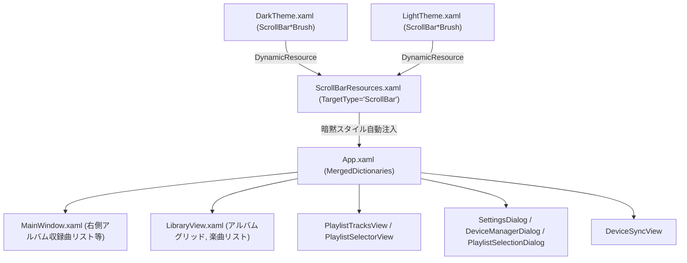

# スクロールバー 詳細設計書

## 1. 概要
本ドキュメントは、Audio Effector アプリケーションにおける「スリム・ミニマルスクロールバー」のアーキテクチャ、XAML ControlTemplate 設計、動的幅変更アニメーション/トリガー、テーマ連動リソース定義、およびグローバル暗黙スタイルの適用仕様を定義する詳細設計書です。

---

## 2. アーキテクチャとリソース構成



### 2.1 ファイル構成
- **`AudioEffector/Presentation/Themes/ScrollBarResources.xaml`**:
  - `ScrollBar` の `ControlTemplate`（垂直・水平）、`Thumb` スタイル、および `TargetType="{x:Type ScrollBar}"` の暗黙スタイルを定義。
- **`AudioEffector/Presentation/Themes/DarkTheme.xaml`**:
  - ダークテーマ用のカラー・ブラシ（`ScrollBarTrackBrush`, `ScrollBarThumbBrush`, `ScrollBarThumbHoverBrush`, `ScrollBarThumbDraggingBrush`）を定義。
- **`AudioEffector/Presentation/Themes/LightTheme.xaml`**:
  - ライトテーマ用のカラー・ブラシを定義。
- **`AudioEffector/App.xaml`**:
  - `MergedDictionaries` に `ScrollBarResources.xaml` を登録。
- **`AudioEffector/Presentation/Themes/ThemeManager.cs`**:
  - テーマ切り替え時に `ScrollBarResources.xaml` が誤って削除されないよう、`DarkTheme.xaml` / `LightTheme.xaml` のみを厳密に対象として差し替える安全設計を適用。

---

## 3. XAML ControlTemplate 設計

### 3.1 テンプレート構造
WPFの `ScrollBar` コントロールは `Track`（`PART_Track`）を中心に構成されます。本実装では上下・左右の矢印ボタン（LineUp/LineDown/LineLeft/LineRight）を排除し、トラック余白のクリック（PageUp/PageDown）とつまみ（Thumb）のドラッグのみを実装しています。

```xaml
<!-- Vertical ScrollBar Template -->
<ControlTemplate x:Key="VerticalScrollBarTemplate" TargetType="{x:Type ScrollBar}">
    <Grid x:Name="Bg" Background="{DynamicResource ScrollBarTrackBrush}" SnapsToDevicePixels="True">
        <Track x:Name="PART_Track" IsDirectionReversed="True" HorizontalAlignment="Center" Width="8">
            <Track.DecreaseRepeatButton>
                <RepeatButton Style="{StaticResource ScrollBarPageButtonStyle}" Command="{x:Static ScrollBar.PageUpCommand}"/>
            </Track.DecreaseRepeatButton>
            <Track.IncreaseRepeatButton>
                <RepeatButton Style="{StaticResource ScrollBarPageButtonStyle}" Command="{x:Static ScrollBar.PageDownCommand}"/>
            </Track.IncreaseRepeatButton>
            <Track.Thumb>
                <Thumb Style="{StaticResource VerticalScrollBarThumbStyle}"/>
            </Track.Thumb>
        </Track>
    </Grid>
</ControlTemplate>
```

### 3.2 Thumb（つまみ）の動的幅拡張ロジック
通常時はコンテンツの視認性を邪魔しないよう細身（幅 6px）で描画し、スクロールバー領域にマウスが重なった際、またはドラッグ中に 8px に拡張して操作性を高めます。

```xaml
<Style x:Key="VerticalScrollBarThumbStyle" TargetType="{x:Type Thumb}">
    <Setter Property="OverridesDefaultStyle" Value="True"/>
    <Setter Property="IsTabStop" Value="False"/>
    <Setter Property="MinHeight" Value="24"/>
    <Setter Property="Width" Value="6"/>
    <Setter Property="HorizontalAlignment" Value="Center"/>
    <Setter Property="Template">
        <Setter.Value>
            <ControlTemplate TargetType="{x:Type Thumb}">
                <Border x:Name="ThumbBorder"
                        Background="{DynamicResource ScrollBarThumbBrush}"
                        CornerRadius="3"
                        HorizontalAlignment="Stretch"
                        VerticalAlignment="Stretch"/>
                <ControlTemplate.Triggers>
                    <Trigger Property="IsMouseOver" Value="True">
                        <Setter TargetName="ThumbBorder" Property="Background" Value="{DynamicResource ScrollBarThumbHoverBrush}"/>
                    </Trigger>
                    <Trigger Property="IsDragging" Value="True">
                        <Setter TargetName="ThumbBorder" Property="Background" Value="{DynamicResource ScrollBarThumbDraggingBrush}"/>
                    </Trigger>
                </ControlTemplate.Triggers>
            </ControlTemplate>
        </Setter.Value>
    </Setter>
    <Style.Triggers>
        <DataTrigger Binding="{Binding IsMouseOver, RelativeSource={RelativeSource AncestorType={x:Type ScrollBar}}}" Value="True">
            <Setter Property="Width" Value="8"/>
        </DataTrigger>
        <Trigger Property="IsDragging" Value="True">
            <Setter Property="Width" Value="8"/>
        </Trigger>
    </Style.Triggers>
</Style>
```

---

## 4. テーマ連動と ThemeManager 連携

### 4.1 動的リソース（DynamicResource）によるバインド
すべての色・ブラシは `DynamicResource` で参照されているため、テーマ切り替え時にスクロールバー側の再初期化を行わずに配色が自動追従します。

### 4.2 ThemeManager における保護設計
`ThemeManager.ApplyTheme()` でテーマ差し替えを行う際、`ScrollBarResources.xaml` が誤って削除されないよう、判定式を厳密化しています。

```csharp
var existingThemeDict = System.Windows.Application.Current.Resources.MergedDictionaries
    .FirstOrDefault(d => d.Source != null && (d.Source.OriginalString.EndsWith("DarkTheme.xaml") || d.Source.OriginalString.EndsWith("LightTheme.xaml")));

if (existingThemeDict != null)
{
    System.Windows.Application.Current.Resources.MergedDictionaries.Remove(existingThemeDict);
}
```

---

## 5. パフォーマンス考慮事項
- **高負荷エフェクトの排除**:
  - `DropShadowEffect` や `BlurEffect` は使用せず、GPUで高速描画可能な `Border`（`CornerRadius="3"`）および `SolidColorBrush` で描画。
- **レイアウトパスの安定化**:
  - 親 `ScrollBar` の幅（8px）を固定し、内部の `Thumb` のみ（6px ⇔ 8px）を変更するため、`ScrollViewer` や周囲のコンテンツの再レイアウト（Measure / Arrange）を発生させず、非常に軽量に動作。

---

## 6. 関連Issue
- 親Issue: #51
- 実装Issue: #180
