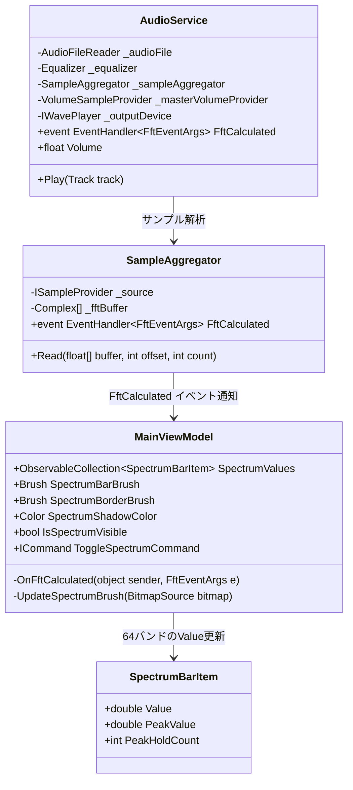
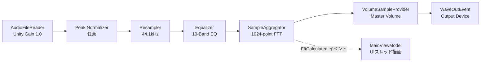

# スペクトラムアナライザ 詳細設計書

## 1. 概要
本ドキュメントは、Audio Effector アプリケーションにおける「スペクトラムアナライザ」機能の内部構造、データフロー、アルゴリズム、およびUIレンダリングの詳細仕様を定義する詳細設計書です。

---

## 2. アーキテクチャとクラス構造

### 2.1 クラス構成図


---

## 3. オーディオパイプラインとFFT解析フロー

### 3.1 パイプライン構成
音声信号は以下の順序で処理され、マスター音量（Volumeスライダー）の影響を受けずに楽曲本来の音響エネルギーがFFT解析器へ渡されます。



---

## 4. 周波数分割およびアルゴリズム詳細

### 4.1 64バンド周波数対数マッピング
- **解析周波数範囲**: $f_{min} = 30\text{ Hz} \sim f_{max} = 18,000\text{ Hz}$
- **FFTサイズ**: 1024点（ナイキスト周波数: 22,050 Hz、1ビンあたり解像度 $\approx 43.07\text{ Hz}$）
- **対数ステップ計算**:
  $$\text{logMin} = \log_{10}(30), \quad \text{logMax} = \log_{10}(18000), \quad \text{logStep} = \frac{\text{logMax} - \text{logMin}}{64}$$
  各バンド $i$ ($0 \le i < 64$) の周波数範囲 $[f_{\text{start}}, f_{\text{end}}]$:
  $$f_{\text{start}} = 10^{\text{logMin} + i \cdot \text{logStep}}, \quad f_{\text{end}} = 10^{\text{logMin} + (i+1) \cdot \text{logStep}}$$

### 4.2 チューニング係数と周波数補正ロジック
音響エネルギーの特性（低音域のエネルギー集中と高音域の急激なロールオフ）を補正し、低音から高音（シンバル/ハイハット）まで躍動感のあるバランスを実現するため、以下の係数を適用します。

| 係数名 | 型・値 | 役割・説明 |
| :--- | :--- | :--- |
| `SpectrumBassScale` | `double = 0.55` | 低音域（〜250Hz）のスケール係数。低音が天井に張り付くのを防止 |
| `SpectrumMidScale` | `double = 0.90` | 中音域（250Hz〜2.5kHz）のスケール係数。ボーカルやメロディの明瞭化 |
| `SpectrumTrebleScale` | `double = 2.90` | 高音域（2.5kHz〜18kHz）のスケール係数。シンバル・ハイハットのダイナミックな跳躍を強化 |
| `SpectrumTrebleTiltDb` | `double = 8.5` | 高音域チルト補正係数（250Hz以上に対しオクターブあたり +8.5dB 底上げ） |
| `SpectrumSensitivity` | `double = 1.65` | 全体ゲイン係数（バーの高さスケーリング） |

#### 高音域チルト・スケーリング数式
中心周波数 $f_c = \sqrt{f_{\text{start}} \cdot f_{\text{end}}}$ に対し：
$$\text{trebleTilt} = \begin{cases} \log_2\left(\frac{f_c}{250}\right) \times 8.5 & (f_c > 250\text{ Hz}) \\ 0 & (f_c \le 250\text{ Hz}) \end{cases}$$
$$\text{adjustedDb} = \text{rawDb} + 65 + \text{trebleTilt}$$
$$\text{val} = \max(0, \text{adjustedDb}) \times 1.65$$
帯域スケーリング:
- **低音域 ($f_c < 250\text{ Hz}$)**: $\text{val} \times \left(0.45 + (0.55 - 0.45) \times \frac{f_c}{250}\right)$
- **中音域 ($250\text{ Hz} \le f_c < 2500\text{ Hz}$)**: $\text{val} \times 0.90$
- **高音域 ($f_c \ge 2500\text{ Hz}$)**: $\text{val} \times \left(0.90 + (2.90 - 0.90) \times \left(\frac{f_c - 2500}{12000}\right)^{0.85}\right)$

### 4.3 スムージング（アタック・ディケイ）
- **アタック（上昇時）**: 係数 `0.45`（高速応答）
  $$\text{Value}_{t} = \text{Value}_{t-1} + (\text{Target} - \text{Value}_{t-1}) \times 0.45$$
- **ディケイ（下降時）**: 係数 `0.075`（滑らかな減衰）
  $$\text{Value}_{t} = \text{Value}_{t-1} - (\text{Value}_{t-1} - \text{Target}) \times 0.075$$

---

## 5. UIレイアウトおよびレンダリング設計

### 5.1 固定アスペクト比コンテナ構成
画面リサイズによるバーの歪みを防止するため、全描画要素を中央固定幅（768px）コンテナ内に集約しています。

```xml
<!-- 展開時高さ: 140px / アニメーション開閉対応 -->
<Grid Grid.Row="1" x:Name="SpectrumSlidePanel" Height="140" ClipToBounds="True">
    <!-- 背景: アルバムアートブラー + 暗色グラデーション -->
    
    <!-- 中央固定幅描画領域 (768px) -->
    <Grid Width="768" HorizontalAlignment="Center">
        <Grid.RowDefinitions>
            <RowDefinition Height="22"/> <!-- 周波数ラベル (60Hz, 250Hz, 500Hz, 1kHz, 4kHz, 16kHz) -->
            <RowDefinition Height="*"/>  <!-- ビジュアライザー (バー, 発光ベースライン, 水面反射) -->
        </Grid.RowDefinitions>
        
        <!-- 1. 発光ベースライン (Height: 1px) -->
        <!-- 2. スペクトラムバー (64本, Width: 6px, MaxHeight: 80px, CornerRadius: 3px) -->
        <!-- 3. 水面ミラーリフレクション (VisualBrush + ScaleY="-1" + BlurEffect) -->
    </Grid>
</Grid>
```

### 5.2 ビジュアルエフェクト仕様
1. **縦方向ネオングラデーション**:
   - 下部（Offset 0.0）: ディープパープル/マゼンタ（抽出色ベース、Alpha: 220）
   - 中央（Offset 0.5）: 高彩度ネオンシアン/アクセント（抽出色ベース、Alpha: 255）
   - 頂点（Offset 1.0）: ホワイトネオン（Alpha: 255）
2. **ネオングロー**: `DropShadowEffect` (Color: SpectrumShadowColor, BlurRadius: 10, ShadowDepth: 0, Opacity: 0.95)
3. **水面ミラーリフレクション**:
   - `VisualBrush` を用い、`ScaleTransform ScaleY="-1"` で上下反転。
   - `OpacityMask` により上部から下部へフェードアウト（Opacity: 65% → 0%）。
   - `BlurEffect Radius="3"` による水面拡散演出。

---

## 6. 関連ドキュメント・Issue
- 画面設計書: [設計/画面設計/スペクトラムアナライザ.md](file:///c:/Users/tnish/vs_code_git/Audio_Effector/設計/画面設計/スペクトラムアナライザ.md)
- 機能仕様書: [設計/機能仕様/スペクトラムアナライザ.md](file:///c:/Users/tnish/vs_code_git/Audio_Effector/設計/機能仕様/スペクトラムアナライザ.md)
- 関連Issue: #87 (スペクトラムアナライザのUIデザイン改良)
