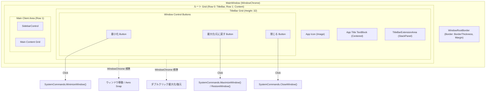

# カスタムタイトルバー 詳細設計書

## 1. 概要
本ドキュメントは、Audio Effector アプリケーションにおける「カスタムタイトルバー」のアーキテクチャ、コンポーネント構造、WindowChrome設定仕様、ウィンドウ最大化時の境界制御、およびテーマ切り替え制御の実装詳細を定義する詳細設計書です。

---

## 2. アーキテクチャとコンポーネント構造

### 2.1 全体構造図 (Mermaid)


### 2.2 主要コンポーネントと役割
- **`MainWindow` (`WindowChrome.WindowChrome`)**:
  - `WindowChrome` を利用してクライアント領域をウィンドウ上端まで拡張し、OS標準のタイトルバーを描画しないように構成。
- **`WindowRootBorder` (`Border`)**:
  - ウィンドウ全体を囲むルート要素。
  - 通常表示時は `BorderThickness="1"`、`BorderBrush="{DynamicResource TitleBarBorderBrush}"` を適用してウィンドウ境界を明確化。
  - 最大化表示時は `BorderThickness="0"`、`Margin="7"` を動的に適用してDWMのはみ出しを防止。
- **`TitleBar` (`Grid`)**:
  - ウィンドウ最上段（Row 0）に配置される高さ 32px のコンテナ。
  - 背景色に `TitleBarBackgroundBrush` を適用。
- **ウィンドウ制御ボタン群 (`Button`)**:
  - `WindowChrome.IsHitTestVisibleInChrome="True"` を付与し、WindowChrome領域内でもクリックイベントを確実に受領。
  - マウスホバー・押下状態のスタイルおよびアイコン動的切り替えを定義。

---

## 3. WindowChrome の設定仕様

`MainWindow.xaml` における `WindowChrome` の設定プロパティは以下の通りです。

```xaml
<WindowChrome.WindowChrome>
    <WindowChrome CaptionHeight="32"
                  ResizeBorderThickness="6"
                  CornerRadius="0"
                  GlassFrameThickness="0"
                  UseAeroCaptionButtons="False" />
</WindowChrome.WindowChrome>
```

| プロパティ | 設定値 | 役割・選定理由 |
| :--- | :--- | :--- |
| `CaptionHeight` | `32` | タイトルバーの高さを 32px に指定。この領域内でのドラッグ移動およびダブルクリックトグルが自動有効化。 |
| `ResizeBorderThickness` | `6` | ウィンドウ外周 6px をリサイズ境界として定義。スムーズなウィンドウサイズ変更を担保。 |
| `CornerRadius` | `0` | 角丸を無効化し、クリーンな矩形ウィンドウレイアウトを維持。 |
| `GlassFrameThickness` | `0` | OS標準のAero Glassフレームを非表示にし、クライアント描画領域に完全統合。 |
| `UseAeroCaptionButtons` | `False` | OS標準のキャプションボタン（最小化・最大化・閉じる）を非表示化。 |

---

## 4. ウィンドウ制御とライフサイクル連携

### 4.1 操作ハンドラーの実装 (`MainWindow.xaml.cs`)
WPF標準の `SystemCommands` を用いて、ウィンドウメッセージと正常なライフサイクルを呼び出します。

```csharp
private void TitleBarMinimizeButton_Click(object sender, RoutedEventArgs e)
{
    SystemCommands.MinimizeWindow(this);
}

private void TitleBarMaximizeButton_Click(object sender, RoutedEventArgs e)
{
    if (this.WindowState == WindowState.Maximized)
    {
        SystemCommands.RestoreWindow(this);
    }
    else
    {
        SystemCommands.MaximizeWindow(this);
    }
}

private void TitleBarCloseButton_Click(object sender, RoutedEventArgs e)
{
    SystemCommands.CloseWindow(this);
}
```

### 4.2 既存ロジックとの完全互換性
- **最小化時のミニプレイヤー移行**:
  - `SystemCommands.MinimizeWindow()` により `WindowState` が `Minimized` に変更されると、既存の `OnStateChanged` 内の処理が発火し、メインウィンドウの非表示とミニプレイヤー（`MiniPlayerWindow`）の起動が連動します。
- **アプリ終了時の転送中確認**:
  - `SystemCommands.CloseWindow()` により `OnClosing` が発火し、デバイスへのデータ転送中確認ダイアログおよびクリーンアップ処理が安全に実行されます。

---

## 5. 最大化時のDWM境界はみ出し防止ロジック

### 5.1 課題と対策
Windows OS の仕様上、`WindowChrome` が適用されたウィンドウを最大化すると、ウィンドウ境界（見えないリサイズボーダー分、約7〜8px）が画面外にはみ出します。これにより、ウィンドウ端にある閉じるボタンやアイコンが切れたり、マルチモニター環境で隣のモニターに食い込む問題が発生します。

### 5.2 XAML DataTrigger による補正実装
ルートコンテナ `WindowRootBorder` のスタイルに `WindowState` トリガーを定義し、最大化時に `Margin="7"` を適用して画面内に正しく収まるよう補正します。

```xaml
<Style x:Key="MainWindowRootBorderStyle" TargetType="Border">
    <Setter Property="BorderBrush" Value="{DynamicResource TitleBarBorderBrush}"/>
    <Setter Property="BorderThickness" Value="1"/>
    <Style.Triggers>
        <DataTrigger Binding="{Binding WindowState, RelativeSource={RelativeSource AncestorType=Window}}" Value="Maximized">
            <Setter Property="BorderThickness" Value="0"/>
            <Setter Property="Margin" Value="7"/>
        </DataTrigger>
    </Style.Triggers>
</Style>
```

---

## 6. テーマ連動リソース定義 (`DarkTheme.xaml`, `LightTheme.xaml`)

タイトルバー関連のブラシはすべて動的リソース（`DynamicResource`）として参照されており、`ThemeManager.ApplyTheme()` 実行時にリソースディクショナリが差し替えられることで、即座にテーマ色が反映されます。

```xaml
<!-- DarkTheme.xaml -->
<Color x:Key="TitleBarBackgroundColor">#161920</Color>
<Color x:Key="TitleBarForegroundColor">#F0F4F8</Color>
<Color x:Key="TitleBarBorderColor">#2A323D</Color>
<Color x:Key="TitleBarButtonHoverColor">#2A323D</Color>
<Color x:Key="TitleBarButtonPressedColor">#384454</Color>
<Color x:Key="TitleBarCloseButtonHoverColor">#E81123</Color>
<Color x:Key="TitleBarCloseButtonPressedColor">#B2101E</Color>

<!-- LightTheme.xaml -->
<Color x:Key="TitleBarBackgroundColor">#F5F5F5</Color>
<Color x:Key="TitleBarForegroundColor">#1E1E1E</Color>
<Color x:Key="TitleBarBorderColor">#E2E8F0</Color>
<Color x:Key="TitleBarButtonHoverColor">#E5E5E5</Color>
<Color x:Key="TitleBarButtonPressedColor">#CCCCCC</Color>
<Color x:Key="TitleBarCloseButtonHoverColor">#E81123</Color>
<Color x:Key="TitleBarCloseButtonPressedColor">#C4101E</Color>
```

---

## 7. パフォーマンス考慮事項
- **軽量レンダリング**: タイトルバーおよび各ボタンには `DropShadowEffect` や `BlurEffect` などの高負荷エフェクトは一切使用せず、ハードウェアアクセラレーションが効く `SolidColorBrush` および `Border` で描画しています。
- **不要な再レイアウトの抑止**: ボタンのホバーフィードバックは色の変化のみに留め、要素サイズやマージンの変更を伴わないため、レイアウトパスの再計算（Measure / Arrange）を発生させません。

---

## 8. 関連Issue
- 親Issue: #51
- 実装Issue: #165
