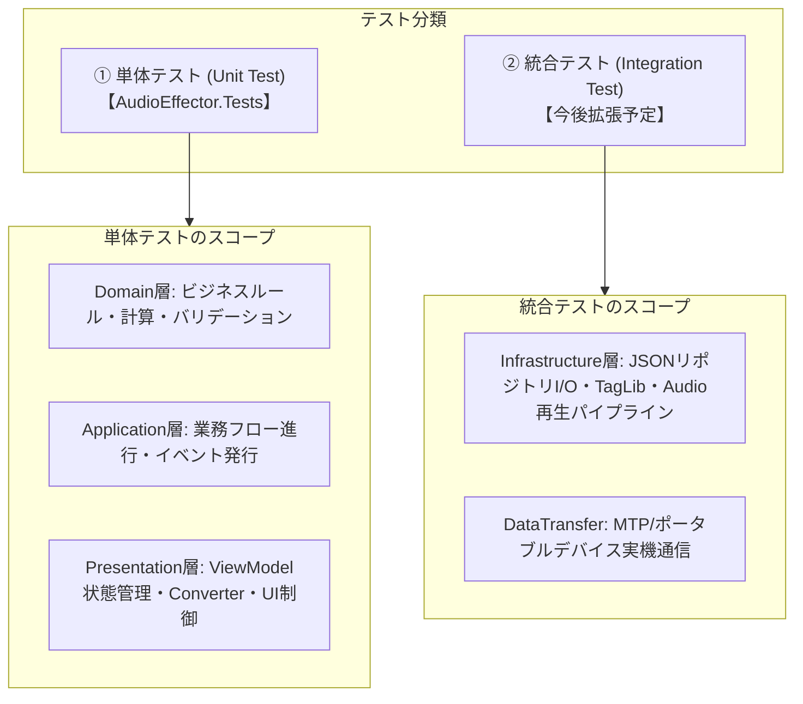
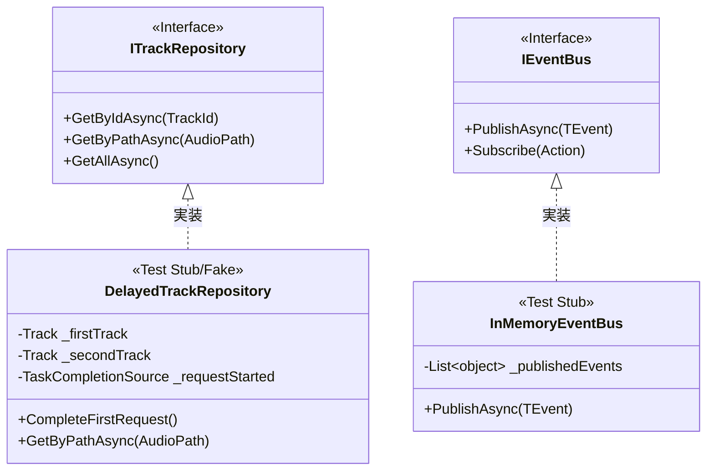

# テスト方針書

## 1. 概要と目的

### 1.1 目的
本ドキュメントは、AudioEffector プロジェクトにおけるテスト戦略、フレームワーク選定基準、テストコードの配置規則、モック/スタブ作成方針、および品質保証基準を定義する仕様書です。
4層アーキテクチャへのリファクタリングに伴い、各レイヤー（Domain, Application, Infrastructure, Presentation）の責務分離を担保し、長期的な保守性と回帰テスト（リグレッション防止）の信頼性を向上させることを目的とします。

### 1.2 テスト自動化の基本方針
1. **4層対称配置の徹底**: テストコードはプロダクションコードと完全に対称となるディレクトリ構造および名前空間を維持し、どのコードに対するテストであるかを直感的に把握可能とします。
2. **高速性と独立性**: 単体テストは外部I/O（ディスク、ネットワーク、外部デバイス等）から隔離し、ミリ秒単位で高速に実行・完了できることとします。テスト間の順序依存やグローバル状態の共有を禁止します。
3. **振る舞いの検証（BDD的アプローチ）**: 単なる内部実装のトレースではなく、「どのような事前条件のときに、どのような処理を行い、どのような結果が得られるか」という仕様・振る舞いを検証します。

---

## 2. テストフレームワーク選定と技術スタック

本プロジェクトにおけるテスト関連技術スタックは以下の通りです。

| 項目 | 採用技術 | バージョン | 選定理由・特徴 |
| :--- | :--- | :--- | :--- |
| **テストフレームワーク** | **xUnit** | 2.5.3 | ・Modern .NETにおけるデファクトスタンダード<br>・テストクラスごとにインスタンスが新規生成されるため、ステートの独立性が極めて高い<br>・`[Theory]` + `[InlineData]` による柔軟なデータ駆動テストが可能<br>・並列実行性能に優れる |
| **テストランナー** | **Microsoft.NET.Test.Sdk**<br>**xUnit.runner.visualstudio** | 17.8.0 / 2.5.3 | ・`dotnet test` CLIおよびVisual Studio Test Explorerとの完全な統合 |
| **カバレッジ収集** | **coverlet.collector** | 6.0.0 | ・ビルドパイプライン連携が容易なクロスプラットフォームカバレッジ収集ツール |
| **ターゲットフレームワーク** | **net8.0-windows** | .NET 8 | ・プロダクションコードと同一のランタイム環境およびWPF UIスタックをサポート |

> [!NOTE]
> **MSTestとの比較検討**: MSTestは従来の.NET開発で広く利用されていますが、xUnitはテスト実行時の副作用（共有インスタンスによる状態汚染）を言語仕様レベルで防ぐ設計となっており、DDD/Clean Architectureにおけるドメイン・アプリケーション層の純粋なロジック検証に最も適合するため採用しています。

---

## 3. テストの分類とスコープ

本システムにおけるテストは、その目的と依存関係に応じて以下の2階層に分類します。



### 3.1 単体テスト (Unit Test) - 本プロジェクトの主軸
- **対象**: Domain層のエンティティ/値オブジェクト/サービス、Application層のApplicationService、Presentation層のViewModel/Converter/Control。
- **実行条件**: 外部ファイル、実オーディオデバイス、外部ハードウェアに依存せず、インメモリかつ単一プロセス内で完結すること。
- **配置先**: `AudioEffector.Tests`

### 3.2 統合テスト (Integration Test)
- **対象**: Infrastructure層のファイル永続化（リポジトリのJSON読み書き）、TagLibSharpによる音声ファイルタグ抽出、NAudio再生エンジン、MTPデバイス同期。
- **実行方針**: モック化が困難な実I/Oを検証するため、一時ディレクトリの生成や特定テスト用音声アセットを用いて段階的に拡充します。

### 3.3 単体テスト実装を見送る条件と結合テストへの委譲基準

本プロジェクトでは**プロダクションコードの保守性と設計純度を最優先**とし、「単体テストを通しやすくするためだけにプロダクションコードを改変すること」を原則禁止とします。そのため、以下の条件に該当する処理は単体テストでの実装を見送り、後続の結合テスト（UIテストスイート、統合検証シナリオ）で動作を吸収・担保します。

#### ① テスト目的によるプロダクションコード改変の禁止原則
- 単体テストで非同期処理や内部状態を観測・同期しやすくすることのみを目的に、本来不要な公開API（publicメソッド、publicプロパティ）を新設してはならない。
- テストランナーや特定スレッド（STA等）の停止タイミングに対応するためだけの条件分岐（例: `!dispatcher.Thread.IsAlive` やテスト環境固有のフラグ判定）をプロダクションコードへ混入させてはならない。
- ※ 他のViewModelとのアーキテクチャ統一や、コードベース全体の一貫性を高めるリファクタリング（例: `RunOnUiThread` によるUIディスパッチ共通化、WPF標準の `dispatcher.HasShutdownStarted || dispatcher.HasShutdownFinished` によるライフサイクル堅牢化）は正当な改修として許容・推奨される。

#### ② 単体テスト実装を見送る具体的な条件
1. **非同期UIコマンドの完了待機が困難な場合**:
   - `ICommand`（`RelayCommand` 等）の実行デリゲートが `async void` であり、外部待機用の `Task` や完了通知イベントが設計上公開されていない場合。
   - プロダクションコード側にテスト用の `public async Task ExecuteAsync()` などを新設しなければ安全にアサーションできないケースは、単体テストを見送る。
2. **WPF UIスレッド（Dispatcher）やメッセージループへの強結合**:
   - 単体テスト環境（テストプロセス・バックグラウンドスレッド）において、`Application.Current` やメッセージループのライフサイクルと強く結合し、決定論的な同期が困難な処理。
3. **モーダルダイアログおよびネイティブOS APIとの直接対話**:
   - `MessageBox.Show`、`OpenFileDialog`、OSネイティブのファイルシステム・レジストリアクセスなど、インターフェースによる抽象化が行われておらず同期ブロッキングを伴うUI操作。

#### ③ 結合テスト（テストスイート）での吸収方針
上記に該当するViewModelのUIコマンドや画面遷移、ダイアログ連携は、単体テストで無理にモックや不適切なコード改変を行わず、結合テスト（アプリケーション起動を伴うテストスイート動作確認、UI統合テストシナリオ、実機動作確認）において一連のエンドツーエンド（E2E）動作として検証します。

---

## 4. 4層アーキテクチャ対称配置の原則

テストプロジェクト `AudioEffector.Tests` は、プロダクションコード `AudioEffector` と対称的なディレクトリ構造および名前空間を厳格に保持します。

### 4.1 ディレクトリ・名前空間マッピング

```
AudioEffector/ (プロダクション)               AudioEffector.Tests/ (単体テスト)
├── Domain/                                 ├── Domain/
│   ├── Entities/                           │   └── Entities/
│   │   └── Track.cs                        │       └── TrackTests.cs
│   ├── ValueObjects/                       │   └── ValueObjects/
│   └── Services/                           │   └── Services/
├── Application/                            ├── Application/
│   └── ApplicationServices/                │   └── ApplicationServices/
├── Infrastructure/                         ├── Infrastructure/
│   ├── Audio/                              │   └── Audio/
│   └── Repository/                         │   └── Repository/
└── Presentation/                           └── Presentation/
    ├── Controls/                           ├── Controls/
    │   └── SpectrumBarItem.cs              │   └── SpectrumBarItemTests.cs
    ├── Converters/                         ├── Converters/
    │   ├── EnumToBoolConverter.cs          │   ├── EnumToBoolConverterTests.cs
    │   ├── IndexIsOddConverter.cs          │   ├── IndexIsOddConverterTests.cs
    │   └── IndexToZebraBackground...cs     │   └── IndexToZebraBackground...cs
    ├── Themes/                             ├── Themes/
    │   ├── DarkTheme.xaml                  │   └── ThemeResourceTests.cs
    │   └── LightTheme.xaml                 │
    └── ViewModels/                         └── ViewModels/
        └── PlaylistViewModel.cs                └── PlaylistViewModelTests.cs
```

### 4.2 名前空間規則
ルート名前空間を **`AudioEffector.Tests`** とし、以降は `AudioEffector` のプロジェクト階層構造と完全同一とします。

- 例: `AudioEffector.Domain.Entities.Track` のテスト
  - ファイルパス: `AudioEffector.Tests/Domain/Entities/TrackTests.cs`
  - 名前空間: `AudioEffector.Tests.Domain.Entities`

### 4.3 UIディスパッチ（RunOnUiThread）のライフサイクル安全設計
ViewModelからUIスレッドへの同期・非同期反映（`RunOnUiThread`）において、アプリケーション終了時や単体テスト実行環境（複数テスト連続実行時やSTAスレッド終了後）におけるDispatcherのシャットダウンに起因するデッドロックや `TaskCanceledException` を防止するため、以下のライフサイクル保護を共通実装として適用します。

1. **Dispatcherライフサイクル検証**:
   - `dispatcher == null || dispatcher.HasShutdownStarted || dispatcher.HasShutdownFinished || dispatcher.CheckAccess()`
   - Dispatcherが存在しない場合や、既にシャットダウンが開始/完了している場合、または同一スレッド上にある場合は、ディスパッチを経由せず直接アクションを同期実行します。
2. **`TaskCanceledException` のフォールバック**:
   - `dispatcher.Invoke` 実行時に操作がキュー内でキャンセルされた場合（シャットダウン移行時など）は、`catch (TaskCanceledException)` により直接実行にフォールバックします。

---

## 5. モック・スタブ・フェイク作成方針

上位レイヤーの単体テストにおいて下位依存（Infrastructure層の具象クラスや外部I/O）を切り離すため、以下のモック・スタブ作成指針を定めます。



### 5.1 インターフェース依存と軽量インメモリ実装
1. **DIP（依存性逆転）の活用**:
   - ApplicationServiceやViewModelは、リポジトリや通知機構のインターフェース（`ITrackRepository`, `IPlaylistRepository`, `IEventBus` 等）に依存しています。
   - テスト時には、これらのインターフェースを実装した軽量なインメモリスタブ（例: `InMemoryEventBus`, `DelayedTrackRepository`）を作成してコンストラクタ注入（DI）します。
2. **外部モックライブラリ非依存の推奨**:
   - 重厚な動的プロキシライブラリ（Moqなど）を多用せず、C#の型安全性を活かした専用テストダブルクラス（Fake/Stub）をテストファイル内部またはテスト共通フォルダに明示的に定義します。これにより、リファクタリング耐性とコンパイル時チェックの恩恵を最大化します。

### 5.2 UIスレッド（WPF / STA）の取り扱い方針
WPFのリソースディクショナリ（XAML）やUI要素は、STA（Single Threaded Apartment）スレッドで実行される必要があります。
テストプロジェクトでは、`RunInStaThread` ヘルパーを用いて分離されたSTAスレッド上でインスタンス化・アサーションを実行します。

```csharp
private static void RunInStaThread(Action action)
{
    Exception? threadEx = null;
    var thread = new Thread(() =>
    {
        try
        {
            if (System.Windows.Application.Current == null)
            {
                _ = new System.Windows.Application();
            }
            action();
        }
        catch (Exception ex)
        {
            threadEx = ex;
        }
    });
    thread.SetApartmentState(ApartmentState.STA);
    thread.Start();
    thread.Join();

    if (threadEx != null) throw threadEx;
}
```

---

## 6. テストコード記述規約（実装ルール）

プロジェクトの `.agents/rules/test_rules.md` に基づき、全テストコードで以下の規約を厳守します。

### 6.1 テスト対象変数名 (`sut`)
テスト対象インスタンスの変数名は、一律 **`sut`**（System Under Test）と命名します。

### 6.2 メソッド命名規則
**`テスト対象の処理_テスト事前条件_期待される結果`** のフォーマットで日本語記述します。

- 例: `IsHiRes判定_サンプリングレートとビット深度の組み合わせ_期待されるHiRes判定結果を返す`
- 例: `SelectPlaylistAsync_古い読み込みが後から完了する_最新プレイリストの楽曲を維持する`

### 6.3 日本語XMLコメント
すべてのテストメソッドに `<summary>` タグを付与し、テストの検証意図・目的を日本語で明記します。

### 6.4 AAAパターンの必須適用
各テストメソッド内は、準備（Arrange）、実行（Act）、検証（Assert）の3ブロックに構造化し、**それぞれの処理の区切りに `// Arrange`, `// Act`, `// Assert` のコメントを必ず記載**します。
なお、各フェーズにおける詳しい処理内容のコメントは必要に応じて記載するものとし、必須ではありません。

```csharp
// Arrange
var sut = new Track
{
    SampleRate = 44100,
    BitsPerSample = 16
};

// Act
sut.IsHiRes = sut.SampleRate > 48000 || sut.BitsPerSample > 16;

// Assert
Assert.False(sut.IsHiRes);
```

### 6.5 非同期テストの記述法
- 非同期処理をテストするメソッドは必ず `async Task` を戻り値とします（`async void` 禁止）。
- レースコンディションや遅延ロードの整合性検証には、`TaskCompletionSource` を用いて完了順序を明示的に制御します。

---

## 7. カバレッジ目標と品質保証指標

各レイヤーの特性に応じた目標カバレッジを設定し、継続的な品質担保を行います。

| レイヤー | 目標ラインカバレッジ | 重点検証観点 |
| :--- | :--- | :--- |
| **Domain層** | **80% 以上** | ドメインルールの完全性、等価性（Equals/GetHashCode）、不変条件バリデーション、音質・拡張子判定 |
| **Application層** | **70% 以上** | ユースケース進行の整合性、ドメインイベントの発行、例外ハンドリング |
| **Presentation層** | **60% 以上** | Converterの値変換・双方向変換、ViewModelのプロパティ変更通知（INotifyPropertyChanged）、コマンド実行状態 |
| **Infrastructure層** | **50% 以上** | 永続化フォーマットの整合性、例外時のリカバリ、リソース破棄（IDisposable） |
