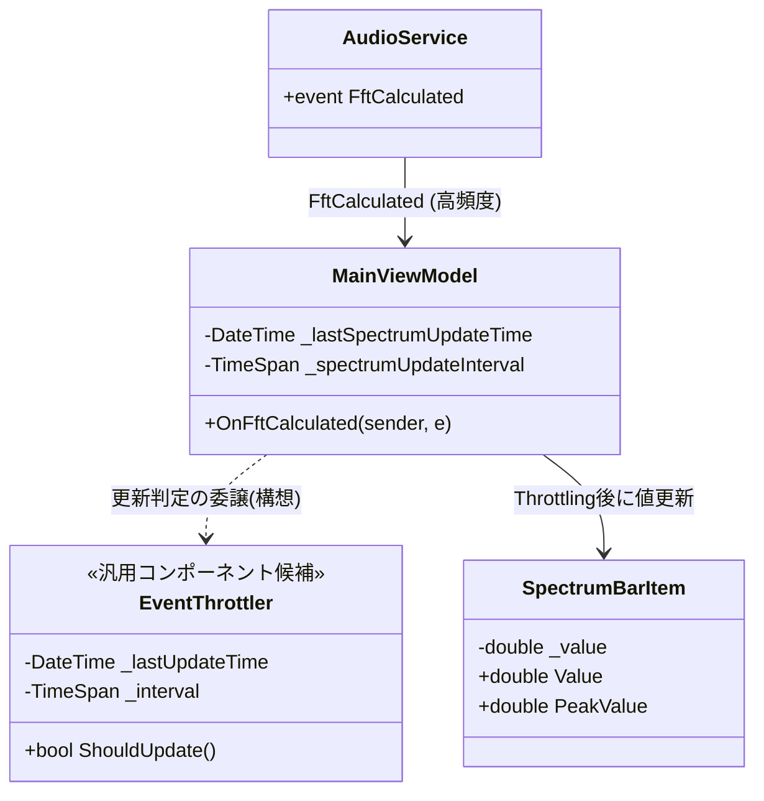

# パフォーマンス最適化 詳細設計書

## 1. 概要
本設計書は、アプリケーション実行中におけるCPUおよびメモリ使用量の削減、並びにUIのかくつき（Stuttering）解消を目的としたパフォーマンス最適化の実装詳細と、**後続の機能追加や新規部品（コンポーネント）作成時にも適用すべき共通設計方針**を定義する。
主にスペクトラム描画に伴うUIスレッドの過負荷軽減、データバインディングの最適化、および画像リソース等のメモリ管理改善を対象とするが、これらの概念は今後の全機能において継承・適用されるものとする。

## 2. 共通パフォーマンス設計方針（後続機能への継承事項）
本アプリケーションにおけるすべての新規機能・UIコンポーネントは、以下の原則に従って設計・実装を行う。

1. **UIスレッドの保護（Throttling / Debouncing の徹底）**
   - バックグラウンドからの高頻度イベント（例: センサー、音声解析、プログレス更新）をそのままUIスレッド（`Dispatcher.InvokeAsync` 等）に流し込まない。
   - 必ず ViewModel 層または中間層でスロットリング（更新間引き）を行い、最大でも 30fps〜60fps 程度の更新頻度に抑えること。
2. **データバインディングの最適化（無駄な通知の抑止）**
   - `INotifyPropertyChanged` の発行は、UI上の視覚的な変化を伴う有意な差分（Epsilon以上の変化）がある場合のみ行う。
3. **画像・大容量リソースのメモリ管理（Freeze と GC）**
   - UIで表示する `BitmapSource` や `BitmapImage` などのリソースは、必ずバックグラウンドで `Freeze()` を呼び出し、UIスレッド間でのクロススレッド参照とメモリリークを防ぐ。
   - 不要になった大容量オブジェクトへの参照は速やかに破棄し、キャッシュは必要最小限に留める。
4. **安全かつ堅牢なUIディスパッチ（ライフサイクル保護とフォールバック）**
   - UIディスパッチ（`RunOnUiThread` 等）において、WPFの `Dispatcher` がシャットダウン中または終了済みの場合（`HasShutdownStarted || HasShutdownFinished`）や同一スレッド上にある場合は、不要なキューイングやブロッキングを避け直接実行する。
   - 同期ディスパッチ時の `TaskCanceledException` 等に対しても例外で破綻させず安全にフォールバックさせる。

## 3. アーキテクチャとクラス構造
### 3.1 クラス構成と連携 (Mermaid)
以下は、上記原則を適用したスペクトラム処理の例である。この「高頻度イベントの受け皿とスロットリング」のパターンは他の機能にも応用可能である。



### 3.2 主要クラスと責務
- **`MainViewModel`**: FFT計算イベントを受信し、一定間隔（スロットリング）でUIのスペクトラムバー（`SpectrumBarItem`）へ値を反映させる。将来的にスロットリング処理は共通クラス（`EventThrottler`等）への切り出しを検討する。
- **`SpectrumBarItem`**: スペクトラムの各バーの値を保持。プロパティ変更通知（INotifyPropertyChanged）の頻度を最適化し、UIレンダリングの負荷を下げる。
- **`AudioService`**: 実際のFFT計算を担当し、結果の配列を発行する。

## 4. データフローと処理パイプライン
### 4.1 スロットリングと描画パイプライン (Mermaid)
```mermaid
flowchart TD
    A[高頻度イベント発火 例: AudioService.FftCalculated] --> B{前回更新からの経過時間が Interval以上か?}
    B -- No --> C[スキップ (Throttled)]
    B -- Yes --> D[最終更新時刻を現在時刻に更新]
    D --> E[Dispatcher.InvokeAsync(UIスレッド)]
    E --> F[UIバインド用ViewModel値の再計算]
    F --> G{変化量が閾値(Epsilon)以上か?}
    G -- Yes --> H[OnPropertyChanged発行]
    G -- No --> I[プロパティ通知スキップ]
```

### 4.2 スレッド制御とメモリ管理
- **UIスレッド連携**: データ解析はバックグラウンドスレッドで計算し、`Dispatcher.InvokeAsync` の発行回数自体を一定フレームレート（例: 30fps）に間引く。
- **画像リソースのメモリ管理**: `OnTrackChanged` 時等に生成される `BitmapImage` について、不必要にキャッシュされないよう古い画像の破棄や、適切な `Freeze()` によるメモリ消費抑制を徹底する。

## 5. アルゴリズム・計算ロジック詳細
### 5.1 UIスロットリング計算
```csharp
private readonly TimeSpan _spectrumUpdateInterval = TimeSpan.FromMilliseconds(1000.0 / 30.0); // 約33ms (30fps)
private DateTime _lastSpectrumUpdateTime = DateTime.MinValue;

// イベントハンドラ内
if (DateTime.Now - _lastSpectrumUpdateTime < _spectrumUpdateInterval) return;
_lastSpectrumUpdateTime = DateTime.Now;
// 以下、Dispatcher.InvokeAsyncでUI更新...
```

### 5.2 チューニング係数・定数一覧
| 定数・係数名 | 型・既定値 | 役割・調整時の影響 |
| :--- | :--- | :--- |
| `SpectrumTargetFps` | `int = 30` | 描画の目標フレームレート。高いほど滑らかだがCPU負荷増。後続のUIアニメーション機能でも標準値とする。 |
| `UpdateEpsilon` | `double = 0.5` | プロパティ変更通知を発火する最小の差分閾値。 |

## 6. UIレイアウトおよびレンダリング設計
### 6.1 バインディング最適化
- `SpectrumBarItem.Value` などのSetterにて、`Math.Abs(_value - value) < UpdateEpsilon` の場合は `OnPropertyChanged` をコールせず、レンダリングエンジンの再レイアウト・再描画パスをスキップさせる。この原則は今後作成するSliderやプログレスバー等にも適用する。

### 6.2 高負荷エフェクト（ソフトウェアレンダリング）の排除
- WPFにおいて、`DropShadowEffect` や `BlurEffect`、画面全体の `VisualBrush` などは、多くの場合ハードウェアアクセラレーションが効かず、CPU（ソフトウェアレンダリング）による膨大なピクセル計算とキャッシュメモリの浪費を引き起こす。
- **原則として、高頻度で更新されるUI要素（スペクトラムバーなど数十の要素が毎フレーム動く箇所）に対して、これらのエフェクトを使用してはならない。**
- 発光表現などは、グラデーションブラシや半透明の境界線（Border）など、GPUで高速に描画可能な手法に置き換えること。

## 7. 関連ドキュメント・Issue
- 関連Issue: #108, #113
