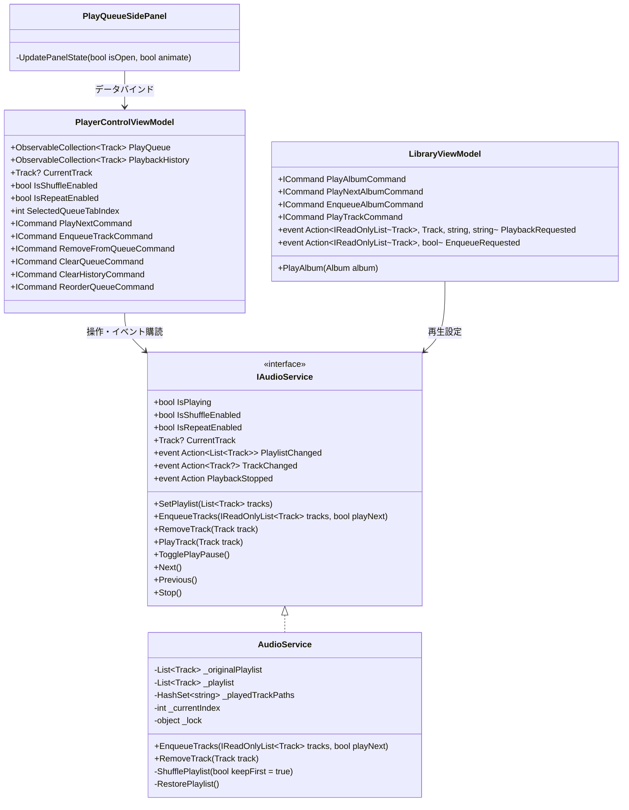
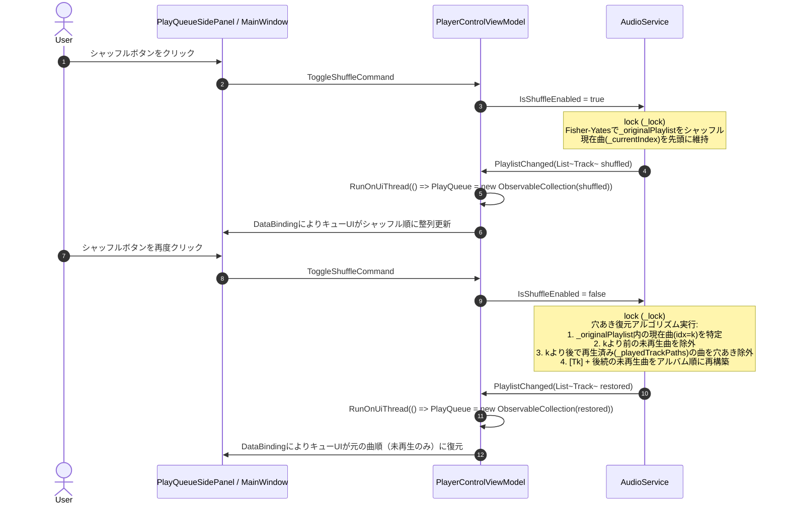
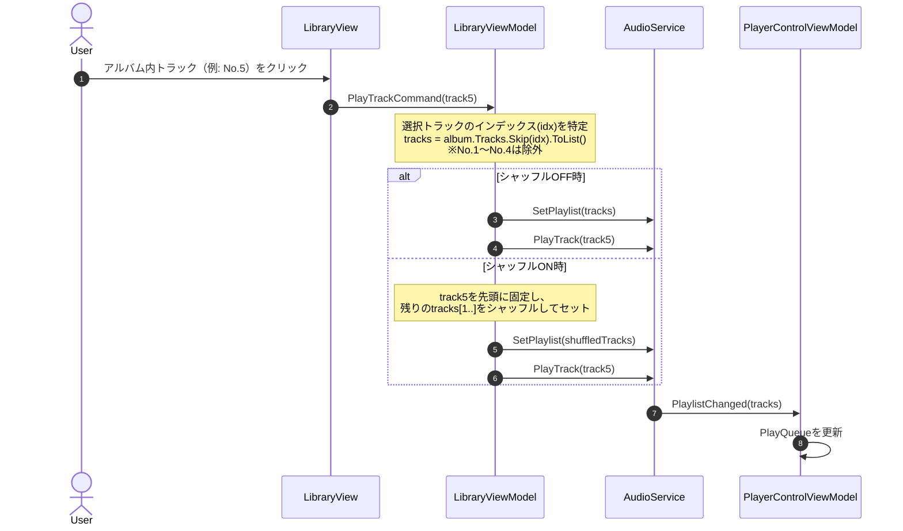
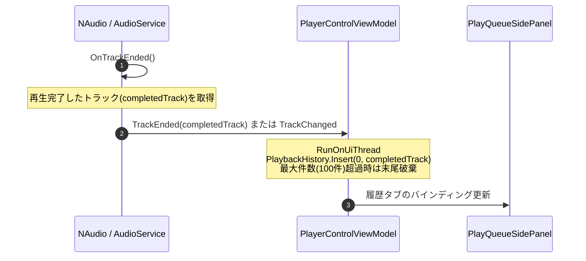
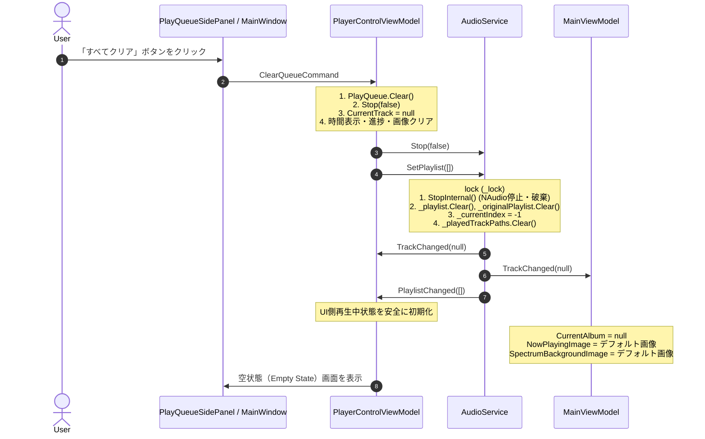

# 再生キュー 詳細設計書

## 1. 概要
本ドキュメントは、アプリケーションにおける「再生キュー（Play Queue）」機能の内部アーキテクチャ、データ同期機構、シャッフル・リピート等の再生戦略アルゴリズム、履歴管理、およびUIレンダリング構造を定義する詳細設計書です。

上位ドキュメントとして以下を参照します：
- 機能仕様書: [再生キュー機能仕様書.md](../機能仕様/再生キュー機能仕様書.md)
- 画面設計書: [再生キュースライドパネルUI仕様書.md](../画面設計/再生キュースライドパネル/再生キュースライドパネルUI仕様書.md)

---

## 2. アーキテクチャとクラス構造

### 2.1 クラス構成図 (Mermaid)



### 2.2 主要クラスと責務

| クラス / インターフェース | レイヤー | 主な責務 |
| :--- | :--- | :--- |
| `IAudioService` | Application | 音声再生パイプライン・再生順制御の抽象インターフェース。単一情報源（Single Source of Truth）。 |
| `AudioService` | Infrastructure | NAudioを用いた音声再生実装。元の再生順（`_originalPlaylist`）と現在再生順（`_playlist`）を保持し、シャッフル・復元・次曲遷移を管理。 |
| `PlayerControlViewModel` | Presentation | プレイヤー操作のViewModel。`PlayQueue`（キュー表示コレクション）と `PlaybackHistory`（履歴コレクション）を保持し、UIと `IAudioService` の双方向同期を担当。 |
| `LibraryViewModel` | Presentation | ライブラリ楽曲・アルバムのブラウズおよび再生要求。アルバム途中曲再生時の前No除外ロジックやアルバム単位のキュー追加を発行。 |
| `PlayQueueSidePanel` | Presentation (View) | 再生キュースライドパネルのUI。UI仮想化 `ListBox`、タブ切り替え、D&D並び替え、開閉アニメーションを提供。 |

---

## 3. データフローと処理パイプライン

### 3.1 処理シーケンス

#### A. シャッフルON / OFF 切り替えシーケンス


#### B. アルバム途中トラック再生シーケンス（前No除外仕様）


#### C. 再生終了曲の履歴追加シーケンス（Issue #218連携）


#### D. 再生キュー全クリアおよび空キュー時の再生停止・再生中情報クリアシーケンス


### 3.2 イベント連携・スレッド制御
- **スレッドセーフティ**: `AudioService` 内の再生リスト操作（`SetPlaylist`, `ShufflePlaylist`, `RestorePlaylist`, `PlayTrack`）はすべて `lock (_lock)` により排他制御され、NAudioの再生スレッドとUIスレッドの競合を防止。
- **UIディスパッチ**: `PlaylistChanged` や `TrackChanged` などのイベント通知先では、必ず `RunOnUiThread`（`Application.Current.Dispatcher`）を経由して `PlayQueue` や `PlaybackHistory` を更新。

---

## 4. アルゴリズム・ロジック詳細

### 4.1 シャッフルアルゴリズムと二重リスト管理

#### 二重リストによる完全復元機構
- `_originalPlaylist`: ユーザーが追加した元の並び順（アルバムトラック順やプレイリスト順）。
- `_playlist`: 現在実際に再生されている順序（シャッフル順または元順序）。

```csharp
// シャッフル生成ロジック (Fisher-Yates)
private void ShufflePlaylist(bool keepFirst = true)
{
    if (_playlist.Count <= 1) return;

    Track? currentTrack = (_currentIndex >= 0 && _currentIndex < _playlist.Count)
        ? _playlist[_currentIndex] : null;

    var rng = new Random();
    var shuffled = new List<Track>(_originalPlaylist);
    
    // 現在曲が存在し、先頭に保持する場合
    if (keepFirst && currentTrack != null)
    {
        shuffled.RemoveAll(t => t.FilePath == currentTrack.FilePath);
    }

    int n = shuffled.Count;
    while (n > 1)
    {
        n--;
        int k = rng.Next(n + 1);
        (shuffled[k], shuffled[n]) = (shuffled[n], shuffled[k]);
    }

    if (keepFirst && currentTrack != null)
    {
        shuffled.Insert(0, currentTrack);
        _currentIndex = 0;
    }

    _playlist = shuffled;
    PlaylistChanged?.Invoke(new List<Track>(_playlist));
}
```

#### シャッフル中の「キュー追加（EnqueueTracks）」アルゴリズム
シャッフル再生中に新たな楽曲群（単曲またはアルバム）がキューに追加された場合、操作種別に応じて以下のように制御します：

1. **元順序リスト（`_originalPlaylist`）の維持**:
   - アルバムや楽曲が追加された順序（各アルバム内は元のトラック番号順）で末尾に `AddRange` されます。これにより、シャッフル中も常に「追加されたアルバム順（A → B → C...）」が保持されます。
2. **アルバム単位の「次に再生（playNext = true）」**:
   - **仕様**: アルバムの順番がランダムな状態で、まとめて現在再生中の曲の直後に追加される。
   - 追加対象アルバムの曲群をランダムにシャッフルした上で、現在再生中インデックス（`_currentIndex`）の直後へ `InsertRange` で一括割り込み挿入します（他の既存キューの順序は崩さず維持）。
3. **「キューに追加（playNext = false）」**:
   - **仕様**: 現在再生中以外の全キューリストと再シャッフルして均一にランダム配置。
   - 現在曲を先頭（インデックス 0）に固定したまま、残りの既存キュー＋新規追加曲を結合して Fisher-Yates シャッフルを実行します。

#### シャッフル解除時の穴あき復元アルゴリズム（RestorePlaylist・複数アルバム対応）
アルバムなどの再生中にシャッフルを解除した場合、元のアルバム収録順（`_originalPlaylist`）に復元しつつ、再生済みトラックをスキップする「穴あき復元」を行います：

- 元順序リスト: $\text{\_originalPlaylist} = [T_0, T_1, \dots, T_{N-1}]$ （追加順に並ぶアルバム群のトラック列）
- 現在再生中曲を $T_{current}$ とする。
- 復元後キューの構成（未再生曲を現在曲の上下に残し、再生済み曲のみ穴あき除外）:
  $$Q_{restored} = \{ T_i \in \text{\_originalPlaylist} \mid T_i = T_{current} \lor T_i \notin \text{\_playedTrackPaths} \}$$
  $$\text{\_currentIndex} = Q_{restored}.\text{IndexOf}(T_{current})$$

```csharp
private void RestorePlaylist()
{
    Track? currentTrack = (_currentIndex >= 0 && _currentIndex < _playlist.Count)
        ? _playlist[_currentIndex]
        : null;

    // 候補トラック列（_originalPlaylistを基本とし、未登録トラックがあれば補完）
    var allTracks = new List<Track>(_originalPlaylist);
    foreach (var t in _playlist)
    {
        if (!allTracks.Any(o => o.FilePath == t.FilePath))
        {
            allTracks.Add(t);
        }
    }

    // 残す対象曲（現在再生中の曲、または未再生曲）
    var remainingTracks = new List<Track>();
    var seenPaths = new HashSet<string>(StringComparer.OrdinalIgnoreCase);

    foreach (var track in allTracks)
    {
        if (seenPaths.Add(track.FilePath))
        {
            bool isCurrent = currentTrack != null && string.Equals(track.FilePath, currentTrack.FilePath, StringComparison.OrdinalIgnoreCase);
            bool isPlayed = _playedTrackPaths.Contains(track.FilePath);

            if (isCurrent || !isPlayed)
            {
                remainingTracks.Add(track);
            }
        }
    }

    if (remainingTracks.Count == 0 && currentTrack != null)
    {
        remainingTracks.Add(currentTrack);
    }

    static string GetAlbumKey(Track track)
    {
        if (!string.IsNullOrWhiteSpace(track.Album)) return track.Album.Trim();
        string? dir = null;
        try { dir = System.IO.Path.GetDirectoryName(track.FilePath); } catch { }
        if (!string.IsNullOrWhiteSpace(dir)) return dir;
        return !string.IsNullOrWhiteSpace(track.Title) ? track.Title : track.FilePath;
    }

    // キューに追加されたアルバムの出現順（allTracksに現れる順＝追加時系列順）
    var albumOrder = new List<string>();
    foreach (var track in allTracks)
    {
        string key = GetAlbumKey(track);
        if (!albumOrder.Contains(key, StringComparer.OrdinalIgnoreCase))
        {
            albumOrder.Add(key);
        }
    }

    // 残っている曲をアルバムごとにグループ化
    var grouped = remainingTracks
        .GroupBy(t => GetAlbumKey(t), StringComparer.OrdinalIgnoreCase)
        .ToDictionary(g => g.Key, g => g.ToList(), StringComparer.OrdinalIgnoreCase);

    var restoredPlaylist = new List<Track>();
    foreach (var albumKey in albumOrder)
    {
        if (grouped.TryGetValue(albumKey, out var tracksInAlbum))
        {
            // 各アルバム内の曲をトラック番号順（TrackNumber > 0 なら昇順、同一番号または0ならallTracks内の元の出現インデックス順）
            var sortedTracks = tracksInAlbum
                .OrderBy(t => t.TrackNumber > 0 ? (int)t.TrackNumber : int.MaxValue)
                .ThenBy(t => allTracks.FindIndex(o => string.Equals(o.FilePath, t.FilePath, StringComparison.OrdinalIgnoreCase)))
                .ToList();

            restoredPlaylist.AddRange(sortedTracks);
        }
    }

    _playlist = restoredPlaylist;

    if (currentTrack != null)
    {
        _currentIndex = _playlist.FindIndex(t => string.Equals(t.FilePath, currentTrack.FilePath, StringComparison.OrdinalIgnoreCase));
        if (_currentIndex < 0 && _playlist.Count > 0)
        {
            _currentIndex = 0;
        }
    }
    else
    {
        _currentIndex = _playlist.Count > 0 ? 0 : -1;
    }

    PlaylistChanged?.Invoke(new List<Track>(_playlist));
}
```

- **アルゴリズムの特徴と複数アルバム整合性**:
  1. **アルバム追加順（キュー追加順）の完全グループ化**: シャッフル中に複数アルバム（A, B, C...）の曲がどれだけ混ざり合っていても、シャッフル解除時にはキューに追加された時系列順（初出順）でアルバムごとにまとまります。
  2. **各アルバム内のトラック番号昇順整列**: 各アルバムに属する楽曲群は、`TrackNumber` 昇順（TrackNumberが未設定の場合は追加時の収録順）にソートされて復元されます。
  3. **未再生曲の完全保持（現在曲の上・下に残す）**: 元のアルバム順において現在再生中の曲より前の曲であっても、未再生であれば除外されず再生中の曲の上に残り、後続の未再生曲も再生中の曲の下に残ります。
  4. **再生済み曲の穴あき除外**: シャッフル中に既に再生された曲（`_playedTrackPaths` に登録）は「履歴」に残したままキュー側は穴あき（除外）されます。
  5. **再生位置インデックスの追従**: 復元されたキュー内における現在再生中楽曲の正確な位置（アルバム群・未再生曲群の中での位置）に `_currentIndex` が設定され、音途切れなく再生を継続します。

### 4.2 アルバム途中トラック再生の抽出ロジック
アルバムの特定トラック $T_{selected}$（インデックス $k$）が指定された場合：
- 対象トラックリスト: $L = [T_k, T_{k+1}, \dots, T_{N-1}]$ （$0 \le i < k$ のトラックは除外）
- シャッフルOFF時: $L$ をそのままプレイリストとして登録し、$T_k$ から再生開始。
- シャッフルON時: $T_k$ を先頭に固定し、$L' = [T_k] + \text{Shuffle}([T_{k+1}, \dots, T_{N-1}])$ を構築して再生開始。

### 4.3 アルバム終了時の次アルバム自動遷移ロジック
アルバム楽曲の最終トラック再生が終了（リピートOFF時）し、次のアルバムへ自動遷移する際の制御：
- **通常アルバム再生（`LibraryViewModel.PlayAlbum`）と同一パイプラインを通過**:
  - `_audioService.IsShuffleEnabled` を判定。
  - **シャッフルON時**: 次アルバムの収録曲の中からランダムに1曲を選定して `startTrack` とし、`SetPlaylist(tracks, startTrack)` および `PlayTrack(startTrack)` を実行。これにより、**ランダムな1曲がキューの先頭（1行目）に固定されて再生され、残りの曲は2行目以降にシャッフル配置**されます（キューの途中から再生される不具合を防止）。
  - **シャッフルOFF時**: 先頭トラック（トラック1）から通常順序でキューに展開して再生開始。
  - `PlaybackRequested` を通じてメイン画面右ペイン（トラックリスト、アルバム名、アーティスト名）も次アルバムの情報に正しく同期更新。

### 4.4 再生中アイコン排他制御ロジック (Issue #214対策)
キュー内の複数トラックで `IsPlaying == true` が残存する現象を防止するため、`PlayerControlViewModel` において排他制御を徹底：

```csharp
private void SyncTrackPlayingStates(Track? currentPlayingTrack, bool isPlaying)
{
    foreach (var track in PlayQueue)
    {
        bool shouldBePlaying = (track == currentPlayingTrack && isPlaying);
        if (track.IsPlaying != shouldBePlaying)
        {
            track.IsPlaying = shouldBePlaying;
        }
    }
}
```

### 4.5 履歴管理ロジック (Issue #218)
- `PlaybackHistory`: `ObservableCollection<Track>` として保持。
- 楽曲完了時: `PlaybackHistory.Insert(0, track)`（最新を先頭に挿入）。
- 上限設定: `MaxHistoryCount = 100`。要素数が 100 を超えた場合、末尾を `RemoveAt(100)` で自動破棄。
- 重複時の仕様: 同一楽曲が再度再生された場合、古い重複エントリを削除して先頭に再配置（または単純時系列記録のいずれかを選択可能、本仕様では最新を先頭に重複許容時系列記録）。

### 4.6 COMException (0x80004004 E_ABORT) 防止と非同期競合制御
シャッフル再生中や連続曲戻し（`Previous`）時に `System.Runtime.InteropServices.COMException: 操作は中断されました (0x80004004 (E_ABORT))` が発生する問題への恒久対策：

1. **`AudioService.Previous()` のスレッド排他制御**:
   - `Next()` と同様に `lock (_lock)` で囲み、非同期再生スレッドとの競合を防止。
   - 非リピート時に先頭トラックで `Previous()` が連打された場合、負のインデックスや配列外参照とならないよう先頭留まり（`_currentIndex = 0`）を保証。
   - `StopInternal()` 内の `_outputDevice?.Stop()` に例外保護を追加。
2. **WIC（Windows Imaging Component）画像デコード保護**:
   - `MainViewModel.cs` および `PlayerControlViewModel.cs` のトラック変更通知ディスパッチャ内（`BitmapImage.EndInit()`, `FormatConvertedBitmap.EndInit()`）で、急峻な曲切り替えによる非同期中断例外（`COMException`）を `try-catch` で捕捉。
   - 例外発生時はクラッシュさせず安全に握りつぶし、フォールバック画像（デフォルトアルバムアート）を表示する堅牢なフェイルセーフを確立。

### 4.7 再生キュー空（Empty）時の再生停止および再生中情報初期化機構
キューが空になった場合（全クリア実行時、個別削除により最後の曲が削除された時、空のプレイリスト設定時など）に、音声を即座に停止し、UIの再生中情報を未選択・初期状態へクリアするための包括的なフェイルセーフ機構：

1. **`AudioService.SetPlaylist(tracks)` の空リスト受信制御**:
   - `tracks == null || tracks.Count == 0` の場合、即座に `Stop()` を実行して NAudio 再生エンジン（`WaveOutEvent` / `AudioFileReader`）を完全停止・リソース解放。
   - 内部状態（`_playlist`, `_originalPlaylist`, `_currentIndex = -1`, `_lastPlayingTrack = null`, `_playedTrackPaths.Clear()`）を初期化。
   - `TrackChanged?.Invoke(null)` を発行し、全購読 ViewModel に現在曲クリアを通知。
2. **`AudioService.Stop()` の空キュー検知連動**:
   - `Stop()` 実行時に `_playlist.Count == 0`（キューが空）であれば、確実に `TrackChanged?.Invoke(null)` を発行。
3. **`PlayerControlViewModel.ClearQueue()` / `RemoveFromQueue()` の連動制御**:
   - `ClearQueue()` 呼び出し時、`PlayQueue.Clear()`、`PlaybackListTracks = new ObservableCollection<Track>()`、`PlaybackListName = "No Album Selected"`、`PlaybackListSubtitle = string.Empty`、`_audioService.Stop(false)`、`CurrentTrack = null`、`TotalTimeDisplay = "00:00"`、`CurrentTimeDisplay = "00:00"`、`Progress = 0.0`、`NowPlayingImage = null` を即座に同期設定した上で `_audioService.SetPlaylist(new List<Track>())` を発行。
   - `RemoveFromQueue()` において、最後の1曲が削除されて `PlayQueue.Count == 0` に達した場合、自動的に `ClearQueue()` を実行して再生停止と表示クリアを保証。
   - 再生中の曲が削除されキューに他曲が残っている場合は、後続曲（または先頭曲）へスムーズに再生を自動遷移。
4. **タイマー誤更新の完全抑止 (`OnTimerTick`)**:
   - `CurrentTrack == null` の場合は、タイマーによる時間表示・プログレス更新を即座に中断し、`00:00` / `0.0` を強制保持。
5. **`MainViewModel.OnTrackChanged(null)` の完全初期化**:
   - `track == null` を受信した場合、`CurrentTrack = null`, `CurrentAlbum = null`, `Progress = 0` とし、右ペインのプレイリスト（`PlaybackListTracks = new ObservableCollection<Track>()`, `PlaybackListName = "No Album Selected"`, `PlaybackListSubtitle = string.Empty`）、`NowPlayingImage` および `SpectrumBackgroundImage` をデフォルト画像にリセット。
   - メイン画面右側トラックリストコンテナ（`MainWindow.xaml`）にも空状態メッセージ（「プレイリストは空です」）を表示。

---

## 5. UIレイアウトおよびレンダリング設計

### 5.1 コンポーネント階層構造 (`PlayQueueSidePanel.xaml`)

```
UserControl (PlayQueueSidePanel)
 └── Grid (ClipToBounds="True")
      └── Border (Background=WindowBackgroundBrush, BorderBrush=ControlBorderBrush)
           └── Grid (Rows: Header, Tabs, Content)
                ├── [Row 0] Header Grid (Title, ClearButton, CloseButton)
                ├── [Row 1] TabBar (PlayQueueTab, HistoryTab)
                └── [Row 2] Content Grid
                     ├── [Content A] ListBox (PlayQueue, VirtualizingPanel, D&D Behavior)
                     │    ├── EmptyState Grid (DataTrigger: PlayQueue.Count == 0)
                     │    └── ItemTemplate (ItemBorder with ContextMenu and Tag)
                     └── [Content B] ListBox (PlaybackHistory, VirtualizingPanel)
                          ├── EmptyState Grid (DataTrigger: History.Count == 0)
                          └── ItemTemplate (History Item Card)
```

### 5.2 コンテキストメニューバインディング修正 (Issue #215対策)
コンテキストメニューの各 `MenuItem` が ViewModel のコマンドを参照できるよう、`PlacementTarget` の親参照を修正：
- `ItemBorder` 自体に `Tag="{Binding DataContext, RelativeSource={RelativeSource AncestorType=UserControl}}"` を明示的に付与。
- 各 `MenuItem` の Command は `{Binding PlacementTarget.Tag.RemoveFromQueueCommand, RelativeSource={RelativeSource AncestorType=ContextMenu}}` により確実に到達可能とする。

### 5.3 パフォーマンスチューニングパラメータ一覧

| 定数・パラメータ名 | 既定値 | 役割・調整時の影響 |
| :--- | :--- | :--- |
| `PanelSlideInDuration` | 0.35秒 | スライドイン演出時間（EaseOutイージング） |
| `PanelSlideOutDuration` | 0.30秒 | スライドアウト演出時間（EaseInイージング） |
| `MaxPlaybackHistoryCount` | 100件 | 履歴コレクションの最大保持件数（メモリ肥大化防止） |
| `VirtualizationMode` | `Recycling` | コンテナリサイクルによるUI仮想化モード |

---

## 6. 関連ドキュメント・Issue
- 機能仕様書: [設計/機能仕様/再生キュー機能仕様書.md](../機能仕様/再生キュー機能仕様書.md)
- 画面設計書: [設計/画面設計/再生キュースライドパネル/再生キュースライドパネルUI仕様書.md](../画面設計/再生キュースライドパネル/再生キュースライドパネルUI仕様書.md)
- パフォーマンス最適化方針: [設計/詳細設計/パフォーマンス最適化.md](パフォーマンス最適化.md)
- 関連Issue:
  - 親Issue: [Issue #211: [Epic] 再生キュー機能の全面刷新・安定化・UX向上](https://github.com/taketonnbo/Audio_Effector/issues/211)
  - [Issue #212: [検討・仕様策定] 再生キューの機能洗い出しとシャッフル・リピート・空状態等の仕様策定・仕様書追記](https://github.com/taketonnbo/Audio_Effector/issues/212)
  - [Issue #213: [バグ修正] シャッフル再生時に再生キューの曲リストが再生順にならない不具合の修正](https://github.com/taketonnbo/Audio_Effector/issues/213)
  - [Issue #214: [バグ修正] シャッフル再生時に再生中アイコンが複数表示される不具合の修正](https://github.com/taketonnbo/Audio_Effector/issues/214)
  - [Issue #215: [バグ修正] 再生キューにおいて右クリックコンテキストメニューの操作が効かない不具合の修正](https://github.com/taketonnbo/Audio_Effector/issues/215)
  - [Issue #216: [機能追加] 再生キューの楽曲リストにおけるドラッグ＆ドロップによる再生順変更機能](https://github.com/taketonnbo/Audio_Effector/issues/216)
  - [Issue #217: [機能変更] ミニプレイヤーでの再生キュー下部連結延長デザイン化および旧ダイアログの完全撤廃](https://github.com/taketonnbo/Audio_Effector/issues/217)
  - [Issue #218: [機能追加] 再生キューの「再生リスト／履歴」タブ切り替え機能および再生終了曲の履歴管理](https://github.com/taketonnbo/Audio_Effector/issues/218)
