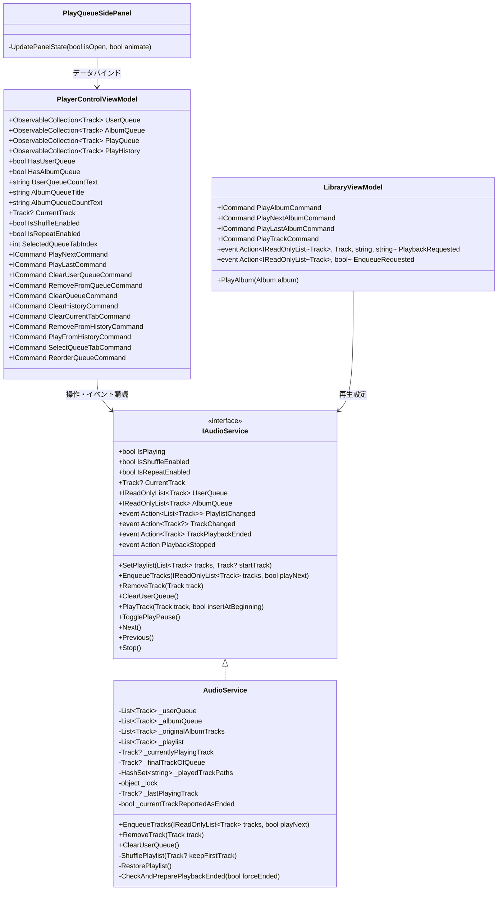
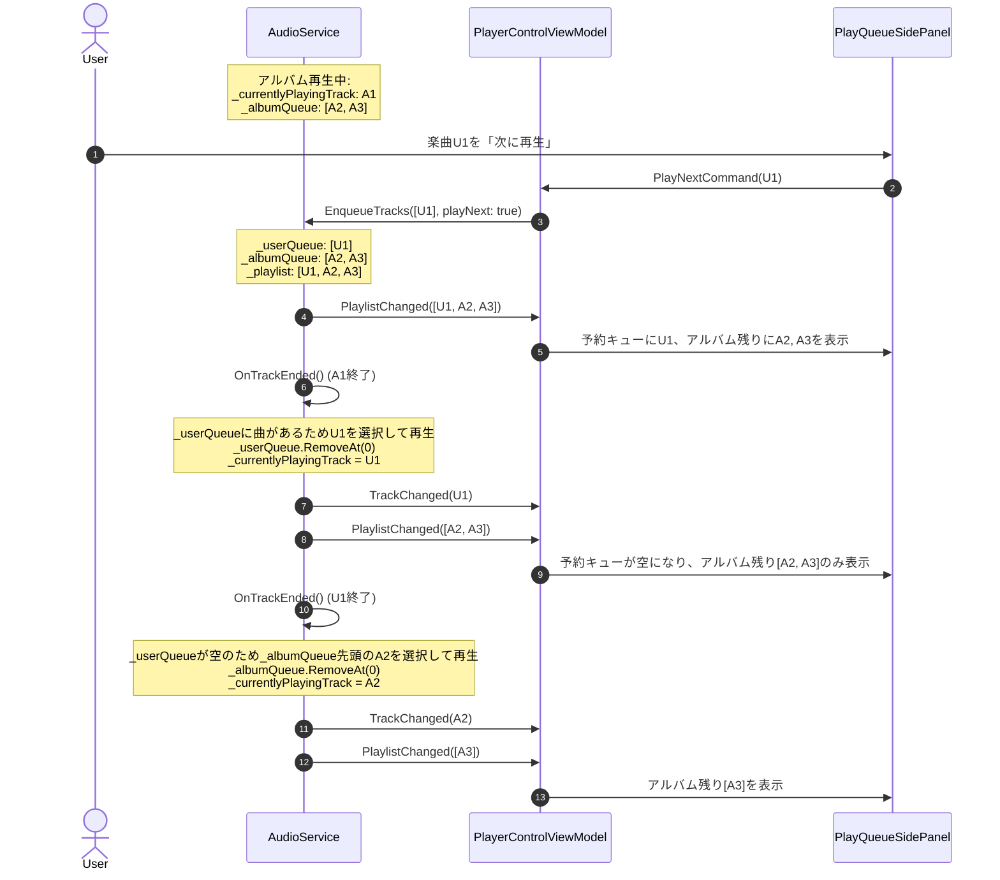
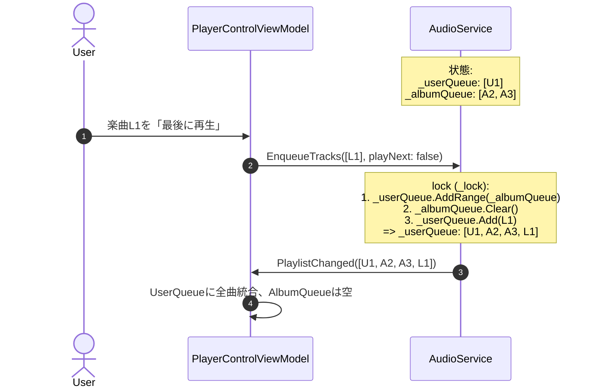
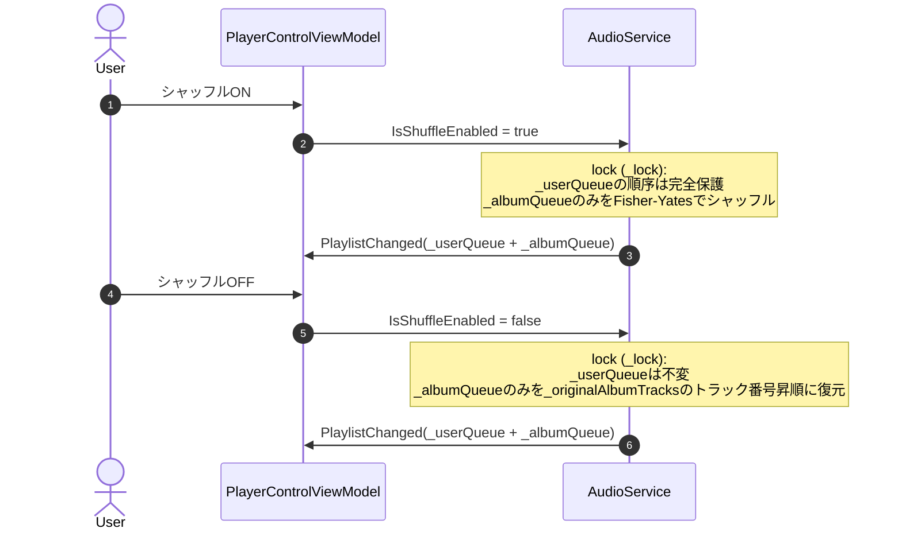

# 再生キュー 詳細設計書

## 1. 概要
本ドキュメントは、アプリケーションにおける「再生キュー（Play Queue）」機能の内部アーキテクチャ、データ同期機構、セクション分離モデル（予約キュー／アルバムの残り曲）、シャッフル局所化制御、履歴管理、およびUIレンダリング構造を定義する詳細設計書です。

上位ドキュメントとして以下を参照します：
- 機能仕様書: [再生キュー機能仕様書.md](../機能仕様/再生キュー機能仕様書.md)
- 画面設計書: [再生キュースライドパネルUI仕様書.md](../画面設計/再生キュースライドパネル/再生キュースライドパネルUI仕様書.md)

---

## 2. アーキテクチャとクラス構造

### 2.1 クラス構成図 (Mermaid)



### 2.2 主要クラスと責務

| クラス / インターフェース | レイヤー | 主な責務 |
| :--- | :--- | :--- |
| `IAudioService` | Application | 音声再生パイプライン・セクション分離キュー管理の抽象インターフェース。`UserQueue`, `AlbumQueue`, `ClearUserQueue()` を公開。 |
| `AudioService` | Infrastructure | NAudioを用いた音声再生実装。予約キュー（`_userQueue`）とアルバム残り曲（`_albumQueue`）を独立管理し、シャッフル局所化・未再生のみのキュー提供を担当。 |
| `PlayerControlViewModel` | Presentation | プレイヤー操作のViewModel。`UserQueue`、`AlbumQueue`、`PlayHistory` を保持し、UIセクション表示と `IAudioService` の双方向同期を担当。 |
| `LibraryViewModel` | Presentation | ライブラリ楽曲・アルバムのブラウズおよび再生要求。アルバム途中曲再生時の前No除外ロジックやアルバム単位の「次に再生」「最後に再生」を発行。 |
| `PlayQueueSidePanel` | Presentation (View) | 再生キュースライドパネルのUI。予約キュー／アルバム残り曲のセクション分離表示、共通アイテムテンプレート、開閉アニメーションを提供。 |

---

## 3. データフローと処理パイプライン

### 3.1 処理シーケンス

#### A. セクション分離モデルでの再生遷移シーケンス


#### B. 「最後に再生」実行時の統合シーケンス


#### C. シャッフル局所化シーケンス（AlbumQueue限定）


---

## 4. アルゴリズム・ロジック詳細

### 4.1 セクション分離モデルのデータ構造とライフサイクル

#### コレクション構造
- `_userQueue`: ユーザーが明示的に「次に再生」などで割り込ませた楽曲リスト。
- `_albumQueue`: 現在再生中アルバムの未再生後続トラックリスト。
- `_originalAlbumTracks`: 現在再生中アルバムの全トラック原初リスト（トラック昇順復元用）。
- `_currentlyPlayingTrack`: 現在再生中の単一楽曲。**再生キュー（`_playlist`）からは除外**される。
- `_playlist`: `_userQueue.Concat(_albumQueue).ToList()` としてUIおよび外部へ公開される未再生リスト。

```csharp
public IReadOnlyList<Track> UserQueue
{
    get { lock (_lock) { return _userQueue.ToList(); } }
}

public IReadOnlyList<Track> AlbumQueue
{
    get { lock (_lock) { return _albumQueue.ToList(); } }
}
```

### 4.2 「次に再生」「最後に再生」のアルゴリズム
```csharp
public void EnqueueTracks(IReadOnlyList<Track> tracks, bool playNext)
{
    if (tracks == null || tracks.Count == 0) return;

    lock (_lock)
    {
        if (playNext)
        {
            // 「次に再生」: 予約キューの先頭に挿入
            var tracksToAdd = new List<Track>(tracks);
            if (_isShuffleEnabled && tracksToAdd.Count > 1)
            {
                ShuffleList(tracksToAdd);
            }
            _userQueue.InsertRange(0, tracksToAdd);
        }
        else
        {
            // 「最後に再生」: 予約キューとアルバム残りを統合し、すべて予約キューとする
            _userQueue.AddRange(_albumQueue);
            _albumQueue.Clear();
            _originalAlbumTracks.Clear();

            var tracksToAdd = new List<Track>(tracks);
            if (_isShuffleEnabled && tracksToAdd.Count > 1)
            {
                ShuffleList(tracksToAdd);
            }
            _userQueue.AddRange(tracksToAdd);
        }

        _playlist = _userQueue.Concat(_albumQueue).ToList();
        _finalTrackOfQueue = _playlist.Count > 0 ? _playlist[^1] : _currentlyPlayingTrack;
    }

    PlaylistChanged?.Invoke(new List<Track>(_playlist));
}
```

### 4.3 シャッフルと復元の局所化アルゴリズム
```csharp
private void ShufflePlaylist(Track? keepFirstTrack = null)
{
    // シャッフル適用範囲を「AlbumQueue」に限定（予約キューは保護）
    if (_albumQueue.Count > 1)
    {
        ShuffleList(_albumQueue);
    }
    _playlist = _userQueue.Concat(_albumQueue).ToList();
    if (_albumQueue.Count > 0)
    {
        _finalTrackOfQueue = _albumQueue[^1];
    }
}

private void RestorePlaylist()
{
    // 予約キューはそのまま保持し、アルバム残り曲のみを元のアルバムトラック順序に復元
    if (_albumQueue.Count > 1 && _originalAlbumTracks.Count > 0)
    {
        _albumQueue = _albumQueue
            .OrderBy(t => t.TrackNumber > 0 ? (int)t.TrackNumber : int.MaxValue)
            .ThenBy(t => _originalAlbumTracks.FindIndex(o => string.Equals(o.FilePath, t.FilePath, StringComparison.OrdinalIgnoreCase)))
            .ToList();
    }
    _playlist = _userQueue.Concat(_albumQueue).ToList();
}
```

### 4.4 予約クリア（ClearUserQueue）
```csharp
public void ClearUserQueue()
{
    lock (_lock)
    {
        _userQueue.Clear();
        _playlist = _albumQueue.ToList();
        _finalTrackOfQueue = _playlist.Count > 0 ? _playlist[^1] : _currentlyPlayingTrack;
    }

    PlaylistChanged?.Invoke(new List<Track>(_playlist));
}
```

### 4.5 再生中楽曲・アイコンの非表示化
- 再生キュー内のアイテムカードから、アルバムアート上の半透明黒オーバーレイ（`#80000000`）および再生中/停止中アイコン（`Path`）を完全撤廃。
- `PlayQueueSidePanel.xaml` の `QueueTrackItemTemplate` において、アルバムアートサムネイルは純粋な画像表示とし、未再生の美しいリスト表示を実現。

---

## 5. 関連Issue
- [Issue #225: [機能改善] 再生キューのセクション分離モデル（予約キュー／アルバムの残り曲）導入および順序制御・UIの刷新](https://github.com/taketonnbo/Audio_Effector/issues/225)
- 親Issue: [Issue #211: [Epic] 再生キュー機能の全面刷新・安定化・UX向上](https://github.com/taketonnbo/Audio_Effector/issues/211)
