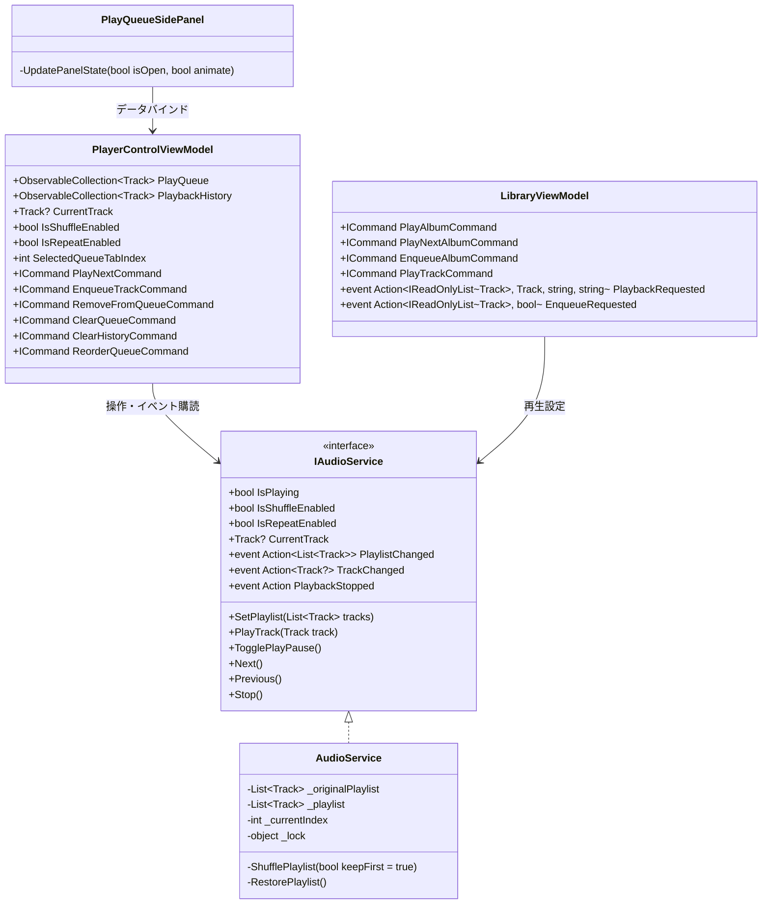
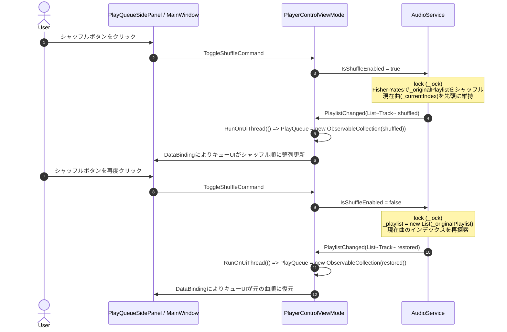
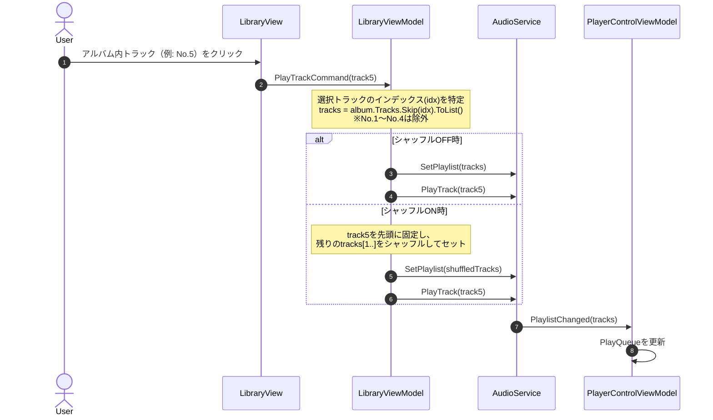
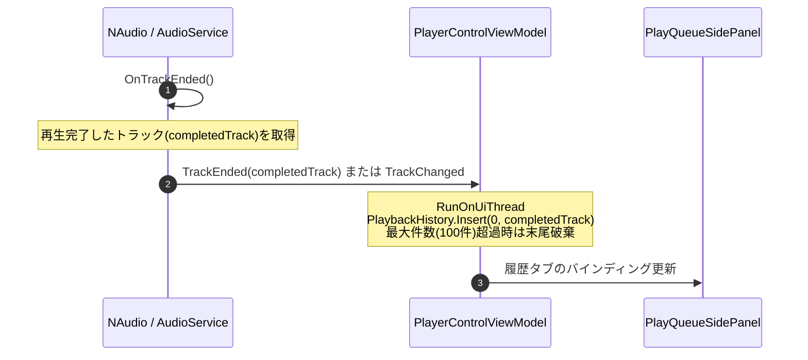

# 再生キュー 詳細設計書

## 1. 概要
本ドキュメントは、アプリケーションにおける「再生キュー（Play Queue）」機能の内部アーキテクチャ、データ同期機構、シャッフル・リピート等の再生戦略アルゴリズム、履歴管理、およびUIレンダリング構造を定義する詳細設計書です。

上位ドキュメントとして以下を参照します：
- 機能仕様書: [再生キュー機能仕様書.md](../機能仕様/再生キュー機能仕様書.md)
- 画面設計書: [再生キュースライドパネルUI仕様書.md](../画面設計/再生キュースライドパネル/再生キュースライドパネルUI仕様書.md)

---

## 2. アーキテクチャとクラス構造

### 2.1 クラス構成図 (Mermaid)



### 2.2 主要クラスと責務

| クラス / インターフェース | レイヤー | 主な責務 |
| :--- | :--- | :--- |
| `IAudioService` | Application | 音声再生パイプライン・再生順制御の抽象インターフェース。単一情報源（Single Source of Truth）。 |
| `AudioService` | Infrastructure | NAudioを用いた音声再生実装。元の再生順（`_originalPlaylist`）と現在再生順（`_playlist`）を保持し、シャッフル・復元・次曲遷移を管理。 |
| `PlayerControlViewModel` | Presentation | プレイヤー操作のViewModel。`PlayQueue`（キュー表示コレクション）と `PlaybackHistory`（履歴コレクション）を保持し、UIと `IAudioService` の双方向同期を担当。 |
| `LibraryViewModel` | Presentation | ライブラリ楽曲・アルバムのブラウズおよび再生要求。アルバム途中曲再生時の前No除外ロジックやアルバム単位のキュー追加を発行。 |
| `PlayQueueSidePanel` | Presentation (View) | 再生キュースライドパネルのUI。UI仮想化 `ListBox`、タブ切り替え、D&D並び替え、開閉アニメーションを提供。 |

---

## 3. データフローと処理パイプライン

### 3.1 処理シーケンス

#### A. シャッフルON / OFF 切り替えシーケンス


#### B. アルバム途中トラック再生シーケンス（前No除外仕様）


#### C. 再生終了曲の履歴追加シーケンス（Issue #218連携）


### 3.2 イベント連携・スレッド制御
- **スレッドセーフティ**: `AudioService` 内の再生リスト操作（`SetPlaylist`, `ShufflePlaylist`, `RestorePlaylist`, `PlayTrack`）はすべて `lock (_lock)` により排他制御され、NAudioの再生スレッドとUIスレッドの競合を防止。
- **UIディスパッチ**: `PlaylistChanged` や `TrackChanged` などのイベント通知先では、必ず `RunOnUiThread`（`Application.Current.Dispatcher`）を経由して `PlayQueue` や `PlaybackHistory` を更新。

---

## 4. アルゴリズム・ロジック詳細

### 4.1 シャッフルアルゴリズムと二重リスト管理

#### 二重リストによる完全復元機構
- `_originalPlaylist`: ユーザーが追加した元の並び順（アルバムトラック順やプレイリスト順）。
- `_playlist`: 現在実際に再生されている順序（シャッフル順または元順序）。

```csharp
// シャッフル生成ロジック (Fisher-Yates)
private void ShufflePlaylist(bool keepFirst = true)
{
    if (_playlist.Count <= 1) return;

    Track? currentTrack = (_currentIndex >= 0 && _currentIndex < _playlist.Count)
        ? _playlist[_currentIndex] : null;

    var rng = new Random();
    var shuffled = new List<Track>(_originalPlaylist);
    
    // 現在曲が存在し、先頭に保持する場合
    if (keepFirst && currentTrack != null)
    {
        shuffled.RemoveAll(t => t.FilePath == currentTrack.FilePath);
    }

    int n = shuffled.Count;
    while (n > 1)
    {
        n--;
        int k = rng.Next(n + 1);
        (shuffled[k], shuffled[n]) = (shuffled[n], shuffled[k]);
    }

    if (keepFirst && currentTrack != null)
    {
        shuffled.Insert(0, currentTrack);
        _currentIndex = 0;
    }

    _playlist = shuffled;
    PlaylistChanged?.Invoke(new List<Track>(_playlist));
}
```

#### シャッフル中の「キューに追加」アルゴリズム
シャッフル再生中に新たな楽曲群（単曲またはアルバム）が「キューに追加」された場合：
1. `_originalPlaylist` の末尾に対象曲を追加。
2. 現在再生中の曲以外のキュー内楽曲＋新規追加楽曲を結合し、Fisher-Yatesシャッフルを実行。
3. 現在再生中の曲を先頭（インデックス 0）に置き、その後ろにシャッフル結果を結合して `_playlist` を構成。
4. これにより、追加された楽曲が末尾に偏ることなく、キュー全体にランダムに散りばめられる。

### 4.2 アルバム途中トラック再生の抽出ロジック
アルバムの特定トラック $T_{selected}$（インデックス $k$）が指定された場合：
- 対象トラックリスト: $L = [T_k, T_{k+1}, \dots, T_{N-1}]$ （$0 \le i < k$ のトラックは除外）
- シャッフルOFF時: $L$ をそのままプレイリストとして登録し、$T_k$ から再生開始。
- シャッフルON時: $T_k$ を先頭に固定し、$L' = [T_k] + \text{Shuffle}([T_{k+1}, \dots, T_{N-1}])$ を構築して再生開始。

### 4.3 再生中アイコン排他制御ロジック (Issue #214対策)
キュー内の複数トラックで `IsPlaying == true` が残存する現象を防止するため、`PlayerControlViewModel` において排他制御を徹底：

```csharp
private void SyncTrackPlayingStates(Track? currentPlayingTrack, bool isPlaying)
{
    foreach (var track in PlayQueue)
    {
        bool shouldBePlaying = (track == currentPlayingTrack && isPlaying);
        if (track.IsPlaying != shouldBePlaying)
        {
            track.IsPlaying = shouldBePlaying;
        }
    }
}
```

### 4.4 履歴管理ロジック (Issue #218)
- `PlaybackHistory`: `ObservableCollection<Track>` として保持。
- 楽曲完了時: `PlaybackHistory.Insert(0, track)`（最新を先頭に挿入）。
- 上限設定: `MaxHistoryCount = 100`。要素数が 100 を超えた場合、末尾を `RemoveAt(100)` で自動破棄。
- 重複時の仕様: 同一楽曲が再度再生された場合、古い重複エントリを削除して先頭に再配置（または単純時系列記録のいずれかを選択可能、本仕様では最新を先頭に重複許容時系列記録）。

---

## 5. UIレイアウトおよびレンダリング設計

### 5.1 コンポーネント階層構造 (`PlayQueueSidePanel.xaml`)

```
UserControl (PlayQueueSidePanel)
 └── Grid (ClipToBounds="True")
      └── Border (Background=WindowBackgroundBrush, BorderBrush=ControlBorderBrush)
           └── Grid (Rows: Header, Tabs, Content)
                ├── [Row 0] Header Grid (Title, ClearButton, CloseButton)
                ├── [Row 1] TabBar (PlayQueueTab, HistoryTab)
                └── [Row 2] Content Grid
                     ├── [Content A] ListBox (PlayQueue, VirtualizingPanel, D&D Behavior)
                     │    ├── EmptyState Grid (DataTrigger: PlayQueue.Count == 0)
                     │    └── ItemTemplate (ItemBorder with ContextMenu and Tag)
                     └── [Content B] ListBox (PlaybackHistory, VirtualizingPanel)
                          ├── EmptyState Grid (DataTrigger: History.Count == 0)
                          └── ItemTemplate (History Item Card)
```

### 5.2 コンテキストメニューバインディング修正 (Issue #215対策)
コンテキストメニューの各 `MenuItem` が ViewModel のコマンドを参照できるよう、`PlacementTarget` の親参照を修正：
- `ItemBorder` 自体に `Tag="{Binding DataContext, RelativeSource={RelativeSource AncestorType=UserControl}}"` を明示的に付与。
- 各 `MenuItem` の Command は `{Binding PlacementTarget.Tag.RemoveFromQueueCommand, RelativeSource={RelativeSource AncestorType=ContextMenu}}` により確実に到達可能とする。

### 5.3 パフォーマンスチューニングパラメータ一覧

| 定数・パラメータ名 | 既定値 | 役割・調整時の影響 |
| :--- | :--- | :--- |
| `PanelSlideInDuration` | 0.35秒 | スライドイン演出時間（EaseOutイージング） |
| `PanelSlideOutDuration` | 0.30秒 | スライドアウト演出時間（EaseInイージング） |
| `MaxPlaybackHistoryCount` | 100件 | 履歴コレクションの最大保持件数（メモリ肥大化防止） |
| `VirtualizationMode` | `Recycling` | コンテナリサイクルによるUI仮想化モード |

---

## 6. 関連ドキュメント・Issue
- 機能仕様書: [設計/機能仕様/再生キュー機能仕様書.md](../機能仕様/再生キュー機能仕様書.md)
- 画面設計書: [設計/画面設計/再生キュースライドパネル/再生キュースライドパネルUI仕様書.md](../画面設計/再生キュースライドパネル/再生キュースライドパネルUI仕様書.md)
- パフォーマンス最適化方針: [設計/詳細設計/パフォーマンス最適化.md](パフォーマンス最適化.md)
- 関連Issue:
  - 親Issue: [Issue #211: [Epic] 再生キュー機能の全面刷新・安定化・UX向上](https://github.com/taketonnbo/Audio_Effector/issues/211)
  - [Issue #212: [検討・仕様策定] 再生キューの機能洗い出しとシャッフル・リピート・空状態等の仕様策定・仕様書追記](https://github.com/taketonnbo/Audio_Effector/issues/212)
  - [Issue #213: [バグ修正] シャッフル再生時に再生キューの曲リストが再生順にならない不具合の修正](https://github.com/taketonnbo/Audio_Effector/issues/213)
  - [Issue #214: [バグ修正] シャッフル再生時に再生中アイコンが複数表示される不具合の修正](https://github.com/taketonnbo/Audio_Effector/issues/214)
  - [Issue #215: [バグ修正] 再生キューにおいて右クリックコンテキストメニューの操作が効かない不具合の修正](https://github.com/taketonnbo/Audio_Effector/issues/215)
  - [Issue #216: [機能追加] 再生キューの楽曲リストにおけるドラッグ＆ドロップによる再生順変更機能](https://github.com/taketonnbo/Audio_Effector/issues/216)
  - [Issue #217: [機能変更] ミニプレイヤーでの再生キュー下部連結延長デザイン化および旧ダイアログの完全撤廃](https://github.com/taketonnbo/Audio_Effector/issues/217)
  - [Issue #218: [機能追加] 再生キューの「再生リスト／履歴」タブ切り替え機能および再生終了曲の履歴管理](https://github.com/taketonnbo/Audio_Effector/issues/218)
