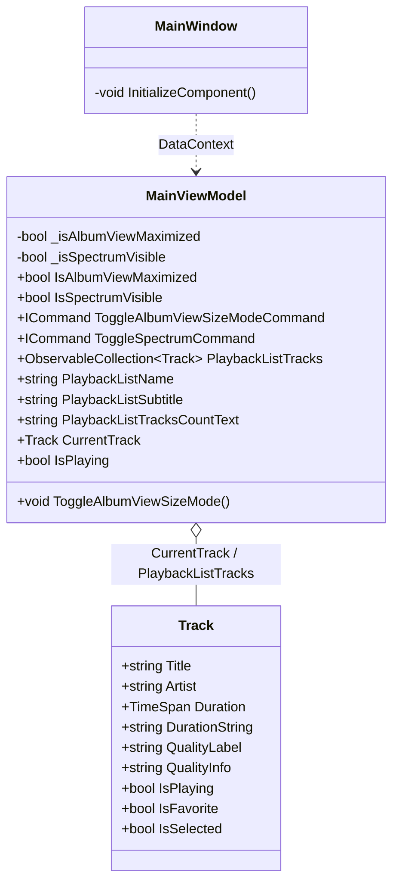
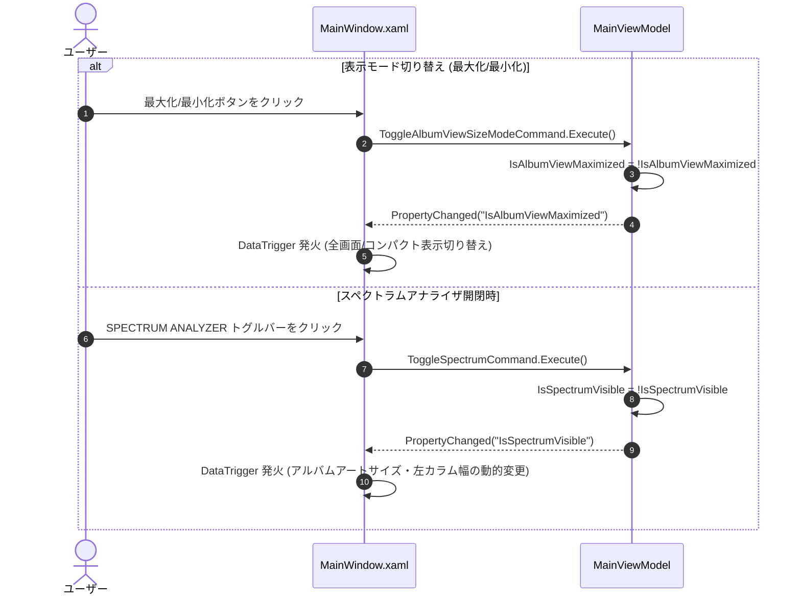

# 右側アルバム情報表示サイズ切り替え機能 詳細設計書

## 1. 概要
本ドキュメントは、メイン画面右側パネルにおけるアルバム情報・プレイヤー表示領域の表示サイズを「最大化（全画面）」と「最小化（コンパクト）」の2値トグルで切り替える機能、およびスペクトラムアナライザの開閉状態と連動した動的サイズ最適化・トラックリスト視認性向上の技術仕様と実装詳細を定義します。

- **上位ドキュメント**:
  - 機能仕様書: [設計/機能仕様/右側アルバム情報表示サイズ切り替え機能.md](../機能仕様/右側アルバム情報表示サイズ切り替え機能.md)
  - UI画面仕様書: [設計/画面設計/右側アルバム情報表示サイズ切り替え機能/右側アルバム情報表示サイズ切り替え機能UI仕様書.md](../画面設計/右側アルバム情報表示サイズ切り替え機能/右側アルバム情報表示サイズ切り替え機能UI仕様書.md)
- **対象Issue**: #122

---

## 2. アーキテクチャとクラス構造

### 2.1 クラス構成図 (Mermaid)


### 2.2 主要クラスと責務
| クラス名 | レイヤー | 責務・役割 |
| :--- | :--- | :--- |
| `MainViewModel` | ViewModel | 表示モード状態（`IsAlbumViewMaximized`）およびアナライザ状態（`IsSpectrumVisible`）の保持、モードトグルコマンドの提供、トラックリスト・再生ステータスの集約。 |
| `MainWindow.xaml` | View | 右側パネルのGrid構成、左右2カラムレイアウト、アナライザ開閉に応じた動的サイズ切り替え（DataTrigger）、トラックリストのゼブラストライプおよびインラインアイコン切り替えの描画。 |
| `Track` | Model | 楽曲メタデータ（トラック番号、曲名、再生時間、フォーマット、再生中/お気に入り/選択フラグ）の保持。 |

---

## 3. データフローと処理パイプライン

### 3.1 モード切り替え & アナライザ連動シーケンス図 (Mermaid)


### 3.2 状態管理とイベント連携
- `IsAlbumViewMaximized` の初期値は `true`（最大化・アルバム鑑賞モード）。
- `IsSpectrumVisible` の初期値は `true`（アナライザ表示）。
- それぞれのプロパティ変更通知（`INotifyPropertyChanged`）を受け、`MainWindow.xaml` 内の `Style` / `DataTrigger` により、各UI要素の寸法・可視性が瞬時かつ協調して切り替わります。

---

## 4. アルゴリズム・ロジック詳細

### 4.1 定数・パラメータ一覧
| 定数・プロパティ名 | 型 / 既定値 | 役割・説明 |
| :--- | :--- | :--- |
| `IsAlbumViewMaximized` | `bool = true` | 最大化モード（true）か最小化モード（false）かのフラグ。 |
| `IsSpectrumVisible` | `bool = true` | スペクトラムアナライザ表示フラグ。 |
| `ArtSizeNormal` | `260 x 260px` | アナライザ表示時（`IsSpectrumVisible = True`）のアルバムアートサイズ。 |
| `ArtSizeExpanded` | `330 x 330px` | アナライザ非表示時（`IsSpectrumVisible = False`）のアルバムアートサイズ（下部ブランク解消用）。 |
| `LeftColumnWidthNormal` | `340px` | アナライザ表示時の左カラム固定幅。 |
| `LeftColumnWidthExpanded` | `380px` | アナライザ非表示時の左カラム固定幅。 |
| `SpectrumTransitionDuration` | `0:0:0.3` (300ms) | アナライザ連動時のリサイズアニメーション時間。 |
| `EasingFunction` | `CubicEase (EaseInOut)` | 伸縮時のイージング関数。 |
| `TrackRowMargin` | `0,2` | 各トラックアイテム間の縦方向マージン。 |
| `TrackRowPadding` | `6,6` | トラック行内部の上下・左右パディング。 |

---

## 5. UIレイアウトおよびレンダリング設計

### 5.1 XAMLコンポーネント構成 (`MainWindow.xaml`)

#### ① スペクトラムアナライザ連動 動的アルバムアート & 左カラム（スムーズイージングアニメーション）
```xml
<!-- 最大化表示: 左右2カラム構成 -->
<Grid Margin="20,15,20,15">
    <Grid.ColumnDefinitions>
        <!-- Left Column: アナライザ開閉に応じて幅をスムーズにアニメーション伸縮 (340px ↔ 380px) -->
        <ColumnDefinition Width="Auto"/>
        <!-- Right Column: トラックリスト (残り全領域) -->
        <ColumnDefinition Width="*"/>
    </Grid.ColumnDefinitions>

    <!-- Left Column: Album Art + Meta + Controls (動的リサイズ対応コンテナ) -->
    <Grid Grid.Column="0" Margin="0,0,25,0">
        <Grid.Style>
            <Style TargetType="Grid">
                <Setter Property="Width" Value="340"/>
                <Style.Triggers>
                    <DataTrigger Binding="{Binding IsSpectrumVisible}" Value="False">
                        <DataTrigger.EnterActions>
                            <BeginStoryboard>
                                <Storyboard>
                                    <DoubleAnimation Storyboard.TargetProperty="Width" To="380" Duration="0:0:0.3">
                                        <DoubleAnimation.EasingFunction>
                                            <CubicEase EasingMode="EaseInOut"/>
                                        </DoubleAnimation.EasingFunction>
                                    </DoubleAnimation>
                                </Storyboard>
                            </BeginStoryboard>
                        </DataTrigger.EnterActions>
                        <DataTrigger.ExitActions>
                            <BeginStoryboard>
                                <Storyboard>
                                    <DoubleAnimation Storyboard.TargetProperty="Width" To="340" Duration="0:0:0.3">
                                        <DoubleAnimation.EasingFunction>
                                            <CubicEase EasingMode="EaseInOut"/>
                                        </DoubleAnimation.EasingFunction>
                                    </DoubleAnimation>
                                </Storyboard>
                            </BeginStoryboard>
                        </DataTrigger.ExitActions>
                    </DataTrigger>
                </Style.Triggers>
            </Style>
        </Grid.Style>

        <Grid.RowDefinitions>
            <RowDefinition Height="Auto"/> <!-- Album Art -->
            <RowDefinition Height="Auto"/> <!-- Album Meta -->
            <RowDefinition Height="Auto"/> <!-- Upper Controls -->
            <RowDefinition Height="Auto"/> <!-- Lower Controls -->
        </Grid.RowDefinitions>

        <!-- Dynamic Cover Art: アナライザ開閉に応じて Width/Height をスムーズに連続伸縮 (260px ↔ 330px) -->
        <Border Grid.Row="0" CornerRadius="8" Background="{DynamicResource ControlBackgroundBrush}" HorizontalAlignment="Center" ClipToBounds="True" Margin="0,0,0,12">
            <Border.Style>
                <Style TargetType="Border">
                    <Setter Property="Width" Value="260"/>
                    <Setter Property="Height" Value="260"/>
                    <Style.Triggers>
                        <DataTrigger Binding="{Binding IsSpectrumVisible}" Value="False">
                            <DataTrigger.EnterActions>
                                <BeginStoryboard>
                                    <Storyboard>
                                        <DoubleAnimation Storyboard.TargetProperty="Width" To="330" Duration="0:0:0.3">
                                            <DoubleAnimation.EasingFunction>
                                                <CubicEase EasingMode="EaseInOut"/>
                                            </DoubleAnimation.EasingFunction>
                                        </DoubleAnimation>
                                        <DoubleAnimation Storyboard.TargetProperty="Height" To="330" Duration="0:0:0.3">
                                            <DoubleAnimation.EasingFunction>
                                                <CubicEase EasingMode="EaseInOut"/>
                                            </DoubleAnimation.EasingFunction>
                                        </DoubleAnimation>
                                    </Storyboard>
                                </BeginStoryboard>
                            </DataTrigger.EnterActions>
                            <DataTrigger.ExitActions>
                                <BeginStoryboard>
                                    <Storyboard>
                                        <DoubleAnimation Storyboard.TargetProperty="Width" To="260" Duration="0:0:0.3">
                                            <DoubleAnimation.EasingFunction>
                                                <CubicEase EasingMode="EaseInOut"/>
                                            </DoubleAnimation.EasingFunction>
                                        </DoubleAnimation>
                                        <DoubleAnimation Storyboard.TargetProperty="Height" To="260" Duration="0:0:0.3">
                                            <DoubleAnimation.EasingFunction>
                                                <CubicEase EasingMode="EaseInOut"/>
                                            </DoubleAnimation.EasingFunction>
                                        </DoubleAnimation>
                                    </Storyboard>
                                </BeginStoryboard>
                            </DataTrigger.ExitActions>
                        </DataTrigger>
                    </Style.Triggers>
                </Style>
            </Border.Style>
            <Image Source="{Binding NowPlayingImage}" Stretch="UniformToFill"/>
        </Border>

        <!-- メタ情報 & コントロール群 -->
        ...
    </Grid>
```

#### ② トラックリストのゼブラストライプ & インラインアイコン統合
```xml
<ScrollViewer Grid.Row="1" VerticalScrollBarVisibility="Auto" HorizontalScrollBarVisibility="Disabled">
    <ItemsControl ItemsSource="{Binding PlaybackListTracks}" AlternationCount="2" HorizontalContentAlignment="Stretch">
        <ItemsControl.ItemTemplate>
            <DataTemplate>
                <Button Command="{Binding DataContext.PlayTrackCommand, RelativeSource={RelativeSource AncestorType=Window}}" 
                        CommandParameter="{Binding}"
                        HorizontalAlignment="Stretch" HorizontalContentAlignment="Stretch"
                        Margin="0,2" BorderThickness="0" Padding="6,6">
                    <Button.Style>
                        <Style TargetType="Button">
                            <!-- ゼブラストライプ背景色 (AlternationIndex: 0=透明, 1=微細明色) -->
                            <Setter Property="Background" Value="Transparent"/>
                            <Style.Triggers>
                                <Trigger Property="ItemsControl.AlternationIndex" Value="1">
                                    <Setter Property="Background" Value="#08FFFFFF"/>
                                </Trigger>
                                <Trigger Property="IsMouseOver" Value="True">
                                    <Setter Property="Background" Value="#1400FFFF"/>
                                </Trigger>
                            </Style.Triggers>
                        </Style>
                    </Button.Style>
                    
                    <Grid HorizontalAlignment="Stretch">
                        <Grid.ColumnDefinitions>
                            <ColumnDefinition Width="28"/> <!-- Track Number / Status Icon (インライン統合) -->
                            <ColumnDefinition Width="*"/>  <!-- Track Title -->
                            <ColumnDefinition Width="45"/> <!-- Duration -->
                        </Grid.ColumnDefinitions>

                        <!-- Column 0: 非再生時は曲番号、再生中/一時停止時はアイコンに置き換え -->
                        <!-- 1. 曲番号 (非再生時のみ表示) -->
                        <TextBlock Grid.Column="0" Text="{Binding RelativeSource={RelativeSource AncestorType=ContentPresenter, AncestorLevel=2}, Path=(ItemsControl.AlternationIndex), Converter={StaticResource IndexConverter}, StringFormat='{}{0:00}.'}" 
                                   Foreground="{DynamicResource MutedTextForegroundBrush}" FontSize="12" VerticalAlignment="Center" HorizontalAlignment="Left">
                            <TextBlock.Style>
                                <Style TargetType="TextBlock">
                                    <Setter Property="Visibility" Value="Visible"/>
                                    <Style.Triggers>
                                        <DataTrigger Binding="{Binding IsPlaying}" Value="True">
                                            <Setter Property="Visibility" Value="Collapsed"/>
                                        </DataTrigger>
                                    </Style.Triggers>
                                </Style>
                            </TextBlock.Style>
                        </TextBlock>

                        <!-- 2. 再生中アイコン (再生中のみ表示: ▶) -->
                        <Path Grid.Column="0" Data="M8,5.14V19.14L19,12.14L8,5.14Z" Fill="{StaticResource NeonCyanBrush}" Width="10" Height="10" Stretch="Uniform" VerticalAlignment="Center" HorizontalAlignment="Left">
                            <Path.Style>
                                <Style TargetType="Path">
                                    <Setter Property="Visibility" Value="Collapsed"/>
                                    <Style.Triggers>
                                        <MultiDataTrigger>
                                            <MultiDataTrigger.Conditions>
                                                <Condition Binding="{Binding IsPlaying}" Value="True"/>
                                                <Condition Binding="{Binding DataContext.IsPlaying, RelativeSource={RelativeSource AncestorType=Window}}" Value="True"/>
                                            </MultiDataTrigger.Conditions>
                                            <Setter Property="Visibility" Value="Visible"/>
                                        </MultiDataTrigger>
                                    </Style.Triggers>
                                </Style>
                            </Path.Style>
                        </Path>

                        <!-- 3. 一時停止アイコン (一時停止中のみ表示: ⏸) -->
                        <Path Grid.Column="0" Data="M6,19h4V5H6V19z M14,5v14h4V5H14z" Fill="{StaticResource NeonCyanBrush}" Width="10" Height="10" Stretch="Uniform" VerticalAlignment="Center" HorizontalAlignment="Left">
                            <Path.Style>
                                <Style TargetType="Path">
                                    <Setter Property="Visibility" Value="Collapsed"/>
                                    <Style.Triggers>
                                        <MultiDataTrigger>
                                            <MultiDataTrigger.Conditions>
                                                <Condition Binding="{Binding IsPlaying}" Value="True"/>
                                                <Condition Binding="{Binding DataContext.IsPlaying, RelativeSource={RelativeSource AncestorType=Window}}" Value="False"/>
                                            </MultiDataTrigger.Conditions>
                                            <Setter Property="Visibility" Value="Visible"/>
                                        </MultiDataTrigger>
                                    </Style.Triggers>
                                </Style>
                            </Path.Style>
                        </Path>

                        <!-- Column 1: 曲名 (左揃え・スペース最大化) -->
                        <TextBlock Grid.Column="1" Text="{Binding Title}" FontSize="13" TextTrimming="CharacterEllipsis" VerticalAlignment="Center" HorizontalAlignment="Left">
                            <TextBlock.Style>
                                <Style TargetType="TextBlock">
                                    <Setter Property="Foreground" Value="{DynamicResource TextForegroundBrush}"/>
                                    <Style.Triggers>
                                        <DataTrigger Binding="{Binding IsPlaying}" Value="True">
                                            <Setter Property="Foreground" Value="{StaticResource NeonCyanBrush}"/>
                                            <Setter Property="FontWeight" Value="SemiBold"/>
                                        </DataTrigger>
                                    </Style.Triggers>
                                </Style>
                            </TextBlock.Style>
                        </TextBlock>

                        <!-- Column 2: 再生時間 -->
                        <TextBlock Grid.Column="2" Text="{Binding DurationString}" Foreground="{DynamicResource MutedTextForegroundBrush}" FontSize="11" VerticalAlignment="Center" HorizontalAlignment="Right"/>
                    </Grid>
                </Button>
            </DataTemplate>
        </ItemsControl.ItemTemplate>
    </ItemsControl>
</ScrollViewer>
```

---

## 6. 関連ドキュメント・Issue
- 機能仕様書: [設計/機能仕様/右側アルバム情報表示サイズ切り替え機能.md](../機能仕様/右側アルバム情報表示サイズ切り替え機能.md)
- UI仕様書: [設計/画面設計/右側アルバム情報表示サイズ切り替え機能/右側アルバム情報表示サイズ切り替え機能UI仕様書.md](../画面設計/右側アルバム情報表示サイズ切り替え機能/右側アルバム情報表示サイズ切り替え機能UI仕様書.md)
- 関連Issue: [#122 [機能追加] 右側タブのアルバム情報の表示サイズ切り替え（全画面・最小化）](https://github.com/taketonnbo/Audio_Effector/issues/122)
- 親Issue: [#121 [機能追加] 右側タブの整理・拡張タスク（親Issue）](https://github.com/taketonnbo/Audio_Effector/issues/121)
