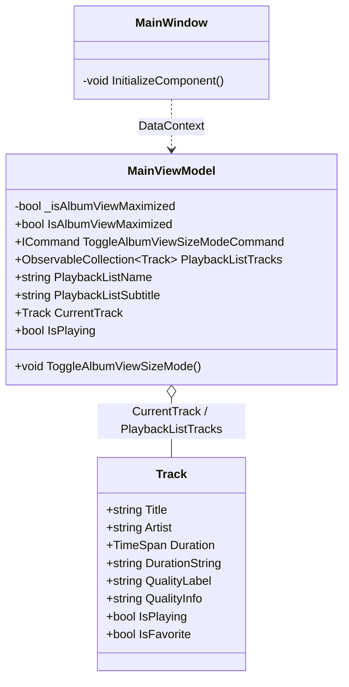
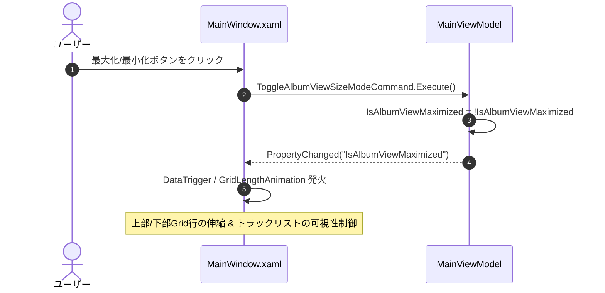

# 右側アルバム情報表示サイズ切り替え機能 詳細設計書

## 1. 概要
本ドキュメントは、メイン画面右側パネルにおけるアルバム情報・プレイヤー表示領域の表示サイズを「最大化（全画面）」と「最小化（コンパクト）」の2値トグルで切り替える機能の技術仕様および実装詳細を定義します。

- **上位ドキュメント**:
  - 機能仕様書: [設計/機能仕様/右側アルバム情報表示サイズ切り替え機能.md](../機能仕様/右側アルバム情報表示サイズ切り替え機能.md)
  - UI画面仕様書: [設計/画面設計/右側アルバム情報表示サイズ切り替え機能/右側アルバム情報表示サイズ切り替え機能UI仕様書.md](../画面設計/右側アルバム情報表示サイズ切り替え機能/右側アルバム情報表示サイズ切り替え機能UI仕様書.md)
- **対象Issue**: #122

---

## 2. アーキテクチャとクラス構造

### 2.1 クラス構成図 (Mermaid)


### 2.2 主要クラスと責務
| クラス名 | レイヤー | 責務・役割 |
| :--- | :--- | :--- |
| `MainViewModel` | ViewModel | 表示モード状態（`IsAlbumViewMaximized`）の保持、モードトグルコマンド（`ToggleAlbumViewSizeModeCommand`）の提供、トラック数や再生状態の集約。 |
| `MainWindow.xaml` | View | 右側パネルのGrid行構成（上部プレイヤー・下部拡張領域）、左右2カラムレイアウト、表示モードに応じたアニメーションおよびVisualState/DataTrigger制御。 |
| `Track` | Model | 楽曲メタデータ（トラック番号、曲名、再生時間、フォーマット、再生中/お気に入りフラグ）の保持。 |

---

## 3. データフローと処理パイプライン

### 3.1 モード切り替えシーケンス図 (Mermaid)


### 3.2 状態管理とイベント連携
- `IsAlbumViewMaximized` の初期値は `true`（最大化・アルバム鑑賞モード）。
- 値の変更通知（`INotifyPropertyChanged`）を受けて、`MainWindow.xaml` 内の `Storyboard` または `DataTrigger` が行の高さをスムーズにアニメーション遷移。

---

## 4. アルゴリズム・ロジック詳細

### 4.1 定数・パラメータ一覧
| 定数・プロパティ名 | 型 / 既定値 | 役割・説明 |
| :--- | :--- | :--- |
| `IsAlbumViewMaximized` | `bool = true` | 最大化モード（true）か最小化モード（false）かのフラグ。 |
| `AnimationDuration` | `0:0:0.3` (300ms) | パネル伸縮時のアニメーション時間。 |
| `EasingFunction` | `CubicEase (EaseInOut)` | アニメーションのイージング関数。 |
| `MinimizedTopHeight` | `Auto` (約 140〜160px) | 最小化時の上部コンパクトプレイヤー領域の高さ。 |

---

## 5. UIレイアウトおよびレンダリング設計

### 5.1 XAMLコンポーネント構成 (`MainWindow.xaml`)

```xml
<!-- 右側カラム: プレイヤー & 拡張領域 -->
<Grid Grid.Column="2" Background="{DynamicResource PanelBackgroundBrush}" ClipToBounds="True">
    <Grid.RowDefinitions>
        <!-- Row 0: アルバム情報・プレイヤー領域 -->
        <RowDefinition>
            <RowDefinition.Style>
                <Style TargetType="RowDefinition">
                    <Setter Property="Height" Value="1*"/>
                    <Style.Triggers>
                        <DataTrigger Binding="{Binding IsAlbumViewMaximized}" Value="False">
                            <Setter Property="Height" Value="Auto"/>
                        </DataTrigger>
                    </Style.Triggers>
                </Style>
            </RowDefinition.Style>
        </RowDefinition>

        <!-- Row 1: 下部拡張領域（タブ・ダッシュボード） -->
        <RowDefinition>
            <RowDefinition.Style>
                <Style TargetType="RowDefinition">
                    <Setter Property="Height" Value="0*"/>
                    <Style.Triggers>
                        <DataTrigger Binding="{Binding IsAlbumViewMaximized}" Value="False">
                            <Setter Property="Height" Value="1*"/>
                        </DataTrigger>
                    </Style.Triggers>
                </Style>
            </RowDefinition.Style>
        </RowDefinition>
    </Grid.RowDefinitions>

    <!-- Row 0: プレイヤー領域 -->
    <Grid Grid.Row="0">
        <!-- 最大化時: 左右2カラム構成 / 最小化時: トラックリスト非表示でコンパクト化 -->
    </Grid>

    <!-- Row 1: 拡張タブ領域 -->
    <Grid Grid.Row="1" Background="{DynamicResource PanelBackgroundBrush}">
        <!-- 今後のIssueでリスニング統計・タグクラウドを追加 -->
    </Grid>
</Grid>
```

### 5.2 各モードのコンポーネント詳細

1. **最大化時 (IsAlbumViewMaximized = True)**:
   - **左カラム**:
     - 特大アルバムアート（260x260px, 正方形アスペクト比維持）
     - アルバム名・アーティスト名
     - 音質詳細バッジ（`CurrentTrack.QualityLabel`, `CurrentTrack.QualityInfo`）
     - **楽曲操作コントロール（上段・下段の2段構成）**:
       - 上段: シャッフル、前へ、再生/一時停止、次へ、リピート、キュー、＋、♥
       - 下段: 現在再生中曲名、現在時間 / シークバー / 総時間
   - **右カラム**:
     - トラック数ヘッダー（`PlaybackListTracksCountText`）
     - フルハイトトラックリスト（固定幅カラムで全行左揃え: 再生/一時停止アイコン `▶`/`⏸`, 曲番号 `01.`, 曲名, 再生時間 `DurationString`）
     - 再生中楽曲クリックで一時停止、一時停止中楽曲クリックで再開

2. **最小化時 (IsAlbumViewMaximized = False)**:
   - トラックリスト（右カラム）を非表示（`Visibility="Collapsed"`）。
   - 上部領域の高さを `Auto` に縮小し、アートサムネイル、タイトル、シークバー、コンパクトコントロール群を配置。
   - 下部領域（`Grid.Row="1"`）を `Height="1*"` で全面展開。

3. **モードトグルボタン**:
   - パネル最右上端に常時固定配置（最大化時: 縮小アイコン、最小化時: 拡大アイコン）。

---

## 6. 関連ドキュメント・Issue
- 機能仕様書: [設計/機能仕様/右側アルバム情報表示サイズ切り替え機能.md](../機能仕様/右側アルバム情報表示サイズ切り替え機能.md)
- UI仕様書: [設計/画面設計/右側アルバム情報表示サイズ切り替え機能/右側アルバム情報表示サイズ切り替え機能UI仕様書.md](../画面設計/右側アルバム情報表示サイズ切り替え機能/右側アルバム情報表示サイズ切り替え機能UI仕様書.md)
- 関連Issue: [#122 [機能追加] 右側タブのアルバム情報の表示サイズ切り替え（全画面・最小化）](https://github.com/taketonnbo/Audio_Effector/issues/122)
- 親Issue: [#121 [機能追加] 右側タブの整理・拡張タスク（親Issue）](https://github.com/taketonnbo/Audio_Effector/issues/121)
